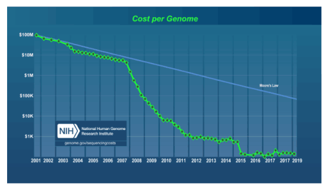

# 生物信息学数据技能


使用开源工具进行可重复且可靠的研究

文斯布法罗


## 生物信息学数据技能

&emsp;&emsp;学习将大型测序数据集转化为可重复且稳健的生物学发现所需的数据技能。为了这个现实的目标，你应该学习如何使用免费开源的工具从大型且复杂的生物数据集中提取有意义的内容。

<!--TOC-->
- [生物信息学数据技能](#生物信息学数据技能)
    - [生物信息学数据技能](#生物信息学数据技能-1)
    - [绪论](#绪论)
        - [使用这本书的方法](#使用这本书的方法)
        - [为什么这本书关注测序数据](#为什么这本书关注测序数据)
        - [观众](#观众)
        - [不同级别的数据技能](#不同级别的数据技能)   
        - [这本书的假设](#这本书的假设)    
        - [github上的补充资料](#github上的补充资料)   
        - [计算资源和设置](#计算资源和设置)   
        - [本书的构成](#本书的构成)    
        - [代码约定](#代码约定)  
        - [本书的约定](#本书的约定)   
        - [代码使用示例](#代码使用示例)   
        - [在线资源](#在线资源)   
        - [如何联系我们](#如何联系我们)  
        - [确认](#确认)
    - [第一部分 意识形态：强大且可重复的生物信息学的数据技能](#第一部分-意识形态强大且可重复的生物信息学的数据技能)    
        - [一、如何学习生物信息学](#一如何学习生物信息学)
    - [第二部分 先决条件：开始生物信息学项目的基本技能](#第二部分-先决条件开生物信息学项目的基本技能)    
        - [二、建立和开展生物信息学项目](#二建立和开展生物信息学项目)    
        - [三、补充Unix Shell知识](#三补充unix-shell知识)    
        - [四、使用远程机器](#四使用远程机器)    
        - [五、git科学家](#五git科学家)    
        - [六、生物信息学数据](#六生物信息学数据)
    - [第三部分 实践：生物信息学数据技能](#第三部分-实践生物信息学数据技能)   
        - [七、Unix 数据工具](#七unix-数据工具)    
        - [八、快速介绍r语言](#八快速介绍r语言)    
        - [九、使用范围数据](#九使用范围数据)    
        - [十、使用序列数据](#十使用序列数据)    
        - [十一、使用对齐数据](#十一使用对齐数据)    
        - [十二、生物信息学shell脚本，编写管道和并行化任务脚本](#十二生物信息shell脚本编写管道和并行化任务脚本)    
        - [十三、补充知识Tabix 和SQLite](#十三补充知识tabix-和sqlite)    
        - [十四、总结](#十四总结)    
        - [然后去哪？](#然后去哪)    
        - [术语表](#术语表)    
        - [参考书目](#参考书目)    
        - [索引](#索引)


# 绪论

&emsp;&emsp;在两年前对我自己提出的这个问题的回答。当我开始在这个领域工作时，我只有python和r方面的编程经验，其他方面的经验很少。我四处寻找关于生物信息学的极好的入门教材，虽然我找到了一些好书，但大多数都不是针对我作为生物信息学家的日常工作所需要的。我找到的一些文本从理论和算法的角度探讨了生物信息学，包括Smith-Waterman比对、系统发育重建、motif查找等主题。尽管它们很吸引人去阅读(并且我确实建议您多阅读这些材料)，但我没有必要在我的日常生物信息学工作中从头开始实现生物信息学算法——这些算法已经存在大量出色的、高度优化的、经过良好测试的实现。其他生物信息学文本采取了更为明确的方法，指导不熟悉计算的读者完成每一步任务，比如运行对齐器或从数据集中下载序列。虽然这些更适用于我的工作，但是，相对而言，他们的书中的大部分内容是过时的。

&emsp;&emsp;正如你所猜到的那样，我找不到比这版的《生物信息学数据技能》更好的生物信息学书了。这本书面向那些不确定如何弥合脚本语言和实践生物信息学之间的巨大差距以便以一个健壮的和可复用的方式回答科学问题的读者。要弥合这一差距，必须学习数据技能 - 这种方法使用一套核心工具来操纵和探索您在生物信息学项目中遇到的任何数据。

&emsp;&emsp;数据技能是学习生物信息学的最佳方法，因为这些技能使用经过时间检验的开放源码工具，这些工具仍然是操作和探索不断变化的数据的最佳方法。这种方法经受住了时间的考验:高通量测序的出现迅速改变了生物信息学领域，但熟练的生物信息学使用这些相同的工具和技能来适应了这一新数据。毕竟，下一代数据只是数据（差异数据，以及更多数据），而生物信息学大师拥有通过将他们的工具应用于这些新数据来解决问题的基本技能。编写《生物信息学数据技能》是为了帮您学习这些核心工具，帮助您发展相同的技能。

## 使用这本书的方法
&emsp;&emsp;许多生物学家从生物信息学起步，往往把“学习生物信息学”等同于“学习如何运行生物信息学软件”。
## 为什么这本书关注测序数据

&emsp;&emsp;生物信息学是一门广泛的学科，涵盖蛋白质组学，代谢组学，结构生物信息学，比较基因学，机器学习和图像处理等子领域。本书主要关注处理测序数据，原因有几个。

&emsp;&emsp;首先，测序数据资源丰富。目前，没有其他“组学”能像测序数据一样有高通量且丰富的数据。测序数据在生物学中具有广泛的应用：变异检测和基因分类，用于基因表达研究的转录组测序，蛋白质-DNA相互作用测定如ChIP-seq，以及用于亚硫酸氢盐甲基化研究的测序等几个例子。这种用测序数据来回答生物学问题的方式只会越来越多。

&emsp;&emsp;其次，测序数据非常适合磨炼你的数据技能。即使，在将来你准备分析其他类型的数据，测序数据依然是学习的最佳示例数据。开发使用测序数据所必需的文本处理技能将适用于处理许多其他数据类型。

&emsp;&emsp;然后，生物信息学的其他子领域更具特定领域。测序的广泛可用性和不断下降的成本使得所有学科的科学家能够使用基因组学数据来回答他们系统中的问题。相比之下，像蛋白质组学或高通量图像处理这样的生物信息学子学科更加专业化，而且不那么广泛。但是，如果您对这些领域感兴趣，本书将教您有用的计算和数据技能，这将有助于您的研究。

## 观众

&emsp;&emsp;根据我在加州大学戴维斯分校为我的朋友、同事和学生进行为期一周的密集课程生物信息学的教学经验，大多数希望学习生物信息学的人都是生物学家或计算机科学家/程序员。生物学家希望教授他们分析自己的数据所必需的计算技能，而程序员和计算机科学家希望教他们如何利用计算技能去解决生物学问题。尽管这两组在生物学知识和计算经验方面存在很大差异，但是《生物信息学数据技能》这本书覆盖的内容对于这两组的诉求都能给与帮助。

&emsp;&emsp;如果你是生物信息学家，《生物信息学数据技能》这本书将会教你在工作中需要的处理生物信息数据的核心技能。值得注意的是，这本书不是一本告诉你什么是生物信息学的书籍;这本关于生物信息学的书很快就会出现数据，或者过于专注于数据以至于无法帮助大多数生物学家。您需要根据您的特定研究方向和系统需求，以及您的子领域使用的现代统计和生物信息学方法，补充本书没有的内容。例如，如果您的项目涉及将测序读数与参考基因组对齐，本书将不会告诉您最新且最佳的校准软件适用于您的特定系统。但无论您使用哪种校准器，您都需要了解校准格式和如何操纵对齐数据 - 这些内容在第11章中有相关介绍。

&emsp;&emsp;在本书中，这些一般的计算和数据技能是大多数生物学家可以构建的坚实，广泛适用的基础。如果你是一个计算机科学家或者程序员，我在这本书中讲到的算法工具你肯定很熟悉。虽然本书中介绍的内容可能与您已有的知识重叠，但您仍将了解生物信息学家在工作中使用的具体格式，工具和方法。同时，通过本书中的示例，您将获得应用基因组学数据的计算技巧。

## 不同级别的数据技能

&emsp;&emsp;这本书旨在成为一本紧密相宜的书。当我开始写这本书的时候，我决定我能做的最坏的打算就是把生物信息学当做一门比实际情况更容易的学科。作为一个专业的生物信息学家，我经常看到一些非常微妙的问题会突然出现，如果他们没有被发现，就会对分析结果产生不利的影响。我不希望你的生物信息学工作是不正确的，因为我人为地简化了一个主题。在《生物信息学数据技能》中的主题涉及的内容比较难，如果你能很好的理解这些内容，你在自己的工作中发现了类似的问题时，能够很好的利用这些知识解决问题。

&emsp;&emsp;这本书的章节内容比较超前，对于部分读者来说可能比较难。不要气馁！像大多数学科一样，这种学科很难，所以，可能需要多读几次才能完全理解。在整本书中，我试图表明。当某些部分特别难时，您可以跳过这些部分之后返回到这些部分进行学习。

&emsp;&emsp;最后，我经常在整本书中使用技术术语。我不喜欢使用技术术语，但在计算机领域，必须使用技术概念进行交流。而且，这种技术术语，可以帮助您可以搜索其他资源和帮助。例如，在google上搜索“左外部连接”比“在一个表中包含空记录的数据合并”要更容易得想要的结果。

## 学习前提

&emsp;&emsp;《生物信息学数据技能》是一本关于生物信息学的中间书籍。为了确保每个人都从同一个节奏开始，这本书从几个简单的章节开始。在第二章中设置了一些基础的生物信息学小项目，在第3章中，我将教授一些关于Unix基础内容，这些内容旨在确保您对Unix有一个基本的理解(因为在后面的章节中，Unix是一个很大章节去讲)。不过，作为一本中间的书，我对你做了一些假设：

*你会一门脚本语言*

&emsp;&emsp;这是使用这本书的前提。除了几个Python程序和R相关的内容(R在第8章中介绍)，这本书并不直接依赖于使用大量脚本。但是，在学习脚本语言时，您已经遇到了许多重要的计算概念，例如使用文本编辑器、在命令行上运行和执行程序以及基础的编程技能。如果你不会任何脚本语言，我建议你在学习这本书的同时学习python。例如《使用Python进行生物信息学编程》(Mitchell L. Model O‘Reilly，2009年)，《学习Python》，第5版(Mark Lutz O‘Reilly，2013年)，和 Python in a Nutshell，第二版(Alex Martelli O‘Reilly，2006)都是很好的开始学习Python的书。如果您知道除Python外的其他脚本语言(例如Perl或Ruby)，您将准备好跟随大多数示例(尽管您需要将一些示例转换成您熟悉的脚本语言)。

*你会使用文本编辑器*

&emsp;&emsp;了解文本编辑器(例如Emacs、Vim、Text-Mate2或SublimText)是很重要的。使用字处理器(例如Microsoft Word)将不起作用，我不鼓励使用记事本或OS X的Tex-tEdit等文本编辑器，因为它们缺乏对常见编程语言的语法突出显示的支持。

*你会Unix命令行*

&emsp;&emsp;例如，我假设您知道终端和shell之间的区别，了解如何输入命令,哪些命令行有什么选项，标志和参数，以及如何使用向上箭头检索最后输入的命令。您还应该对unix文件层次结构有一个基本的了解(包括主目录、相对目录与绝对目录以及根目录等概念)。您还应该能够使用cd、ls、pwd、mv、rm、rmdir和mkdir等命令在Unix中移动和操作目录和文件。最后，您应该掌握基本的Unix文件的所有权和权限，并使用chown和chmod更改它们。如果这些概念不清楚，我建议您小心使用unix命令行，并参考一本好的初学者级别的书，如《生物学家实用计算》( Steven Haddock and Casey Dunn Sinauer，2010年)或《UNIX和Perl基础》（UNIX and Perl to the Rescue）(Keith Bradnam and Ian Korf  剑桥大学出版社，2012年)。

*你对生物学有基本的了解。*

&emsp;&emsp;《生物信息学数据技能》需要你自己了解生物学的基础知识。除了DNA、RNA、蛋白质和基因之外，这些例子并不需要太多的生物学背景，也不需要分子生物学的核心内容。您还应该熟悉一些非常基本的遗传学和基因组概念(例如，单核苷酸多态性、基因型、GC内容等)。这本书中的所有生物学示例都设计得非常简单；如果您不熟悉某个专业名词，您应该能够快速浏览一篇Wikipedia相关的文章并继续该示例。

*您对正则表达式有基本的了解。*

&emsp;&emsp;偶尔，我会再这本书中使用正则表达式。大部分情况下，我将尝试使用最基本的正则表达式，以便您了解基本概念。如果您在学习脚本语言时遇到过正则表达式，那么就可以开始学习了。如果没有，我建议您学习基础的正则表达式知识-不是因为整本书中大量使用正则表达式，而是因为掌握正则表达式是生物信息学中的一项重要技能。《正则表达式介绍》作者迈克尔·菲茨杰拉德(Introducing Regular Expressions by Michael Fitzgerald O‘Reilly)是一本很好的书。现在，编写、测试和调试正则表达式比以往任何时候都更容易，这要归功于一些在线工具，如[https://jex.im/regulex/](https://jex.im/regulex/)、[http://regex101.com](http://regex101.com)和[http://www.debuggex.com](http://www.debuggex.com)我建议在您自己的工作中,使用这本书中的正则表达式示例时使用这些工具。

*你知道如何查找帮助并能看懂文档*

&emsp;&emsp;在这本书中，我尽量减少可以在手册、帮助文档或在线资源中找到的教学信息。有三个原因：

1. 我想节省空间，专注于以展示你在其他地方找不到的资料和内容。
2. 手册页和文档将永远是这方面信息的最佳资源。
3. 在文档中快速找到答案是你学习计算机最重要的技能之一。

&emsp;&emsp;最后这一点特别重要；您不需要记住所有命令或R函数的所有参数-您只需要知道在哪里可以找到这些信息。程序员在工作中经常参考文档，这就是为什么在文档存在诸如man(在Unix中)和help()(在R中)工具的原因。

*您可以管理你的计算机系统(或拥有系统管理员权限)*

&emsp;&emsp;本书并没有教您系统管理技巧，如设置生物信息学服务器或集群、管理用户帐户、网络安全、管理磁盘和磁盘空间、RAID配置、数据备份和高性能计算概念。根本没有足够的空间来充分讨论这些重要的话题。然而，这些都是非常，非常重要的，如果您没有系统管理员，并且需要为您的实验室或研究团队填补该职位，则您也必须掌握这些技能。坦率地说，系统管理技能需要几年的时间才能掌握，而优秀的系统管理员在处理问题时具有令人难以置信的耐心和经验，这些问题会使大多数科学家发疯。如果您可以使用在实验室或组之间共享的全职系统管理员，或者使用带有系统管理员的大学群集，我就是这样做的。最后，这不是必须的，只是以防万一：不断备份你的数据和工作结果。当学习Unix来执行一个破坏文件的命令是很容易的-你最好的防止丢失所有东西的方法就是连续备份。

## github上的补充资料

&emsp;&emsp;这本书中的例子和其他资料可以在[github](https://github.com/vsbuffalo/bds-files)上获取。您可以根据需要从git库下载相应内容(git上的内容按章分类)，或者，您可以通过链接下载Zip文件包。一旦您在第5章中学习了Git，我将建议您克隆存储库，以便在意外重写任何示例文件时都可以恢复它们。等到在第5章中学习了Git，我将建议您克隆存储库，以便在意外重写任何示例文件时都可以恢复它们。现在尝试导航到这个存储库并浏览相应内容，以便熟悉正本书的布局。查看前言的目录，您会发现README.md文件，其中包含关于我所讨论的许多主题的其他信息。除了本书中所有示例所需的补充文件外，此存储库还包含：
1. 关于所有补充文件是如何制作或如何获得的文件。在某些情况下，我通过创建文件或脚本(这两个主题都包含在第12章中)来创建示例数据，所有这些资源都可以在每章的GitHub目录中找到。包括了这些材料，不仅是为了可以重复使用，而且也是作为额外的学习材料。
2. 读者可能会对每一章都感兴趣。这些信息在每章的README.md文件中有列出。我还包括了其他资源，如推荐以供进一步学习的书籍列表，。
3. 纠错，以及任何必要的更新(如料由于某种原因而过时)。

&emsp;&emsp;我选择在GitHub上托管《生物信息学数据技能》的补充文件，这样我可以随时更新所有内容，并解决读者可能遇到的任何问题。如果您发现这本书或它的补充材料有任何问题，请随时在GitHub上创建一个新的问题。

## 计算资源和设置

&emsp;&emsp;我是在一台15英寸16 GB的RAM的MacBookPro笔记本电脑上完成整本书的写作。尽管这是一台功能强大的笔记本电脑，但它比生物信息学计算中常见的服务器要小得多。所有的例子都被设计和测试来运行一台这么大的机器。几乎每个示例都应该在具有8 GB内存的计算机上运行。

&emsp;&emsp;本书中的所有示例都不支持MacOSX和Linux以外的其他操作系统(主要是因为现代生物信息学依赖于基于Unix的操作系统)。本书中所需的所有软件都是免费提供的，并且易于安装；因为需要安装软件，所以我在每一节中都提供了一些基本的说明。通常，您应该使用操作系统的包管理系统(例如，在Ubuntu/Debian上的APT-GET)。如果您使用的是Mac，我强烈推荐Homebrew，这是一个非常棒的OSX软件包管理器，您可以使用它用命令行轻松地安装软件。你可以在Homebrew的官网上找到详细的说明，最重要的是Homebrew维护一组名为“Homebrew-Science”的科学软件包，包括我们在本书中使用的生物信息学软件。按照Homebrew-Science‘s的Readme.md文件中的说明学习如何安装这些科学程序。

## 本书的构成

&emsp;&emsp;这本书由三部分构成：第一部分，包含一个关于意识形态的章节；第二部分，包括生物信息学项目入门的基础知识；第三部分，涉及生物信息学数据技能。虽然章节是按顺序编写的，但如果您熟悉Unix和R，您可能会发现您可以跳过这些章节而不会遇到任何问题。

&emsp;&emsp;在第一章中，我介绍了为什么通过发展数据技能来学习生物信息学是最好的方法。我还介绍了这本书的思想，并描述了可再生和强大的生物信息学和一些建议，以适用于您自己的工作。

&emsp;&emsp;《生物信息学数据技能》第二部分介绍了启动生物信息学项目所需的基本技能。首先，我们将在第2章中研究如何设置和管理项目目录。这可能看起来是个琐碎的话题，但复杂的生物信息学项目需要我们考虑项目管理。在大型的研究中，到处都是文件。从一个精心组织的项目开始，可以避免许多不必要的麻烦。我们还将学习一种非常有用的纯文本项目文档格式Markdown文档。

&emsp;&emsp;在第三章中，为了确保您对基本概念(例如，管道、重定向、标准输入和输出等)有扎实的理解，我们将会讲解生物信息学中的UNIX。了解这些必备的基础知识将使您能够在后面的章节中专注于分析数据，而不是费尽周折地理解Unix的基础知识。

&emsp;&emsp;大多数生物信息学任务需要更强的计算能力，这意味着我们必须使用远程服务器和集群。第4章介绍了在使用远程机器时提高工作效率的一些方法和技巧。

&emsp;&emsp;在第五章中我们将学习一个简化项目版本管理的版本控制系统-git。生物信息学项目充满了大量的代码和数据，这些代码和数据应该使用与协作开发的软件相同的现代工具进行管理。Git是一款功能强大的大型软件，因此这是一个很长的章节。但是，编写本章是为了使您可以跳过关于分支的一节，稍后再返回到它。

&emsp;&emsp;第6章研究生物信息学项目中的数据：如何下载大量数据、如何使用数据压缩、验证数据完整性以及如何可重复地下载项目数据。

&emsp;&emsp;在第三部分中，我们的注意力转向发展所有生物信息工作者在日常工作中解决问题所需的基本数据技能。第7章重点介绍Unix数据工具，这些工具允许您快速编写强大的流处理Unix管道来处理生物信息学数据。这种方法是现代生物信息学的基石，是一项绝对必要的数据技能。

&emsp;&emsp;在第八章中，我通过学习探索性数据分析技术来介绍R语言。本章让您使用R来使用可视化和数据汇总等技术来探索您自己的数据。

&emsp;&emsp;基因组范围数据在生物信息学中是无处不在的，因此我们将在第9章中讨论范围数据和范围操作。我们将首先通过不同的方法来表示基因组范围，并通过使用BioConductor的IRrangesPackage包进行范围操作来增强我们的范围思维直觉。然后，我们将使用GenomicRange处理基因组数据。最后，我们将研究用于在命令行上处理范围数据的BED工具包。

&emsp;&emsp;在第10章中，我们学习了序列数据，它是生物信息学数据的支柱。我们将研究Fasta和FASTQ格式(以及它们的局限性)，并通过从序列中修剪低质量的基组，看看这是如何影响质量分数的分布的。我们还将研究Fasta和FASTQ的解析。

&emsp;&emsp;第11章重点介绍了对准数据格式SAM和BAM。理解和操作这些格式的文件是处理高通量测序数据的一项不可或缺的生物信息学技能。我们将学习如何使用Samtools操作这些文件并对这些数据进行可视化处理，通过一个详细的示例来说明变量调用的一些复杂性。最后，我们将学习如何使用Pysam来解析SAM/BAM文件，以便您可以编写自己的脚本来处理这些特定数据格式的文件。

&emsp;&emsp;大多数生物信息学的日常工作都涉及到编写数据处理脚本和管道。在第12章中，我们将介绍如何编写健壮的和可复用的数据处理管道。我们将专门研究Bash脚本，使用Unix强大工具(如find和xargs)处理文件，最后快速了解如何使用make和makefile编写管道。

&emsp;&emsp;在生物信息学中，我们的数据常常太大，无法放入我们的计算机内存中。在第7章中，我们了解了如何使用Unix管道流处理来帮助解决这个问题，但是第13章介绍了一种不同的方法：不适用内存的方法。首先，我们将研究Tabix，这是一种快速访问索引制表符分隔文件中的信息的方法。然后，我们将通过使用SQLite分析一些GAPP数据来了解SQL的基本知识。

&emsp;&emsp;最后，在第14章中，我将讨论下一步如何进一步发展您的生物信息学技能。

## 代码约定

&emsp;&emsp;大部分生物信息学数据都有一个共同的特点：数据大。在代码例子中，我经常需要截断输出以使其适合页面的宽度。为了指示输出已被截断，我将在输出中始终使用[...]。另外，在代码示例中，我经常使用短的变量名来节省空间。我鼓励你们在个人工作中使用具有更多的描述性的名称来命名变量。

## 本书的约定

&emsp;&emsp;本书采用下面的排版约定：

*斜体*

&emsp;&emsp;指示新术语、URL、电子邮件地址、文件名和文件扩展名。

*恒定宽度*

&emsp;&emsp;用于程序清单，以及在段落中引用程序元素，如变量或函数名、数据库、数据类型、环境变量、语句和关键字。

*恒定宽度粗体*

&emsp;&emsp;显示用户应按字面输入的命令或其他文本。

*恒定宽度斜体*

&emsp;&emsp;显示应替换为用户提供的值或由上下文确定的值的文本。

## 代码使用示例

&emsp;&emsp;这本书可以在工作中帮到你。
## 在线资源

## 如何联系我们

&emsp;&emsp;如果有关此书的评论和问题请使用下面的联系方式向出版商提出：

O’Reilly Media, Inc.

1005 Gravenstein Highway North

Sebastopol, CA 95472

800-998-9938 (in the United States or Canada)

707-829-0515 (international or local)

707-829-0104 (fax)
## 确认

&emsp;&emsp;写一本书是一项巨大的工程，两年来，我在晚上和周末的时间都用在编写《生物信息学数据技能》这本书。生物信息学专业(在过去五个月的写作，作为一名博士生)是一个要求很高的职业。对大多数科学家来说，平衡工作和生活已经够困难的了；我现在知道，平衡工作、生活和写一本书几乎是不可能的。如果没有我的搭档海琳·霍普弗的支持，我是不会在这个过程中幸存下来的。

# 第一部分 意识形态：强大且可重复的生物信息学的数据技能

## 第一章、如何学习生物信息学

&emsp;&emsp;现在，在世界各地的实验室里，机器正在对地球上生命的基因进行测序。即使成本迅速下降，基因组测序技术也有例如巨大进步，我们也只能看到每个细胞、组织、有机体和生态系统中包含的生物信息的一小部分。然而，我们正在收集的全部生物信息中的一小部分相当于生物学家需要处理的大量数据。在人类历史上，我们对生活复杂性的理解能力从未像现在这样如此依赖于我们处理和分析数据的技能。

&emsp;&emsp;这本书是关于通过发展数据技能来学习生物信息学的。在本章中，我们将了解什么是数据技能，以及为什么学习数据技能是学习生物信息学的最佳方法。我们还将研究什么是可靠和可重复的研究。

### 为什么是生物信息学？生物学持续增长的数据

&emsp;&emsp;生物信息学家关注的是用专门的技能工具分析大量的数据中获取对生物的理解。在生物学的早期历史中，这些数据集很小且易于管理。大多数生物信息学家，在学习过统计的课程之后，都可以在自己的电脑上利用微软的Excel分析他们的生物信息数据。然而，这一切都在迅速被改变。大规模的测序数据开始应用，而且在未来的应用汇更加广泛。分析这些数据需要不同的工具、新的技能和许多具有大量内存、处理能力和磁盘空间的计算机。

&emsp;&emsp;在短期内由于测序成本大幅下降，使研究人员能够利用测序数据帮助回答重要的生物学问题。早期测序比较苦难而且成本很高。全基因组测序工作代价高昂(人类基因组的测序成本约为27亿美元)，而且只有通过大规模的合作努力才有可能实现。自人类基因组发布以来，测序成本从2008年开始一直呈指数下降，具体如图1-1所示。随着下一代测序技术的引入，DNA测序的成本下降得更快。在这个关键时刻，以前只有大型合作测序机构(或财力非常雄厚的个人研究人员)才能负担得起的技术，现在对于所有生物学领域的研究人员来说都能负担得起了。阅读这本书很可能是为了学习如何处理测序数据，而这些数据在10年产生的成本会非常昂贵。



图1-1、2008年前后排序成本的下降是由于引入了下一代测序数据（图转载，数据从国家卫生研究院下载[NIH](https://www.genome.gov/about-genomics/fact-sheets/Sequencing-Human-Genome-cost))

&emsp;&emsp;这些使测序成本下降的新技术将会导致什么后果呢？正如你所猜到的那样，数据越来越多。随着数据越来越多，生物数据库也经历了指数增长。过去，协作者之间共享小型数据库就足够了，而现在全世界的服务器上都有千兆字节的有用数据。生物学问题的关键数据不仅存在于硬盘上未经分析的实验数据中，而且还存储在数千英里之外的数据中心的磁盘上。

&emsp;&emsp;生物数据库的增长就像测序成本的下降一样令人震惊。例如，考虑[序列读取存档](https://trace.ncbi.nlm.nih.gov/Traces/sra/sra.cgi?)(以前称为短文档)。自2010年以来，它经历了显著的增长(见图1-2)。


图1-2、短读档案馆呈指数增长；开放存取库是向公众提供SRA提交的材料(附图和从[NIH](https://trace.ncbi.nlm.nih.gov/Traces/sra/sra.cgi?)下载的数据)

&emsp;&emsp;通过参考摩尔定律，可以将测序数据的这种令人难以置信的增长规律放在上下文中。戈登·摩尔(英特尔的创始人之一)观察到，计算机芯片中的晶体管数量大约每两年翻一番。每片晶体管越多，计算机处理器的速度就越快，计算机的随机存取内存也就越多，从而使计算机功能更强大。这种非同寻常的技术进步速度-产出每两年翻一番-可能是人类有史以来技术增长最快的一次。然而，自2011年以来，存储在“短读档案馆”中的排序数据的数量甚至超过了这一惊人的增长速度，每年都会翻一番。

&emsp;&emsp;分析生物数据的新工具层出不穷，它们的基本算法也在不断进步，使事情变得更加复杂。2012年的一项审查列出了70多个短读映射器（具体见[http://bit.ly/htsmappers](http://bit.ly/htsmappers)）。同样，在过去的五年里，我们的基因组组装方法发生了很大的变化，随着短的高通量测序读取的出现，组装长序列的方法(如重叠-布局-共识算法)被放弃了。现在，测序化学的进步正在导致更长的测序读取长度，新的算法正在取代其他只有几年历史的算法。

&emsp;&emsp;不幸的是，生物信息学工具的这种丰富和快速的发展有严重的不利之处。通常，生物信息学工具没有进行充分的基准测试，或者，如果有，它们也仅仅只在一个有机体中进行基准测试。这使得新的生物学家很难筛选出最好的工具来分析他们的数据。一些生物信息学程序因为没有被积极地开发，使它们失去相关性或带有可能对结果产生负面影响的bug，这使事情变得更加困难。所有这一切使得，选择一个适合生物信息学研究中的程序变得十分困难。更重要的是，需要严格评估自己的数据在生物信息学程序上运行输出结果的准确性。在整个第II部分的示例中，我们将看到数据技能如何帮助我们评估程序输出结果。

### 通过学习数据技能学习生物信息学

&emsp;&emsp;生物数据的性质变化如此之快，该如何学习生物信息学呢？在现在市场上如此多的分析工具，以及不断创造出的新工具中，一个生物学家应该如何选择一个适合他的数据结构，并能对这些数据做出合理分析的工具呢？

&emsp;&emsp;解决办法就是像生物信息学专家那样对待生物信息学：不断尝试，并对结果进行合理评估。通过这种方式，生物信息学变成拥有使用计算机进行数据实验并分析结果技能的学科。对大多数科学家来说实验部分自然而然是很容易的。对大多数生物学家来说，在计算机上自由实验并处理大量数据的数据技能是他们的短板。这本书的目标是教你必要的生物信息学数据技能，使你可以像在实验室里运行实验一样轻松地在计算机上进行数据实验。

&emsp;&emsp;不幸的是，许多生物学家常用的计算工具无法满足现代复杂且规模庞大的生物数据的需求。复杂的数据格式、众多程序的接口以及评估软件和数据使得大型生物信息学数据集的处理非常困难。学习核心生物信息学数据技能将为您提供学习、应用和评估任何生物信息学程序或分析方法的基础。10年后，生物信息学人员可能只使用现今的少数几个生物信息学软件程序。但我们肯定会利用数据技能和实验来评估未来的数据和方法。

&emsp;&emsp;那么什么是数据技能呢？它们是一组计算技能，使您能够使用一套众所周知的工具快速创建一种查看复杂数据集的方法。一个很好的比喻就是爵士音乐家所说的有“演奏技巧（chops）”。一位拥有好演奏技巧的爵士音乐家可以走进一家夜总会，听一首熟悉的标准歌曲，识别和弦的变化，并开始在这些和弦上演奏音乐思想。同样，具有良好数据技能的生物信息学家再收到一个庞大的测序数据集时，能够立刻使用一组工具来查看数据背后所隐藏的内容。

&emsp;&emsp;就像一位精通乐器的爵士乐演奏家一样，一位拥有精湛数据技能的生物信息专家需要掌握一套工具的使用。学习工具是发展数据技能的必要步骤，但不是充分的步骤(同样，学习乐器是演奏音乐思想的必要步骤，但不是充分步骤)。在这本书中，我们将发展我们的数据技能，在第二部分学习创建生物信息学项目和数据，第三部分针对不同数据量的分析工具。然而，这本书只能让你走上正确的生物信息学道路；真正的掌握这些技能，需要在实际项目中反复应用技能进行联系和巩固。

### 可复用性和健壮性研究面临的新挑战

&emsp;&emsp;生物学越来越多地使用大型测序数据集，改变的不仅仅是我们所需要的工具和技能：它也改变了我们的科学发现的可再现性和健壮性。当我们使用新的工具和技术来分析基因组数据时，有必要确保我们的方法仍然像其他任何实验方法一样具有重现性和健壮性。不幸的是，我们的数据的大小和我们分析工作的复杂性使得这些目标在基因组学中特别困难。

&emsp;&emsp;最重要的是我们共享我们的数据和方法。在前基因组学时代，共享数据很容。论文可以包括详细的方法总结和完整的数据集-就像Kreitman在1986年的论文中对4713bp的ADH基因侧翼序列所做的那样(它被嵌入到论文的中间)。现在的论文有很长的补充方法、代码和数据。共享数据也不再是一件简单的事情，因为排序项目可能包括TB字节的附带数据。因为分析中使用的参考基因组和注释数据集不断更新，使得重复性变得更棘手。指向补充材料、方法和期刊网站数据的链接中断，当教职员工移动或更新他们的网站时，教职员工网站上的材料就会消失，而当开发人员离开而不更新代码时，软件项目就会变得陈旧。贯穿这本书，我们将看看在做实际的分析的同时，可以做什么来提高你的项目的再现性，因为我相信这些是必要的补充内容。

&emsp;&emsp;此外，生物信息学分析的复杂性可能导致发现易受错误和技术混乱的影响。即使是相当常规的基因组项目也可以使用几十种不同的程序，复杂的输入参数组合，以及许多样本和注释数据集；此外，工作可能分布在不同的服务器和工作站上。最终的结果是，研究可能会在一个摇摇欲坠的脚手架上进行许多加工步骤。更糟糕的是，生物信息学的工作流程和分析通常只为了出版物生成结果而运行一次，然后再也不运行或测试。这些分析依赖于所使用的所有软件特定的版本，这使得在不同的系统上重现变得异常困难。在学习生物信息学数据技能时，需要同时学习可再现性和健壮的最佳实践版本。让我们依次看一下再现性和健壮性。

### 可复现性研究

&emsp;&emsp;复现科学发现是确认其准确性的唯一方法，而不是单个实验或分析的产物。卡尔·波普尔(KarlPopper)在《科学发现的逻辑》(Te Logic Of Science Fc Discovery)一书中曾说过一句著名的话：“不可复制的单个事件对科学没有意义”(1959年)。我们评估科学发现有效性的黄金标准是实验和分析结果的独立可复现行。不幸的是，大多数测序实验太昂贵，不能从试管上复制，所以我们越来越多地依赖于电子的再现性。生物信息学项目的复杂性通常会阻碍其复现性，因此作为优秀的科学家，我们的工作就是通过鼓励使用更容易地电子可再现性，促进可复现性的发展。正如我们稍后将会看到的那样，作为一名研究员采用良好的可再现性实践可以使您的生活更加轻松。

&emsp;&emsp;那么什么是可重复的生物信息学项目呢？至少，它的项目的代码和数据是可以共享的。大多数期刊和资助机构都要求您共享项目的数据，而像NCBI的Sequence Read Archive这样的资源也是为此目的而存在的。现在，编辑和审阅者通常会建议(或在某些情况下要求)共享项目的代码，特别是如果代码是研究结果的重要部分更应该共享。然而，我们可以而且应该做更多的事情来确保我们的项目的可再现性。通过复现生物信息学分析来验证结果，让我学到了细节的重要性。

&emsp;&emsp;例如，我和同事曾经很难复现我们自己曾经做过的RNA-seq差异表达分析。我们在几周前对一组样本进行了初步分析，但令我们惊讶的是，我们目前的分析结果中产生的差异表达基因的数量比几周前要少得多。在重新检查我们过去的结果是如何创建的，比较数据版本和文件创建时间，以及查看分析代码中的差异之后，我们仍然感到困惑-没有任何东西可以解释结果之间的差异。最后，我们检查了R包的版本，发现服务器上的版本更新了。然后，我们重新安装了旧版本，发现，两次实验结果的不同确实是由R包的版本变更引起的。这里的教训是，将来无论是自己还是其他人，复制通常不仅依赖于数据和代码，还依赖于诸如软件版本、数据下载时间和版本等细节。这种元数据，或关于数据的数据，是确保可再现性的关键细节因素。

&emsp;&emsp;生物信息学可再现性方面的另一个激励案例研究是所谓的“杜克传奇”(DukeSaga)。Anil Potti博士和杜克大学的其他研究人员发明了一利用高通量微阵列的表达数据来检测和预测不同化疗药物疗效的测试方法。这些方法开创了个体化用药的新方式，并且在临床试验中用该方法确定患者的化疗方案。然而，两位生物统计学家KeithBaggly和KevinCoombes尝试复现这项研究时发现，这个分析中存在严重缺陷(Baggly和Coombes，2009年)。据Baggly和Coombes所说，在复现这一分析过程中，并没有足够的文档能证明有许多需要“法医生物信息学”来证明的内容。总之，Baggly和Coombes发现了许多严重错误，包括：

1. 一个off-by-one错误，完整的基因表达值列表相对于它们的对照品值被向下移动。
2. 所使用的微阵列上没有两个生物学上感兴趣的离群点基因。
3. 样本组名称相互混淆

&emsp;&emsp;Baggly和Coombes的研究结果总结并发表了文章《从细胞系中获得化疗敏感性》：法医生物信息学和高吞吐量生物学中的可再生研究(请参阅本章的GitHub目录以获得这篇文章和更多关于杜克传奇的信息)。Baggly和Coombes工作的教训是：“常见的错误是简单的，简单的错误是常见的”，糟糕的文档会导致错误和结果的不可复现性。方法、数据版本和代码的文档化不仅会促进重复性，而且很可能会避免研究过程中的一些严重错误。在你的项目中尽可能的做到可复现性，会使你的项目更加健壮。

### 稳健性研究与生物信息学的黄金法则

>>Since the computer is a sharp enough tool to be really useful, you can cut yourself on it.

>>— The Technical Skills of Statistics
John Tukey(1964) 

&emsp;&emsp;在生物学验室中，实验失败的结果是非常明显的，但在计算分析中，失败与否并不明显。跑电泳凝胶的痕迹看起来像罗夏墨迹，而不是整齐的条带，这清楚地表明结果不正确。在计算科学中，错误可能是无声的，即代码和程序可能会产生输出(而不是因错误而停止)，但这种输出可能是不正确的。这在生物信息学学习过程中是非常重要的一个概念。

&emsp;&emsp;此外，在科学计算中，代码只运行一次是很常见的，因为研究人员会得到他们想要的输出，然后进入下一步。相比之下，考虑一下电子游戏：它可以在数千台(如果不是数百万台)不同的机器上运行，实际上，许多用户都在不断地对它进行测试。如果出现删除用户分数的错误，用户很快就会注意到并进行反馈。不幸的是，大多数生物信息学项目并不会有这样的情况出现。

&emsp;&emsp;基因组学数据的复杂性也为强有力的研究带来了自己的挑战。首先，大多数生物信息学分析产生的中间输出数据量太大且数据维度较高，很难通过肉眼检查去发现问题。大多数分析会涉及多个步骤，因此，即使可以检查整个中间数据集是否存在问题，也很难对每个步骤执行此操作进行数据检查(因此，我们通常使用检查数据样本或查看数据汇总统计信息来解决这个问题)。其次，在生物学实验室中，通常更容易事先推测出实验的预期结果。例如，研究人员可能期望在某些组织中看到某种mRNA的表达现象低于特定的管家基因。有了这些先前的期望，一个异常的结果可以归咎于结果分析的失败，而不是生物学原理错误。相比之下，大多数基因组学结果数据的高维性使得人们几乎不可能预测结果。通过RNA-seq实验对成千上万个基因中的每一个基因的表达形成特定的事先预期是不切实际的。不幸的是，如果没有事先的期望，就很难区分好结果的好坏。

&emsp;&emsp;生物信息学人员还必须警惕生物信息学程序，即使是大型的经过社区审查的工具，如校准器和装配器，在它们的特定有机体上也可能不能很好地工作。生物体都是奇妙的，并且他们的生物信息学基因组也是各不相同。许多生物信息学工具都是在像人类这样的二倍体生物模型上进行测试的，而在生命树其他部分的复杂基因组的测试则不是很容易实现。我们真的期望一个短读数对齐器的开箱即用参数能够对一个四倍大小的多倍体基因组起作用吗？也许不会吧。
确保一切正常工作的简单方法是采取谨慎的态度，并检查计算步骤之间的所有内容。此外，您应该以一种怀疑的态度对待生物学数据(无论是来自实验还是来自数据库的数据)。在计算机界，这与“垃圾输入，垃圾输出”的概念有关-分析的好坏取决于输入数据的质量。

&emsp;&emsp;在生物信息学的教学中，我经常把这个想法作为生物信息学的黄金法则来分享：

&emsp;&emsp;&emsp;&emsp;***永远不要相信你的工具(或数据)。***

&emsp;&emsp;这并不是让你偏执于没有一个生物信息学是可信的，或者你必须测试你的数据上的每一个可用的程序和参数。相反，这是为了训练你采取同样谨慎的态度，软件工程师和生物信息专家已经学会了这种方法。简单地检查输入数据和中间结果，快速运行的健康检查，保持适当控制，使用测试程序都是一个很好的开始。这也可以避免您在以后遇到错误，毕竟修复错误意味着做大量的重复工作。您也可以测试实验室技术是否起作用并给出一致的结果；对生物信息学采用一种健壮的方法仅仅是在生物信息学分析中使用。

### 采用健壮和可复现的实验会使您的工作更轻松。

&emsp;&emsp;在科学领域的工作教会了我们许多人生活是很艰难的这一事实。这就像墨菲定律：任何可能出错的事都会发生。生物信息学有它自己的一套这样的规律。在实地工作并与其他生物信息专家讨论过战争故事之后，我几乎可以保证会发生以下情况：

1. 几乎可以肯定的是，您必须不止一次地重新运行分析，也可能需要使用新的或更改的数据。这种情况经常发生，因为您会发现错误，协作者会添加或更新文件，或者您希望尝试某个步骤的上游新内容。在所有情况下，下游分析都依赖于这些早期的结果，这意味着需要重新运行分析的所有步骤。
2. 将来，您(或您的同事或顾问)肯定需要重复的研究项目种某个看来很难理解的部分。你唯一的解决办法就是记录下每一步的运行结果和过程。如果不写下关键步骤(例如，从何处下载数据、何时下载以及运行了哪些步骤)，您肯定会忘记它们。记录你的计算工作相当于保存一本详细的实验室笔记本-这是科学工作的一个绝对关键的部分。

&emsp;&emsp;幸运的是，多次测试确保您项目具有可再现性有助于解决这些问题。从这个意义上说，生物信息学(和一般的科学计算)良好实践既使生活变得更容易，也导可以使项目可复现性更高。原因很简单：如果您项目的每个步骤都经过多次运行(可能使用不同的数据)，并且详细记录了各个步骤的具体内容，那么可以很好地实现可重现性。

&emsp;&emsp;例如，如果我们使用脚本自动执行任务，并跟踪所有输入数据和软件版本，则只需要按下键盘就可以可重新运行分析数据。优良的脚本自然会记录工作流，因此复制此脚本中的所有步骤很容易(我们将在第12章中详细讨论这个问题)。此方法还可节省您的时间：如果您接收到新的或更新的数据，您只需要用替换后的新文件重新运行脚本。这并不难；脚本并不难编写，计算机也很擅长执行脚本中列举的重复任务。

### 对稳健研究的建议

&emsp;&emsp;程序健壮性研究在很大程度上是经过多次测试，消除一些微小的错误对实验结果的叠加影响。如上所述，除了防止可怕的无声错误之外，大多数这些做法也是有益的-这更有理由在您的日常生物信息学工作中应用下面的建议。

### 注重实验设计

&emsp;&emsp;程序健壮性研究始于良好的实验设计。不幸的是，任何聪明的分析都不能挽救一个设计糟糕的实验。引用一位杰出的统计学家和遗传学家的话说：
>>To consult the statistician after an experiment is finished is often merely to ask him to conduct a post mortem examination. He can perhaps say what the experiment died of.

>>—R.A. Fisher

&emsp;&emsp;这句话形容的很贴切；在花费了数千美元的测序费后，一些项目落在我的办公桌上准备进行分析，但它们在到达时就完全死了。设计一个健壮的实验并不困难，但是因为它从根本上是一个统计主题，所以它超出了本书的范围。我之所以提到这个主题，是因为不幸的是，这本书中没有任何东西能挽救一个设计糟糕的实验。特别有必要在高通量研究中考虑实验设计，因为技术上的“批量效应”可能会极大地影响研究结果(关于这一点的观点，见Leek等人2010年)。

&emsp;&emsp;大多数入门统计课程和书籍涵盖了实验设计的基本主题。Quinn和Keough的《生物学家的实验设计和数据分析》(剑桥大学出版社，2002年)是一本关于这一主题的优秀著作。《统计数据》（Statistics in a Nutshell O’Reilly Sarah Boslaugh 第二版）第18章也涵盖了这方面的基础内容。不过，请注意，基因组学实验中的实验设计会有不同的挑战，但是已经有学者正在积极地研究和改进。确保你的几千美元实验能够发挥其潜力的最好方法就是看看你的特定项目目前的最佳设计实践是什么。向您当地友好的统计员咨询任何实验设计问题或您可能在计划一项实验时所关心的问题，是一个很好的主意。

### 为人类编写代码，为计算机编写数据

>>Debugging is twice as hard as writing the code in the first place. Therefore, if you write
the code as cleverly as possible, you are, by definition, not smart enough to debug it.

>>—Brian Kernighan

&emsp;&emsp;生物信息学项目会包含大量的代码，我们对抗bug最好的方式是为人类编写代码，而不是为计算机编写代码(Wilson等人在2012年的一篇优秀文章中提出了这一点)。调试是由人来完成的，所以编写简单、清晰的代码可以使调试变得更容易。

&emsp;&emsp;代码应该是可读的，分解成包含的小组件(模块化)和可重用的(因此，您不用为执行相同的任务而重写代码)。这些实践经验在软件世界中是至关重要的，也应该应用在您的生物信息学工作中。最简单的方法是，为代码添加必要的注释和采用样式指南。Google有适用于多种语言的[公共风格的指南](https://github.com/google/styleguide)，这些指南是很好的模板。为什么代码的可读性如此重要？首先，可读的代码使项目更容易重现，因为其他人可以更容易地理解脚本的作用和运行方式。其次，在可读的、注释良好的代码中查找和纠正软件错误要比混乱的代码容易得多。第三，当代码有很好的注释和清晰的编写时，有利于将来重新访问代码。编写模块化和可重用的代码需要练习-我们将在整本书中看到这方面的一些示例。

&emsp;&emsp;与代码相反，数据应该以便于计算机读取的结构展现。通常情况下，作为人类记录数据的方式最大限度地提高数据对我们的可读性，但在计算机处理数据之前，需要进行大量的清洗和整理。计算机可读的数据(和元数据)越多，我们就越能利用计算机来处理这些数据。

### 让计算机替你工作

&emsp;&emsp;做死记硬背活动的人往往会犯许多错误。使你的工作更加健壮的最简单的方法之一是都让计算机去做这些需要死记硬背的工作。这种自动化任务的方法更健壮，因为它减少了您犯小错误的可能性，例如意外遗漏文件或不正确地命名输出变量。

&emsp;&emsp;例如，通过逐个键入(或复制并粘贴)每个命令来在20个不同的文件上运行程序是脆弱的-处理的每个文件都会增加犯粗心错误的可能性。在生物信息学工作中，养成让你的计算机为你做这种重复性工作的习惯是很好的。与其将相同的命令粘贴20次，然后只更改输入和输出文件，不如编写一个脚本来执行这一过程。这不仅更容易，减少错误率，而且还增加了可重复性，因为您的脚本可以作为您对每个文件所做操作的参考。

&emsp;&emsp;在组织项目、数据和代码的同时，需要考虑利用自动化处理任务的好处。简单的习惯，比如以一种计算机(不仅仅是人类)可以理解的一致的方式命名数据文件，可以极大地促进任务的自动化，也能使工作变得更容易。我们将在第2章看到这方面的示例。

### 在代码和方法中合理的进行断言

&emsp;&emsp;当编写代码时，我们倾向于对我们的数据有隐含的假设。例如，我们预期只有三个DNA链选项(正向，反向和未知)，基因的起始位置小于结束位置，并且我们不能有负的位置。我们对数据所做的这些隐含的假设会影响我们编写代码的方式；例如，如果我们假设某一情况不会发生，我们就不会考虑在代码中处理该情况。不幸的是，这可能会导致可怕的静默错误：我们的代码或程序接收超出期望值的值，虽然这是不正确的，但仍然在没有警告的情况下返回输出。防止这类错误的最好方法是使用Python中的assert()语句或者R的stopifnot()在代码中显式地声明和测试我们对数据的假设。

&emsp;&emsp;几乎每种编程语言都有自己版本的assert函数。这些assert函数的操作方式基本类似：如果语句的计算结果为false，assert函数将停止程序运行并触发错误警示。这些处理虽然很简单，但是这些断言函数在健壮性研究中是必不可少的。在我职业生涯的早期，一位导师鼓励我养成使用断言的习惯-即使某快程序看起来绝对不可能是假的-直到我多次遇到这种奇妙的错误之后，才对这句话表示了认同。在生物信息学中(以及所有领域)，我们要尽可能多地将可怕的无声错误转化为响亮的错误，这一点至关重要。

### 测试代码，最好是让代码测试代码

&emsp;&emsp;软件工程师是一群聪明的人，他们把让电脑为自己工作的想法提升到一个新的水平。他们实践者一想法的第一个方面就是让代码测试其他代码，而不是手动测试。测试代码的一种常用方法称为单元测试。在单元测试中，将我们的代码分解成单独的模块单元(这也可以提高代码的可读性)，然后编写额外的代码来测试这段代码。在实践中，如果我们有一个名为add()的函数，我们将编写一个名为test_add()的附加函数(通常在单独的文件中)。这个test_add()函数将使用特定的输入调用add()函数，并测试输出是否符合预期。在Python中的使用示例如下所示：

``` python
EPS = 0.00001 #比较浮点值时使用的小数字
def add(x,y):
	"""
	求两个数的和
	"""
	return x + y
def test_add():
	"""测试add()函数是否适用于各种数值类型。"""
	print('test')
	assert(add(2,3) == 5)
	assert(add(2,-3) == -1)
	assert(add(-2,-3) == -5)
	assert(add(2.1,0.33) == 2.43)
	print(abs(add(2.4,0.1)-2.5))
	assert(abs(add(2.4,0.1)-2.5) < EPS)
if __name__ == "__main__":
	test_add()
```

&emsp;&emsp;test_add()函数的最后一行比较的是浮点数，所以他看起来比其他行更复杂。在计算机上因为存在表示和舍入误差，所以比较浮点值是比较困难的。然而，这是一个很好的提醒，我们在利用计算机进行分析时，不仅需要记住计算机能做什么还要记住计算机不能做什么。

&emsp;&emsp;尽管科学代码可能会包含更多的bug(因为我们的代码通常只为了生成出版物的结果而运行一次，并且科学代码中的许多错误都是沉默的)，但是在科学编码中使用单元测试比在软件行业中使用的要少得多。我把这称为科学编码的悖论：科学编码容易出现bug的本质意味着我们应该使用与软件行业一样多或更多的测试，但实际上我们做的测试要少得多(如果有的话)。这是令人遗憾的，因为现在许多科学结论都是堆积如山的代码的结果。

&emsp;&emsp;虽然测试代码是发现、修复和防止软件错误的最好方法，但测试的成本并不低。虽然测试代码使我们的结果变的更健壮，但是测试本身会耗费我们大量的时间。不幸的是，对于研究人员来说，为他们编写的每一段代码编写单元测试将花费太多的时间。科学飞速发展，在编写和执行单元测试的过程中，您的研究可能会变得过时或被抢占。更明智的策略是每次编写代码时，认真考虑如下三个问题：

1. 这个代码将会被其他代码调用几次？
2.  如果这段代码出现异常，会对结果产生多大的影响？
3.  如果错误发生了，是否会被及时发现？

&emsp;&emsp;测试一段代码的重要性与前两个问题成正比，与第三个问题成反比（即，如果bug非常明显，则么有理由为它编写测试代码）。我们将在正本书中使用这个策略。

### 尽可能使用现有的库

&emsp;&emsp;在每个初出茅庐的程序员的职业生涯中都有一个转折点，当他们觉得编写代码足够舒服时，他们会想，“嘿，我为什么要用一个库来做这个，我可以很容易地自己写这个。”这是一种令人兴奋的感觉，但是有很好的理由使用现有的软件库来代替。
    
&emsp;&emsp;与您自己编写的库相比，现有的开源库有两个优势：历史更长，受众更广。这两个优点使现有库出现bug的概率降低。软件中的bug类似于众所周知的大海捞针的问题。如果你编写自己的软件库(其中肯定潜伏着几个bug)，你就是一个人在寻找几根针。相反，开放源码软件库在本质上就像是已经有更多的人为那些针头寻找更长的时间。因此，在这些开放源代码库中发现、报告和修复错误的可能性比您自己自制的版本更大。

&emsp;&emsp;这方面的一个很好的例子是在编写脚本将核苷酸翻译成蛋白质时出现的一个潜在的微妙问题。大多数具有一定编程经验的生物学家都可以轻松地编写脚本来完成这项任务。但是在这些简单的编程练习背后隐藏着隐藏的复杂性，您可能不会单独考虑。如果你的核苷酸序列中含有NS怎么办？还是Ys？还是Ws？NS，Ys和Ws可能看起来不是有效的碱基，但这些是国际纯粹和应用化学联合会(IUPAC)标准的含糊核苷酸，在生物信息学中是完全有效的。在许多情况下，经过良好审查的软件库已经发现并修复了这些隐藏的问题。

### 将数据视为只读数据

&emsp;&emsp;许多科学家花费大量时间使用Excel，不眨眼就会改变单元格中的值并保存结果。我强烈反对以这种方式修改数据。相反，更好的方法是将所有数据视为只读，只允许程序读取数据并创建新的、单独的结果文件。
    
&emsp;&emsp;为什么将数据视为只读在生物信息学中很重要？首先，就地修改数据很容易导致结果偏移较大。例如，假设您编写了一个直接修改文件的脚本。在处理大文件的中途，您的脚本遇到错误并崩溃。因为您已经修改了原始文件，所以您不能撤消更改并重试(除非您有备份)！基本上，此文件已损坏，无法再使用。
    
&emsp;&emsp;其次，当我们就地修改文件时，很容易忘记我们是如何更改文件的。与每个步骤都有输入文件和输出文件的工作流不同，就地修改的文件不会给出我们对它做了什么的任何指示。如果我们忘记了我们是如何更改文件的，并且没有原始数据的备份副本，那么我们的更改基本上是不可复制的。
    
&emsp;&emsp;对于经常使用Excel来工作的科学家，将数据视为只读似乎是违反直觉的，但它对于健壮的研究(防止灾难，并有助于复现)是必不可少的。最初的困难是很值得的；除了保护数据不受损坏和不正确的更改之外，它还可以提高数据的可再现性。此外，因为程序不会更改输入数据，可以轻松地重做分析的任何步骤。
花时间将常用脚本开发为工具
    
&emsp;&emsp;作为一名高级生物信息学家，在整个开发过程中，很定会有一些经常且多次使用的脚本。这些脚本可能是从数据库下载数据，或者处理某种类型的文件，或者只是生成同样漂亮的图形。这些脚本可以与实验室成员共享，甚至可以跨实验室共享。您应该投入额外的时间和精力，尽可能的完善这些高使用率或高度共享的脚本。在实践中，我认为这就是把一次性的脚本变成工具的过程。
    
&emsp;&emsp;与脚本不同，工具可以多次运行。它们在共享的版本控制存储库中有良好的文档记录，具有明确的版本控制，具有可理解的命令行参数。这些看起来可能是细微的差异，但稳健的研究就是做一些小事，这样做有利于减少错误。加大开发和研究重复应用于大量数据集的脚本，并增加他们的健壮性且利于使用，会影响更多分析的结果。尤其是您与其他研究人员共享的脚本，这些研究人员需要能够查阅文档并将您的工具安全地应用于他们自己的数据。虽然开发工具是一个比编写一次性脚本更耗费人力的过程，但从长远来看，它可以节省时间并能避免许多令人头疼的问题。

### 让数据证明它是高质量的
    
&emsp;&emsp;当科学家考虑分析数据时，他们通常会考虑分析实验数据以得出生物学结论。然而，要进行稳健的生物信息学工作，我们实际上需要分析的不仅仅是实验数据。这包括检查和分析关于实验数据质量的数据，来自生物信息学程序的中间输出文件，以及可能的模拟测试数据。这样做可以确保我们的数据处理按照我们的预期发挥作用，并体现了生物信息学的金科玉律：不要相信你的工具或数据。
    
&emsp;&emsp;千万不要假设数据集是高质量的，这一点很重要。相反，应该通过探索性数据分析(称为EDA)来证明数据的质量。EDA并不复杂或耗时，并且足够健壮来支持你研究大型数据集中隐藏的内容。我们将在第8章中学习更多关于如何使用EDA的内容。

### 可复现性研究的建议
    
&emsp;&emsp;采用可重复的研究实践并不需要太多额外的努力。就像健壮的研究实践一样，可重现的方法最终会让你的工作变得更容易，因为你自己可能需要在忘记细节很久之后重现你过去的工作。以下是练习生物信息学时要考虑的一些能使你的工作具有可复现性的基本建议。
发布代码和数据
    
&emsp;&emsp;为了可再现性，最低要求是及时发布代码和数据。如果没有可用的代码和数据，您的研究就无法重现(关于这一点，请参阅Peng，2001)。稍后我们将在本书中讨论如何共享代码和数据。

### 记录一切
    
&emsp;&emsp;科学家走进实验室的第一天，他们被告知要保存实验室笔记本。可悲的是，这种良好的实践经常被计算领域的研究人员抛弃。发布代码和数据是可重复性的最低要求，但广泛的文档也是可重复性的重要组成部分。为了完全重现一项研究，分析的每一个步骤都必须比在一篇学术文章中描述的更详细。因此，对于可再现性的研究大量的文档是必不可少的。

&emsp;&emsp;一个好做法是将每个分析步骤记录在纯文本README文件中。与详细的实验室笔记本一样，此文档可作为您的操作步骤、文件的位置、来自何处或包含的内容的有价值的记录。该文档可以与项目的代码和数据一起存储(我们将在第2章和第5章中看到更多有关这方面的内容)，这可以帮助合作者了解您所做的事情。文档还应该包括执行的每个程序的所有输入参数，这些程序的版本，以及它们是如何运行的。现代的软件，如R和IPython笔记本是记录研究的有力工具；我在本章github上的README文件中列举了一些如何使用这些工具的资料。

### 对脚本的结果进行数据化并统计
    
&emsp;&emsp;确保科学项目是可重现的，不仅仅涉及对研究结果重要的关键统计检验的可重复性-论文的支持要素(例如，数据和图表)也应该是可重现的。确保这些组件可重现的最好方法是让每个图像或表都是一个(或多个)脚本的输出。
    
&emsp;&emsp;与在Excel或R中以交互方式生成图像和表格相比，编写脚本来生成图像和表格似乎是一个更耗时的过程。然而，如果您曾经在更改了之前的步骤后手动重新生成多个数字，那么您就知道这种方法的优点。生成表和图像的脚本可以很容易地重新运行，节省您的时间，并使您的研究更具可重复性。像IPython笔记本和编织(在前一节中提到)这样的工具也在这些任务中起到了很大的帮助。

### 使用代码作为文档
    
&emsp;&emsp;对于复杂的处理管道，最好的文档通常是代码化的文档。因为代码足以告诉计算机如何执行程序(以及使用哪些参数)，它也可以告诉人类如何再现你的研究内容(像软件版本和输入数据这样的附加信息也是完全可复制的)。在许多情况下，编写脚本来执行分析的关键步骤可能比输入命令然后将其记录在其他地方更容易。同样，代码是一件奇妙的事情，使用代码来记录分析的每个步骤意味着如果必要的话，可以很容易地重新运行分析的所有步骤-脚本只需重新运行即可。

### 不断提高您的生物信息学数据技能
    
&emsp;&emsp;在读完本书的其余部分时，请将本章中介绍的基本思想放在脑后。我在这里介绍的内容仅足以让您开始思考健壮和可重现的生物信息学中的一些核心概念。其中的许多主题(例如，可再现性和软件测试)目前仍在积极研究，我鼓励感兴趣的读者更深入地研究这些主题(我在GitHub关于本章内容的[README]()文件中包含了一些相应的学习资源)。

# 第二部分 先决条件：生物信息学项目入门必备技能
## 第二章、建立和管理生物信息学项目

&emsp;&emsp;就像一个组织良好的实验室会让科学家的生活变得更容易一样，一个组织良好且有完整文档记录的项目会让一个生物信息学家的工作变得更容易。无论您正在处理的是什么特定的项目，您的项目目录都应该以一致和可理解的方式进行布局。清晰的项目组织使你和合作者更容易弄清楚每件事的确切位置和内容。此外，当文件分布规范并且命名明确时，自动执行任务要容易得多。例如，使用脚本处理存储在单独的FASTA文件中的300个基因序列是微不足道的，如果这些文件被组织在单个目录中并且名称一致。
    
&emsp;&emsp;每个生物信息学项目都是从一个空的项目目录开始的，所以本书从项目组织的一章开始是合适的。在本章中，我们将研究组织您的生物信息学项目目录的一些最佳实践，以及如何使用纯文本Markdown文件对您的工作进行数字文档记录。我们还将了解为什么项目目录组织不仅仅是关于整洁，而是对于跨大量文件自动执行任务的方式至关重要(我们在生物信息学中经常这样做)。

### 项目目录及其结构

&emsp;&emsp;创建组织良好的目录结构是可复制生物信息学项目的基础。实际过程非常简单：布置一个项目只需要用mkdir创建几个目录，用touch创建空的readme文件(命令我们将在后面进行更深入地研究)。但从长远来看，这种简单的初始规划是很有益的。对于大型项目，研究人员可能会花费数年时间在此目录结构中工作。
    
&emsp;&emsp;其他研究人员也注意到了良好的项目组织的重要性(Noble 2009)。虽然最终您将开发一个适合您的项目组织方案，但我们将在本章从我在工作中使用的一个方案开始(与Noble的方案类似)。
    
&emsp;&emsp;项目中使用的所有文件和目录都应该存在于一个具有明确名称的单个项目目录中。在项目过程中，您将积累数据文件、笔记、脚本等-如果这些文件分散在您的硬盘驱动器上(或者更糟，分布在许多计算机的硬盘驱动器上)，那么跟踪所有内容将是一场噩梦。更糟糕的是，这样一个混乱的项目以后会让你的研究几乎不可能重现。
    
&emsp;&emsp;将所有文件保存在单个目录中将极大地简化您和您的合作者的工作，并促进项目的可复现性(我们将在第5章讨论如何与Git协作处理项目目录)。假设您使用SNP调用玉米(Zea Mays)。您的第一步将是选择一个简短的、适当的项目名称，并创建一些基本目录：

``` shell
$ mkdir zmays-snps
$ cd zmays-snps
$ mkdir data
$ mkdir data/seqs scripts analysis
$ ls -l
total 0
drwxr-xr-x 2 vinceb staff 68 Apr 15 01:10 analysis
drwxr-xr-x 3 vinceb staff 102 Apr 15 01:10 data
drwxr-xr-x 2 vinceb staff 68 Apr 15 01:10 scripts
```

&emsp;&emsp;这是一个合理的项目布局方案。在这里，data/包含所有原始和中间数据。正如我们将看到的，数据处理步骤在这个data/目录中被视为单独的子项目。我将通用项目范围的脚本保存在scripts/目录中。如果脚本包含许多文件(例如，多个Python模块)，它们应该驻留在自己的子目录中。在开发这些脚本时(当它们生成测试输出文件时)，将脚本隔离在它们自己的子目录中也可以保持项目目录的整洁。
    
&emsp;&emsp;生物信息学项目包含许多较小的分析-例如，分析原始序列的质量、比对输出和最终数据，这些数据将为论文生成图表。我更喜欢将这些保存在单独的analysis/目录中，因为它允许合作者查看这些高级分析，而不必更深入地挖掘子项目目录。

 **名字里有什么？**

&emsp;&emsp;在计算机上命名文件和目录比你想象的更重要。在从基于图形用户界面(GUI)的操作系统过渡到Unix命令行的过程中，许多人带来了在文件和目录名称中使用空格的坏习惯。这在基于Unix的环境中是不合适的，因为空格用于分隔命令中的参数。例如，假设您从GUI(例如，通过OS X的Finder)创建名为raw sequences的目录，然后尝试使用以下命令删除它及其内容：

``` shell
$ rm -rf raw sequences
```

&emsp;&emsp;如果你幸运的话，会看到警示语‘不存在名称为raw和sequences的目录或文件’。这里发生了什么事？空格问题：您的shell将这个rm命令解释为“删除raw和sequences文件/目录”，而不是“删除名称为raw sequences的单个文件或目录”。
    
&emsp;&emsp;如果你不够幸运，存在一个名称为raw或sequences的文件或目录，这个rm命令将会删除它。可以通过使用引号(例如rm -r "raw sequences")对其进行转义，但更好的做法是不要在文件或目录名称中使用空格。最好在文件和目录名称中只使用字母、数字、下划线和破折号。

&emsp;&emsp;尽管Unix不需要文件扩展名，但在文件名中包含扩展名有助于指示每个文件的类型。例如，名为osativa-genes.fasta的文件表明这是FASTA格式的序列文件。相反，名为osativa-gene的文件可以是基因模型的文件、关于这些Oryza sativa基因来自哪里的注释或序列数据。当有疑问时，当涉及到文件名、文档和编写代码时，显式总是比隐式更好。
    
&emsp;&emsp;脚本和分析通常需要引用项目层次结构中的其他文件(例如数据)。这可能需要引用目录层次结构中的父目录(例如，使用...)。在这些情况下，一定要始终使用相对路径(例如../data/stats/qual.txt)而不是绝对路径(例如/home/vinceb/projects/zmays-snps/data/stats/qual.txt).只要您的内部项目目录结构保持不变，这些相对路径将始终有效。相反，绝对路径依赖于项目目录级以上的特定用户帐户和目录结构细节(不好)。使用绝对路径会使您的工作在协作者之间的可移植性降低，并降低可重复性。
    
&emsp;&emsp;我这里的项目目录方案绝不是唯一的方案。我与生物信息学家合作过，他们的项目使用了完全不同的方案，而且做得非常出色。然而，不管组织方案如何，一个好的生物信息学家总是会广泛地记录一切，并使用计算机可以解析的清晰的文件名，这两点我们将在稍后讨论。

### 项目文档
    
&emsp;&emsp;除了有一个组织良好的目录结构外，你的生物信息学项目也应该有很好的文档记录。糟糕的文档可能导致不可重复性和严重错误。生物信息学工作中潜伏着大量的复杂性：复杂的工作流程，多个文件，无数的程序参数，以及不同的软件版本。防止这种复杂性导致问题的最好方法是详细记录各个步骤的所有内容。当您需要返回并重新运行分析，编写关于论文步骤的详细方法，或在目录中查找某些数据的来源时，详细的文档会让你的工作变得更轻松。那么你到底应该记录什么呢？以下是一些建议：

*记录您的方法和工作流程*
    
&emsp;&emsp;这应该包括通过运行shell生成数据或中间结果的完整命令行(复制和粘贴)。即使你在软件中使用默认值，也一定要写下这些值；程序的较高版本可能使用不同的默认值。脚本自然地记录了所有的步骤和参数(我们将在第12章中讨论这个主题)，但是一定要记录用于运行这个脚本的所有命令行及其参数。通常，任何在您的工作中使用的产生结果的命令都需要记录在某个地方。

*记录项目目录中所有数据的来源*

&emsp;&emsp;您需要跟踪数据是从哪里下载的，是谁提供给您的，以及任何其他相关信息。“数据”不仅仅是指项目的实验数据-它是程序用来创建输出的任何数据。这包括您的合作者通过各自的分析、基因注释轨迹、参考基因组等发送给您的文件。记录这些关于您的数据或元数据的重要数据是至关重要的。例如，如果您下载了一组基因区域，请记录网站的URL。这似乎是一个明显的建议，但是我无数次遇到了一个分析步骤，因为有人忘记记录数据的来源，这一步骤很难被复制。

*记录下载数据的时间*
    
&emsp;&emsp;重要的是要包括下载数据的时间，因为外部数据源(如网站或服务器)将来可能会发生变化。例如，直接从数据库下载数据的脚本如果在更新外部数据库后重新运行，可能会产生不同的结果。因此，记录数据何时进入存储库是很重要的。

*记录数据版本信息*
    
&emsp;&emsp;许多数据库都有明确的发布号、版本号或名称(例如，拟南芥的TAIR10版本的基因组注释，或线虫的Wormbase版本WS231)。重要的是在文档中记录所有版本信息，包括次要版本号。

*描述您是如何下载数据的*
     
&emsp;&emsp;例如，您是否使用MySQL下载了一组基因？还是UCSC基因组浏览器？这些详细信息对跟踪问题非常有用，例如当协作者之间的数据不同时。

*记录您运行的软件的版本*
      
&emsp;&emsp;这可能看起来并不重要，但请记住第6页“可重现研究”中的例子，我和我的同事将不一致的结果追溯到正在更新的单个软件上。这些细节很重要。好的生物信息学软件通常有一个命令行选项来返回当前版本信息。使用版本控制系统(如Git)管理的软件对每个版本都有明确的标识符，可以用来记录您运行的精确版本(我们将在第5章中了解更多)。如果没有可用的版本信息，发布日期、软件链接和下载日期就足够了。

&emsp;&emsp;所有这些信息最好存储在 README文件中。可以直接从命令行轻松读取、搜索和编辑纯文本，使其成为便携和可访问的README文件的最佳选择。它还可以在所有计算机系统上使用，这意味着您可以直接在服务器或计算机集群上工作时记录您的步骤。纯文本也缺乏复杂的格式，这可能会在将命令从文档复制并粘贴回命令行时产生问题。最好避免像Microsoft Word for README文档这样的格式，因为这些格式对生物信息学中常见的Unix系统的可移植性较差。
      
&emsp;&emsp;你应该把你的README文件放在哪里？一种好的方法是在项目的每个主目录中保存README文件。这些README文件不一定需要很长，但它们至少应该解释这个目录中的内容以及它是如何到达那里的。即使是这个小小的努力也可以节省人们探索您的项目目录的大量时间，并防止混淆。这个人可以是你的顾问或合作者，可能是在你搬到另一个实验室后试图重现你的工作的同事，甚至可能是你六个月后完全忘记自己做过的事情时的自己(每个人都会发生这种情况！)。
       
&emsp;&emsp;例如，data/README文件将包含data/目录中有关数据文件的元数据。即使你认为你可以记住关于你的数据的所有相关信息，仅仅把它放在自述文件中要容易得多(而且合作者不需要通过电子邮件来询问你有什么文件或者它们在哪里)。让我们使用touch创建一些空的README文件。touch创建一个文件(如果该文件尚不存在)，或者更新文件的修改时间。我们可以将其用于前一个目的，以创建空模板文件来布局我们的项目结构：

```shell
$ touch README data/README
```

&emsp;&emsp;根据刚刚讨论的文档指南，此data/READM文件将包括您在data/中下载数据的位置、何时下载以及如何下载。当我们在第6章中了解更多关于数据的内容时，我们将看到一个如何在项目目录中下载和正确记录数据的研究案例示例(第120页上的“案例研究：可重现下载数据”)。
       
&emsp;&emsp;通过记录这些信息，我们开始记录关于我们的实验和分析的一切，使其可重现。请记住，随着项目的增长和数据文件的积累，记录数据文件的这些信息对于你梳理自己的项目是非常用益的。

### 使用目录将项目划分为多个子项目

&emsp;&emsp;生物信息学项目涉及许多子项目和子分析。例如，在通过生物信息学工具(如校准器或装配器)运行之前，应对原始实验数据的质量进行评估，并删除低质量数据(我们在第346页的“示例：检查和修剪低质量碱基”中将会看到这方面的一个例子)。
       
&emsp;&emsp;创建目录以便从逻辑上分隔子项目(例如，排序数据质量改进，对齐，分析对齐结果等)可以简化复杂的项目并帮助保持文件的组织结构。它还有助于降低使用有漏洞的脚本意外破坏文件的风险，因为子目录有助于隔离事故。将一个项目分解为几个子项目，并将它们保存在单独的子目录中，这也使得记录您的工作更容易；每个READM文件都与其所在的目录有关。最终，您将做到让这个系统为您的项目组织工作；其要点是：利用目录来帮助保持组织结构。

### 组织数据以实现文件处理任务自动化
&emsp;&emsp;因为自动化文件处理任务是生物信息学不可或缺的一部分，所以组织我们的项目以促进这一点是至关重要的。将数据组织到子目录中并使用清晰一致的文件命名方案是势在必行的-这两种做法都允许我们以编程方式引用文件，这是自动化任务的第一步。以编程方式做某事意味着通过代码而不是手动完成，使用一种可以毫不费力地扩展到多个对象(例如文件)的方法。以编程方式引用多个文件比键入所有文件更容易、更安全(因为它不太容易出错)。

**shell扩展提示**

&emsp;&emsp;生物信息学家、软件工程师和系统管理员花费大量时间在终端上打字。不足为奇的是，这些人收集技巧，使这个过程尽可能有效。当你花更多的时间在shell上时，你会发现花一点时间学习这些技巧可以为你节省很多时间。
        
&emsp;&emsp;一个有用的技巧是shell扩展。shell扩展是指当您的shell(例如，Bash，很可能是您正在使用的shell)为您展开文本时，您不必键入它。如果您曾经键入cd~转到您的home目录，那么您已经使用过shell展开-是您的shell将代字号(~)展开为您的home目录的完整路径(如 /users/vinceb/)。您的shell也会将通配符如星号(*)扩展到所有匹配的文件。

&emsp;&emsp;一种称为支架扩展的shell扩展可用于使用单个命令快速创建简单的zmays-snps/项目目录结构。大括号扩展通过扩展大括号内的逗号分隔值来创建字符串。通过一个简单的例子可以更容易的理解这一点：

```shell
$ echo dog-{gone,bowl,bark}
dog-gone dog-bowl dog-bark
```
&emsp;&emsp;使用相同的策略，我们可以使用下面的命令创建zmays-snps/项目目录：

```shell
$mkdir -p zmays-snps/{data/seqs,scripts,analysis}
```
&emsp;&emsp;用这个命令行生成的zmays-snps项目布局与我们在第21页的“项目目录和目录结构”中的四个单独步骤构建的项目布局：analysis/、data/seqs和scripts/相同。因为mkdir接受多个参数(为每个参数创建一个目录)，所以这会创建三个子目录(并且省去了您键入“zmays-snps/”三次的麻烦)。注意，我们需要使用mkdir的-p标签，它告诉mkdir创建它需要的任何必要的子目录(在我们的例子中，data/来创建data/seqs/)。
      
&emsp;&emsp;我们将通过一个玩具示例来说明这一点，并在此过程中学习一些重要的shell通配符技巧。在本例中，将数据文件组织到具有一致文件名的单个目录中，使我们做好了迭代所有数据的准备，无论是本例中使用的四个示例文件，还是实际项目中的40，000个文件。这样想：还记得当你发现你可以用鼠标光标选择很多文件的时候吗？使用这个技巧，你可以像移动六个文件一样轻松地移动60个文件。您也可以选择某些文件类型(如照片)，并将它们全部附加到一封电子邮件中，只需一次移动即可。通过使用一致的文件命名和目录组织，您可以使用Unix shell和其他编程语言以编程方式完成相同的操作。我们将看到一个Unix示例，使用shell通配符在许多文件中自动执行任务。稍后在第12章中，我们将看到更高级的批量文件操作策略。
      
&emsp;&emsp;让我们创建一些假的空数据文件，看看一致的名称如何帮助以编程方式处理文件。假设我们有三个玉米样品，“A”、“B”和“C”，以及每种样品的成对末端测序数据：

```shell     
cd data$ touch seqs/zmays{A,B,C}_R{1,2}.fastq
$ ls seqs/
zmaysA_R1.fastq zmaysB_R1.fastq zmaysC_R1.fastq
zmaysA_R2.fastq zmaysB_R2.fastq zmaysC_R2.fastq
```
     
&emsp;&emsp;在此文件命名方案中，每个文件名的两个变量部分表示样本名称(zmaysA，zmaysB，zmaysC)和读取对(r1和r2)。假设我们想要以编程方式检索具有示例名称zmaysB的所有文件(无论读取对是什么)，而不是必须手动指定每个文件。为此，我们可以使用Unix shell通配符，星号字符(*)：

```shell    
$ ls seqs/zmaysB*zmaysB_R1.fastq zmaysB_R2.fastq
```
      
&emsp;&emsp;通配符扩展到所有匹配的文件或目录名称(此过程称为全局匹配)。在前面的示例中，shell将表达式zmaysB*扩展为zmaysB_R1.fastq和zmaysB_R2.fastq，因为这两个文件以zmaysB开头。如果这个目录包含数百个zmaysB文件，那么所有文件都可以很容易地引用和使用shell通配符进行处理。

​​
**通配符和“参数列表太长”**
       
&emsp;&emsp;OSX和Linux系统对可以提供给命令行的参数数量有限制(更严格地说，限制参数的总长度)。当使用与数万个文件匹配的通配符时，我们有时会达到这个限制。当这种情况发生时，您将看到一条“参数列表太长”的错误消息，表明您的参数长度已经达到了上限。幸运的是，有一个解决这个问题的聪明方法(参见411页上的“使用find和xargs”获得解决方案)。

       
&emsp;&emsp;通常，尽可能严谨的使用通配符。这可以防止意外匹配。例如，如果一个粗心的同事在这个目录中创建了一个名为zmaysB-interest-snps-ound.xls的Excel文件，这会意外地匹配通配符表达式zmaysB*。如果需要处理所有zmaysB FASTQ文件，使用zmaysB*匹配它们会包含此Excel文件并导致异常情况。这就是为什么尽可能严谨的使用通配符。使用zmaysB*fastq或zmaysB_R？.fastq(？仅匹配单个字符)，代替zmaysB*。
       
&emsp;&emsp;还有其他一些简单的shell通配符，它们在以编程方式访问文件时使用非常方便。假设一个合作者告诉你C样本序列的质量很差，所以当C被重新排序时，你将不得不只处理A和B样本。在收到新的样本之前，您不想删除zmaysC_R1.fastq和zmaysC_R2.fast，因此在此期间您希望忽略这些文件。发明通配符的人预见到了这样的问题，所以他们创建了shell通配符，允许您匹配特定的字符或字符范围。例如，我们可以用[UVWXY]或[U-Y]匹配字符U、V、W、X和Y(两者都是等效的)。回到我们的示例，我们可以使用以下任一方法排除C示例：

```shell       
$ ls zmays[AB]_R1.fastqzmaysA_R1.fastq zmaysB_R1.fastq
$ ls zmays[A-B]_R1.fastq
zmaysA_R1.fastq zmaysB_R1.fastq
```
      
&emsp;&emsp;使用A和B之间的范围并不是真正必要的，但是如果我们有样本A到I，那么使用像zmays[C-I]_R1.fastq这样的范围将比输入zmays[CDEFGHI]_R1.fastq更好。有一个非常重要的警告：范围只可以对字符范围进行操作，而不能操作像13到30这样的数字范围。这意味着像snps_[10-13].txt这样的通配符将不匹配文件snps_10.txt、snps_11.txt、snps_12.txt和snps_13.txt。
      
&emsp;&emsp;然而，shell确实提供了对数值范围的扩展解决方案-通过我们前面看到的大括号扩展。在我们看到这个快捷方式之前，请注意，虽然通配符匹配和花括号扩展看起来可能表现类似，但它们略有不同。通配符仅扩展到与其匹配的现有文件，而大括号扩展始终扩展，而不管是否存在相应的文件或目录。如果我们知道文件snps_10.txt到snps_13.txt确实存在，我们可以将它们与大括号扩展序列表达式(如snps_{10..13}.txt)进行匹配。这将扩展为整数序列10到13(但请记住，这些文件是否存在不会通过大括号展开进行检查)。表2-1列出了常见的Unix通配符。

表2-1、通用Unix文件名通配符

| 通配符  | 匹配的内容 |
|:-------|:---------|
|*|零个或多个字符(但忽略以句点开头的隐藏文件)。|
|？|一个字符(也忽略隐藏文件)。|
|[A-Z]  |提供的字母数字范围内的任何字符(在本例中为A和Z之间的任何字符)；这适用于任何字母数字字符范围(例如，[0-9]匹配0到9之间的任何字符)。|

&emsp;&emsp;到目前为止，您应该开始看到shell通配符的效用：它们允许我们轻松地处理多个文件。由于大量日常生物信息学工作涉及文件处理，以编程方式访问文件使我们的工作变得更容易，并消除了因错误键入文件名或忘记样本而造成的错误。然而，只有当我们的文件名一致时，我们才能以编程方式使用通配符(或R或Python中的其他方法)访问文件。虽然通配符很强大，但如果文件命名不一致，它们是无用的。例如，处理名称为zmays sampleA-1.fastq、zmays_sampleA-2.fastq、sampleB1.fastq、sample-B2.fastq的文件子集是不必要的，因为这些文件名不一致。不幸的是，命名不一致的现象在整个生物学中普遍存在，并且这是世界各地生物信息学家的祸害。总的来说，生物信息学家可能已经浪费了数千个小时来对抗他人对文件、基因和代码的糟糕命名方案。

**前导零和排序**

&emsp;&emsp;另一个有用的技巧是在命名文件时使用前导零(例如，file-0021.txt而不是file-21.txt)。这很有用，因为按照字典顺序对文件进行排序(就像ls一样)会导致正确的排序。例如，如果我们有文件名，例如gene-1.txt，gene-2.txt，…，gene-14.txt，按词典顺序对这些进行排序将产生：

```shell
$ ls -l
-rw-r--r-- 1 vinceb staff 0 Feb 21 21:24 genes-1.txt
-rw-r--r-- 1 vinceb staff 0 Feb 21 21:24 genes-11.txt
-rw-r--r-- 1 vinceb staff 0 Feb 21 21:24 genes-12.txt
-rw-r--r-- 1 vinceb staff 0 Feb 21 21:24 genes-13.txt
-rw-r--r-- 1 vinceb staff 0 Feb 21 21:24 genes-14.txt
[...]
```

&emsp;&emsp;但是如果我们使用前导零(例如gene-001.txt，gene-002.txt，…，gene-014.txt)，文件将按正确的顺序排序：

```shell       
$ ls -l-rw-r--r-- 1 vinceb staff 0 Feb 21 21:23 genes-001.txt
-rw-r--r-- 1 vinceb staff 0 Feb 21 21:23 genes-002.txt
[...]
-rw-r--r-- 1 vinceb staff 0 Feb 21 21:23 genes-013.txt
-rw-r--r-- 1 vinceb staff 0 Feb 21 21:23 genes-014.txt
```

&emsp;&emsp;使用前导零不仅在命名文件名时有用；这也是命名基因、转录本等的最好方法。像Ensembl这样的项目在命名他们的基因时使用这种命名方案(例如，ENSG00000164256)。
      
&emsp;&emsp;除了简化对文件的处理之外，一致的文件命名也是健壮的生物信息学中经常被忽略的组成部分。不好的样本命名方案很容易导致切换样本。当您或合作者认为您使用的是正确的数据时，选择不当的文件名也会导致严重的错误，但实际上它已经过时或错误的文件。我保证，在过去十年发表的所有论文中，由于文件命名问题，至少有一些，很可能更多的论文含有错误的结果。

### 用Markdown记录项目文档
      
&emsp;&emsp;记录一个项目笔记非常重要，其中包含有关计算工作年表的详细信息，所采取的步骤，关于您做出决定的原因的信息，当然还有复制您的工作所需的所有相关信息。一些科学家在手写的笔记本上这样做，其他的在微软的Word文档中。与README文件一样，生物信息学家通常喜欢将项目笔记本保存在简单的纯文本中，因为这些笔记本可以从命令行读取、搜索和编辑，也可以通过网络连接到服务器。纯文本也是一种面向未来的格式：20世纪60年代编写的纯文本文件今天仍然可读，而文字处理程序中只有10年历史的文件可能很难打开和编辑或不可能打开和编辑。此外，纯文本项目笔记本也可以置于版本控制之下，我们将在第5章中讨论这一点。
      
&emsp;&emsp;虽然纯文本很容易在文本编辑器中编写，但对于不熟悉命令行的协作者来说，阅读起来可能会很不方便。一种称为Markdown的轻量级标记语言是一种纯文本格式，易于阅读，并且可以轻松地合并到键入的笔记中，并且还可以转换为HTML或PDF格式。
      
&emsp;&emsp;Markdown源自纯文本电子邮件中使用的简单格式约定。早在HTML进入电子邮件之前，电子邮件就用简单的标记来修饰强调、列表和文本块。随着时间的推移，这成为事实上的纯文本电子邮件格式化方案。这个方案非常直观：文本两侧的下划线或星号表示强调，列表只是以破折号开头的文本行。
      
&emsp;&emsp;Markdown只是纯文本，这意味着它是可移植的，并且将存在编辑和读取它的程序。任何用旧版本的文字处理器写过笔记或论文的人都可能熟悉尝试共享或更新过时的专有格式的麻烦。由于这些原因，Markdown成为一种简单而优雅的笔记本格式。

### Markdown格式基础知识
       
&emsp;&emsp;Markdown的格式化功能与生物信息学笔记本的所有需求相匹配：文本可以分解为层次结构部分，代码块和内联代码都有语法，并且很容易嵌入链接和图像。虽然Markdown格式非常简单，但有几个不同的变体。在我们的示例中，我们将使用John Gruber发明的原始Markdown格式。John Gruber的完整的[降价语法规范](https://daringfireball.net/projects/markdown/syntax)可以在他的网站上找到。下面是说明格式的基本Markdown文档：

```shell      
# *Zea Mays* SNP Calling
We sequenced three lines of *zea mays*, using paired-end
sequencing. This sequencing was done by our sequencing core and we
received the data on 2013-05-10. Each variety should have **two**
sequences files, with suffixes `_R1.fastq` and `_R2.fastq`, indicating
which member of the pair it is.

## Sequencing Files

 All raw FASTQ sequences are in `data/seqs/`:
 $ find data/seqs -name "*.fastq"
 data/seqs/zmaysA_R1.fastq
 data/seqs/zmaysA_R2.fastq
 data/seqs/zmaysB_R1.fastq
 data/seqs/zmaysB_R2.fastq
 data/seqs/zmaysC_R1.fastq
 data/seqs/zmaysC_R2.fastq
 
## Quality Control Steps

After the sequencing data was received, our first stage of analysis
was to ensure the sequences were high quality. We ran each of the
three lines' two paired-end FASTQ files through a quality diagnostic
and control pipeline. Our planned pipeline is:
1. Create base quality diagnostic graphs.
2. Check reads for adapter sequences.
3. Trim adapter sequences.
4. Trim poor quality bases.

Recommended trimming programs:
 - Trimmomatic
 - Scythe
```

&emsp;&emsp;下面这些内容显示了由PandocHTML5呈现的这个示例Markdown笔记本。Markdown成为实验室笔记本的一种很好的格式是，它在未呈现的纯文本中的阅读就像在呈现的HTML中一样容易。接下来，让我们看一下本例中使用的Markdown语法(参见表2-2以获得参考)。
      Markdown展示内容 //todo
      
表2-2、最小Markdown内联语法
  
|Markdown语法|结果|
|:----|:--------|
|*强调*|强调|
|*粗体*|粗体|
|`inline code`|inline code|
|<http://websitecom/link>| Hyperlink to http://website.com/link|
|[link text](http://websitecom/link)|Hyperlink to http://website.com/link|
||Image, with alternative text “alt text”|

&emsp;&emsp;像标头、列表和代码块这样的块元素很简单。可以使用不同数量的哈希值(#)指定不同级别的标头。例如：

```shell
# Header level 1
## Header level 2
### Header level 3
```

&emsp;&emsp;Markdown支持最多六个级别的标题。还可以对最多两个级别的标头使用替代语法：

```shell 
Header level 1
==============
Header level 2
--------------
```

&emsp;&emsp;有序列表和无序列表都很容易。对于无序列表，使用破折号、星号或加号作为列表元素标记。例如，使用破折号：

```shell
- Francis Crick
- James D. Watson
- Rosalind Franklin
```

&emsp;&emsp;要对列表进行排序，只需使用数字(即1.、2.、3.等)。顺序并不重要，因为HTML会自动为您递增这些值。然而，清晰地给要点编号仍然是一个好主意，这样纯文本版本就可以阅读了。
代码块也很简单-只需在每个代码行之前添加四个空格或一个制表符：

```shell
我运行了以下命令：
$find seqs/-name“*.fast”
```

&emsp;&emsp;如果要在列表项中放置代码块，请将这八个空格或两个制表符设置为：

```shell
1. 我使用以下命令搜索所有FASTQ文件: find seqs/ -name "*.fastq"
2. 最后，VCF文件具有:
 find vcf/ -name "*.vcf"
 ```
      
&emsp;&emsp;我们在这里介绍的内容应该足以让你开始用数字方式记录你的生物信息学工作。此外，还有Markdown的扩展，例如[MultiMarkdown](https://fletcherpenney.net/multimarkdown/)和[GitHub](https://help.github.com/en/categories/writing-on-github)风格的Markdown。这些变体添加了功能(例如，MultiMarkdown添加表、脚注、LaTeX数学支持等)，并更改了一些默认渲染选项。如果您喜欢基于GUI的编辑器，也有许多专门的Markdown编辑应用程序(有关一些建议，请参阅本章GitHub上的自述文件)。

### 使用Pandoc将Markdown呈现为HTML
     
&emsp;&emsp;我们将使用Pandoc，一个流行的文档转换器，将Markdown文档呈现为有效的HTML。然后，这些HTML文件可以与合作者共享或托管在网站上。有关如何在您的系统上安装Pandoc的说明，请参阅[Pandoc](https://pandoc.org/installing.html)安装页面。
     
&emsp;&emsp;Pandoc可以在各种不同的标记和输出格式之间进行转换。使用Pandoc非常简单-要将Markdown转换为HTML，请使用-from mark down和-to html选项，并提供输入文件作为最后一个参数：
 
```shell
$ pandoc --from markdown --to html notebook.md &gt; output.html
```
      
&emsp;&emsp;默认情况下，Pandoc将输出写入标准输出，我们可以将其重定向到文件(我们将在第3章了解更多关于标准输出和重定向的信息)。我们还可以使用-output output.html指定输出文件。最后，请注意，Pandoc可以在多种格式之间进行转换，而不仅仅是Markdown到HTML。我在本章关于GitHub的自述文件中包含了更多的例子，包括如何从HTML转换为PDF。

## 第三章、补充Unix Shell知识
## 第四章、使用远程机器
## 第五章、git科学家
## 第六章、生物信息学数据
# 第三部分 实践：生物信息学数据技能
## 第七章、Unix 数据工具
## 第八章、快速介绍r语言
## 第九章、使用范围数据
## 第十章、使用序列数据
## 第十一章、使用对齐数据
## 第十二章、生物信息学shell脚本，编写管道和并行化任务脚本
## 第十三章、补充知识Tabix 和SQLite
## 第十四章、总结

&emsp;&emsp;当我打算开始写《生物信息学数据技能》时，起初，我为如何以一种不会在快速发展的生物信息学领域迅速过时的方式，以书的形式呈现中等水平的生物信息学而苦苦挣扎。甚至在我完成这本书的时间里，新的闪亮算法、统计方法和生物信息学软件已经被生物信息学社区发布和采用。有可能(甚至可能)新的测序技术将再次给生物学带来革命性的变化，而生物信息学将需要调整它们的方法和工具。在这个不断变化的环境中，纸质书如何成为一项有价值的学习资产?

&emsp;&emsp;我通过每天在工作中使用的工具-Unix，Python和R-找到了这个问题的答案。Unix的时间可以追溯到20世界70年代，它已经有40多年的历史了。Python诞生于1991年，R出现于1993年，他们都有超过20年的历史了。这些工具都经受住了时间的考验，并且是现代数据处理和统计计算的基础。生物信息学和Unix有着几乎不可分割的历史——学习生物信息学技能首先需要学习的是Unix。在基因组学快速发展的同时，生物信息学家继续寻求同样的标准工具来解决新问题和分析新数据集。此外,Unix，Python和R都是可扩展的工具。几乎所有新的生物信息学程序都可以用于Unix命令行。工作期间，使用最新的生物信息学和统计学方法归根结底都是下载和安装新的Python和R包。这本书中庸到的其他工具-GenomicRanges，sqlite3、sam-都是在Unix，Python和R运行的数据工具包。此外，为了能在我们日常工作中充分利用这些工具的价值，我们可以将这些工具组合在一起- 搭建基础生物信息学计算环境进行使用。虽然我们无法确定未来的测序技术将允许我们做什么，但我们可以确信unix，python和r将继续成为现代生物信息学的基础。

&emsp;&emsp;然而，单靠强大的工具并不能创造出一个熟练的生物信息学家。使用强大的工具来熟练地解决实际问题需要一套先进的技能。对于生物信息学，只有在工作中，运用真实数据结合这些技能进行使用才能真正发挥这些技能的价值。《生物信息学数据技能》这本书侧重于一种强大且可重复的方法，因为这是开发生物信息学技能的最佳环境。对某个工具和数据的不信任以及对分析过程中可能发生的众多陷阱的认识是最重要的技能之一。但是，当你遇到并且对自己研究中遇到的严重问题进行解决时，你才会充分理解并掌握这些技能。

## 接下来你将会去哪呢？

&emsp;&emsp;本书是为熟悉脚本和一些unix，但对于不知道如何将这些技能解决日常生物信息学问题的读者设计的。在整本书中，我们已经看到了许多其他工具，并且学到了重要的技巧来解决生物信息学中的几乎所有问题（以及对齐器，装配器等运行工具）。接下来你将会去哪呢？

&emsp;&emsp;首先，我建议你学习更多的统计和概率的内容。这是最为重要的一点。通过学习这本书中的内容，并结合真实数据进行运用，要想成为一个高超的生物信息学家，接下来你需要学习统计和概率的内容。实践技能主要是计算;将基因组学数据过多转化为有意义的生物学知识，关键取决于你使用统计学的能力。同样，理解概率论并具备将其应用于生物学问题的技能，可以为您提供一种全新的方法来解决问题。甚至在你自己的工作中应用简单的概率方法可以让你摆脱不愉快的启发式方法，并且通常可以更好地工作。此外，许多新的创新生物信息学方法建立在概率模型上 - 熟悉基础的概率力学内容对于理解这些方法的工作原理以及它们可能在哪些条件下不能使用至关重要。

&emsp;&emsp;其次，我建议学习计算机科学的一些基础 - 尤其是算法和数据结构。我们需要在生物信息学中处理大量数据，而且如果不熟悉数据结构，肯容易采用一种计算效率低下的方法。研究人员往往需要更多的算力来并行运行代码，如果代码更高效，这些代码可以很容易地在本地计算机上运行。幸运的是，只需要对算法和数据结构有一些基本的了解就可以设计出高效的软件和脚本。我还建议学习对齐器和汇编器中使用的专业生物信息学算法;深入了解这些算法可以帮助您了解生物信息学软件的局限性并选择恰当的软件（如果您愿意，可以提高自己的技能！）
 
&emsp;&emsp;有关这些主题的更多方向，请参阅本章的github上的自述文件。我在这部分包含了自己最喜欢的书，并且还添加了一些我发现的其他书籍。最后，在你成为一个专业的生物信息学家的路途上，我能给你的最后一个建议是使用现有资源。换句话说，阅读代码，阅读大量的代码-（尤其是那些比你技术娴熟的程序员的代码）。开发编程经验技能90％是关于编写，调试和多年的代码爬坑。但是在这个过程中阅读和学习他人的代码就像是一个秘密的捷径。虽然最初盯着数百行代码看起来令人望而生畏。在成千上万行别人的复杂代码中，你同时通过学习比你更聪明程序员的技巧来强化你快速理解代码的能力。在时间之外，阅读别人代码的练习将奖励你更好的程序技能。

## 术语表

## 参考书目

## 索引