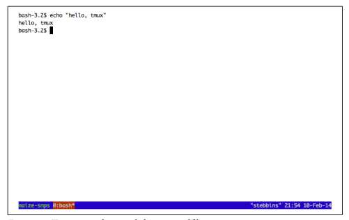

## 第四章、使用远程机器

&emsp;&emsp;生物信息学中的大多数数据处理任务需要比我们在工作站上更多的计算能力，这意味着我们必须使用大型服务器或计算集群。对于一些生物信息学项目，您可能主要通过与远程机器的网络连接进行工作。不出所料，使用远程机器对初学者来说是相当令人沮丧的，并且会阻碍有经验的生物信息学家的生产力。在本章中，我们将学习如何尽可能轻松地使用远程计算机，以便您可以将时间和精力集中在项目本身上。

## 使用SSH连接到远程计算机
       
&emsp;&emsp;通过网络连接到另一台机器的方法有很多，但到目前为止最常见的是通过安全shell(SSH)。我们使用SSH是因为它是加密的(这使得发送密码、编辑私有文件等都是安全的)，并且因为它在每个Unix系统上。服务器、SSH和用户帐户的配置方式由您或您的系统管理员决定；本章不涉及这些系统管理主题。本节涵盖的材料应该可以帮助您回答系统管理员可能会问的常见SSH问题(例如，“您有SSH公钥吗？”)。您还将学习作为生物信息学家将SSH导入远程机器所需的所有基础知识。

&emsp;&emsp;要初始化到主机的SSH连接(在本例中为Biocluster.myUniversisity.edu)，我们使用ssh命令：
```shell
$ ssh biocluster.myuniversity.eduPassword: (1)
Last login: Sun Aug 11 11:57:59 2013 from fisher.myisp.com
wsobchak@biocluster.myuniversity.edu$ (2)
```

(1)当使用SSH连接到远程主机时，系统会提示您输入远程用户帐户的密码。

(2)使用密码登录后，您将在远程主机上获得shell提示符。这允许您在远程主机上执行命令，就像在本地执行命令一样。
       
&emsp;&emsp;SSH也可以使用IP地址-例如，您可以使用ssh 192.169.237.42连接到机器。如果您的服务器使用与默认端口(端口22)不同的端口，或者您在远程计算机上的用户名与您的本地用户名不同，则需要在连接时指定以下详细信息：

```shell       
$ ssh -p 50453 cdarwin@biocluster.myuniversity.edu
```
        
&emsp;&emsp;在这里，我们使用语法user@domain指定了带有标志-p和用户名的端口。如果无法连接到主机，使用ssh-v(-v代表verbose)可以帮助您发现问题。您可以通过使用-vv或-vvv来增加详细程度；有关更多详细信息，请参阅man ssh。

​​存储频繁的SSH主机

    生物信息学家必须不断地SSH到服务器，并且键入IP地址或长域名可能变得非常单调乏味。记住和输入额外的细节，如远程服务器的端口或远程用户名，也是一件繁重的事情。SSH背后的开发人员创建了一个聪明的替代方案：SSH配置文件。SSH配置文件存储有关您经常连接的主机的详细信息。这个文件很容易创建，存储在这个文件中的主机不仅可以使用ssh，还可以使用我们将在第6章中学习的两个程序：scp和rsync。
       
    要创建文件，只需在~/.ssh/confg处创建并编辑文件。每个条目采用以下形式：

    ```shell
    Host bio_serv HostName 192.168.237.42
    User cdarwin
    Port 50453
    ```
    您不需要指定Port和User，除非它们与远程主机的默认值不同。保存此文件后，您可以使用别名ssh bio_serv通过ssh进入192.168.236.42，而不是键入ssh-p 50453 cdarwin@192.169.237.42。
        
&emsp;&emsp;如果您在许多终端选项卡中使用许多远程机器连接，那么有时确保您正在您认为的主机上工作是很有用的。您始终可以使用命令

```shell
hostname访问主机名：
$ hostnamebiocluster.myuniversity.edu
```       
       
&emsp;&emsp;同样，如果您在一台服务器上维护多个帐户(例如，一个用于分析的用户帐户和一个用于sysadmin任务的更强大的管理帐户)，那么检查您正在使用的帐户是非常有用的。命令whoami返回您的用户名：
```shell
$ whoamicdarwin
```
       
&emsp;&emsp;如果您偶尔使用具有更多权限的管理员帐户登录，则这一点特别有用-在具有管理员权限的帐户上犯错误的潜在风险要高得多，所以当您使用此帐户时，您应该始终离开(并尽可能减少这一时间)。

## 使用SSH密钥进行快速身份验证
       
&emsp;&emsp;SSH要求您为远程计算机上的帐户键入密码。但是，每次登录时输入密码可能会变得单调乏味，而且并不总是安全的(例如，可以监视键盘输入)。更安全、更简单的替代方法是使用SSH公钥。公钥密码学是一项令人着迷的技术，但细节超出了本书的范围。要使用SSH密钥在没有密码的情况下登录到远程机器，我们首先需要生成一个公钥/私钥对。我们使用命令ssh-keygen完成此操作。注意公钥和私钥之间的区别非常重要：您可以将公钥分发给其他服务器，但私钥必须保持安全可靠，绝不能共享。

&emsp;&emsp;让我们使用ssh-keygen生成SSH密钥对：

```shell
$ ssh-keygen -b 2048Generating public/private rsa key pair.
Enter file in which to save the key (/Users/username/.ssh/id_rsa):
Enter passphrase (empty for no passphrase):
Enter same passphrase again:
Your identification has been saved in /Users/username/.ssh/id_rsa.
Your public key has been saved in /Users/username/.ssh/id_rsa.pub.
The key fingerprint is:
e1:1e:3d:01:e1:a3:ed:2b:6b:fe:c1:8e:73:7f:1f:f0
The key's randomart image is:
+--[ RSA 2048]----+
|.o... ... |
| . . o |
| . * |
| . o + |
| . S . |
| o . E |
| + . |
|oo+.. . . |
|+=oo... o. |
+-----------------+
```
      
&emsp;&emsp;将在~/.ssh/id_rsa创建私钥，在~/.ssh/id_rsa.pub创建公钥。ssh-keygen为您提供了使用空密码的选项，但通常建议您使用真正的密码。如果你想知道，ssh-keygen创建的随机艺术是验证你的密钥的一种方式(如果你好奇的话，在man ssh中有更多关于这方面的细节)。
      
&emsp;&emsp;要使用SSH密钥进行无密码身份验证，请首先使用SSH到远程主机，然后使用密码登录。将目录更改为~/.ssh，并附加公钥文件的内容(id_rsa.pub，而不是私钥！)到~/.ssh/authorize_keys (请注意，~可以扩展为/home/username或/users/username，具体取决于远程操作系统)。您可以通过从本地系统复制公钥并将其粘贴到远程系统上的~/.ssh/authorize_keys文件来附加此文件。有些系统有一个ssh-copy-id命令，可以自动为您执行此操作。
      
&emsp;&emsp;再次强调，确保您使用的是公钥，而不是私钥。如果您的私钥被意外分发，这会危及您在其上设置了基于密钥的身份验证的计算机的安全性。~/.ssh/id_rsa私钥仅对创建者具有读/写权限，这些限制性权限应以这种方式保留。
      
&emsp;&emsp;将公钥添加到远程主机后，尝试登录几次。您会注意到，系统不断提示您输入SSH密钥的密码。如果你在挠头想知道这是如何节省时间的，还有一个诀窍需要知道：SSH-agent。ssh-agent程序在本地机器的后台运行，并管理SSH密钥。SSH-agent允许您使用您的密钥，而无需每次输入密码-这正是我们经常连接到服务器时所需要的。SSH代理通常已经在基于Unix的系统上运行，但如果没有，您可以使用eval ssh-agent来启动它。然后，为了告诉ssh-agent关于我们的密钥，我们使用ssh-add：
```shell
$ ssh-addEnter passphrase for /Users/username/.ssh/id_rsa:
Identity added: /Users/username/.ssh/id_rsa
```
       
&emsp;&emsp;现在，后台ssh-agent进程为我们管理我们的密钥，我们不必在每次连接到远程机器时都输入密码。我曾经计算过，我每天大约连接不同的机器16次，平均输入密码大约需要两秒钟(打字错误的原因)。如果我们假设我周末不工作，这就相当于大约8，320秒，或者一年2.3个小时的SSH连接。10年后，这相当于在仅仅连接到机器上就浪费了几乎一整天的时间。学习这些技巧可能需要一个小时左右，但在整个职业生涯中，这确实节省了时间。

## 使用nohup和tmux维护长时间运行的作业
 
&emsp;&emsp;在第3章中，我们简要讨论了在关闭终端窗口时如何终止进程(无论是在前台还是后台运行)。如果我们断开与服务器的连接，或者如果我们的网络连接暂时断开，那么进程也会终止。这种行为是有意的-您的程序将收到挂起信号(在技术上称为SIGHUP)，这在几乎所有情况下都会导致您的应用程序立即退出。因为我们在日常的生物信息学工作中经常使用远程机器，所以我们需要一种方法来防止Hangups停止长时间运行的应用程序。在程序运行时，让本地终端与远程机器的连接保持打开状态是一个脆弱的解决方案-即使是最可靠的网络也会出现短暂的中断。我们将研究两个更好的解决方案：nohup和tmux。如果您使用集群，有更好的方法来处理hangup(例如，向集群软件提交批处理作业)，但这些取决于您的特定集群配置。在这种情况下，请咨询您的系统管理员。

## nohup
       
&emsp;&emsp;nohup是执行命令并捕获从终端发送的挂起信号的简单命令。因为nohup命令正在捕获并忽略这些挂起信号，所以您正在运行的程序不会被中断。使用nohup运行命令就像在命令之前添加nohup一样简单：

```shell     
$ nohup program1 > output.txt &  (1)[1] 10900                        (2)
```

(1)我们像往常一样运行带有所有选项和参数的命令，但通过添加nohup，如果您的终端关闭或远程连接断开，此程序将不会中断。此外，就像我们在第3章中所做的那样，重定向标准输出和标准错误是一个好主意，这样您以后就可以检查输出。
(2)nohup返回进程ID号(或PID)，这是您在需要时可以监视或终止此进程的方式(在第51页的“终止进程”中有介绍)。由于当我们通过nohup运行此进程时，我们将无法访问它，因此我们终止它的唯一方法是通过其进程ID引用它。

## 通过Tmux使用远程机器
       
&emsp;&emsp;nohup的替代方案是使用终端多路复用器。除了解决挂断问题外，使用终端多路复用器还可以大大提高通过远程连接工作时的工作效率。我们将使用名为Tmux的终端多路复用器，但一个流行的替代方案是GNU screen。Tmux和Screen有类似的功能，但是Tmux更积极地开发，并且有一些额外的很好的特性。
       
&emsp;&emsp;Tmux(以及一般的终端多路复用器)允许您创建包含多个窗口的会话，每个窗口都能够运行自己的进程。Tmux的会话是持久的，这意味着通过重新连接会话可以轻松地恢复所有窗口及其进程。
       
&emsp;&emsp;当在远程机器上运行时，Tmux允许你维护一个持续的会话，如果你的连接断开或者你关闭你的终端窗口回家(甚至退出你的终端程序)，这个会话不会丢失。相反，Tmux的所有会话都可以重新连接到您当前使用的任何终端-只需SSH回到远程主机并重新连接Tmux会话即可。所有窗口将不受干扰，所有进程仍在运行。

## 安装和配置Tmux
        
&emsp;&emsp;Tmux可通过大多数包/端口管理器获得。在OSX上，Tmux可以通过Homebrew安装，在Ubuntu上可以通过apt-get安装。安装Tmux后，我强烈建议您转到GitHub上本章的目录，并将.tmux.conf文件下载到您的home目录。正如您的shell从~/.Profle或~/.bashrc加载配置一样，Tmux将从~/.tmux.conf加载其配置。.tmux.conf中的最小设置使您更容易学习Tmux，方法是在底部提供一个有用的显示栏，并将Tmux的一些键绑定更改为Tmux用户中更常见的键绑定。

## 创建、分离和附加Tmux会话
        
&emsp;&emsp;Tmux允许您有多个会话，并且在每个会话中有多个窗口。每个Tmux会话都是一个单独的环境。通常，我为我正在处理的每个不同的项目使用一个会话；例如，我可能有一个用于玉米SNP调用的会话，一个用于开发新工具的会话，另一个用于编写R代码来分析一些果蝇基因表达数据的会话。在每一个会话中，我都会有多个窗口。例如，在我的玉米SNP调用项目中，我可能打开了三个窗口：一个用于与shell交互，一个在文本编辑器中打开项目笔记本，另一个打开Unix手册页。请注意，所有这些窗口都在Tmux内；您的终端程序的选项卡和窗口的概念与Tmux的完全不同。与Tmux不同的是，您的终端不能维护持久会话。
        
&emsp;&emsp;让我们创建一个新的Tmux会话。为了使我们的示例更简单，我们将在本地机器上执行此操作。然而，要管理远程主机上的会话，我们需要在该远程主机上启动Tmux(这通常会让初学者感到困惑)。在远程主机上运行Tmux没有什么不同；我们只需SSH进入我们的主机并在那里启动Tmux。假设我们想要创建一个Tmux会话，该会话对应于前面的玉米SNP调用示例：

```shell        
$ tmux new-session -s maize-snps
```

&emsp;&emsp;tmux使用子命令；刚才显示的new-session子命令创建新会话。s选项只是为这个会话提供一个名称，以便以后更容易识别。如果您跟随，并且正确地将.tmux.conf文件放置在您的主目录中，那么您的Tmux会话应该如图4-1所示。
​​

图4-1、tmux使用provided.tmux.conf文件

&emsp;&emsp;Tmux看起来就像一个普通的shell提示，除了它在屏幕底部添加了状态栏(我们稍后会更多地讨论这一点)。当Tmux打开时，我们通过键盘快捷键与Tmux交互。这些快捷键都是基于首先按Ctrl和a，然后添加特定的键(释放Ctrl-a First)。默认情况下，Tmux使用Control-b而不是Control-a，但这是我们在.tmux.conf中所做的更改，以遵循大多数Tmux用户首选的配置。
      
&emsp;&emsp;Tmux(以及一般的终端多路复用器)最有用的特性是能够分离和重新连接会话，而不会丢失我们的工作。让我们看看这在Tmux中是如何工作的。让我们首先在空白shell中输入一些内容，以便稍后可以识别此会话：echo“hello，tmux”。要分离会话，我们使用Control-a，后跟d(用于分离)。输入此命令后，您应该会看到Tmux close，并返回到常规的shell提示符。
      
&emsp;&emsp;断开之后，我们可以看到tmux通过使用list-siession子命令调用tmux来保持会话活动：

```shell
$ tmux list-sessionsmaize-snps: 1 windows (created Mon Feb 10 00:06:00 2014) [180x41]
```
      
&emsp;&emsp;现在，让我们重新连接会话。我们使用attach-session子命令重新连接会话，但较短的连接也可以：

```shell
$ tmux attach
```
      
&emsp;&emsp;请注意，因为我们只有一个正在运行的会话(我们的maize-snps会话)，所以我们不必指定要附加哪个会话。如果有多个会话正在运行，那么当我们执行list-session时，所有的会话名称都会被列出，并且我们可以使用-t<session-name>重新附加一个特定的会话。在只运行一个Tmux会话的情况下，tmux attach等同于tmux attach-session -t maize-snps。

&emsp;&emsp;使用Tmux管理远程会话与我们之前在本地管理会话没有什么不同。唯一的区别是，我们需要先连接SSH之后在远程主机上创建会话。关闭我们的SSH连接(由于网络断开而有意或无意地关闭)将导致Tmux断开任何活动会话。

## 使用Tmux窗口
        
&emsp;&emsp;每个Tmux会话也可以包含多个窗口。当在远程机器上工作时，这特别方便。使用Tmux的windows，到远程主机的单个SSH连接可以支持不同窗口中的多个活动。Tmux还允许您在一个窗口中创建多个窗格，这些窗格允许您将窗口拆分为多个部分，但为了节省空间，我将让读者自己学习此功能。请参阅Tmux手册页(例如，man tmux)或阅读Web上许多优秀的Tmux教程之一。
        
&emsp;&emsp;像其他Tmux键序列一样，我们使用Control-a创建和切换窗口，然后使用另一个键。要创建窗口，我们使用Control-a c，并使用Control-a n和Control-a p分别转到下一个和上一个窗口。表4-1列出了最常用的Tmux键序列。查看man tmux以获得完整的列表，或者按Control-a？从Tmux会话中查找。
        
表4-1、公共Tmux键序列     
| 键名 | 作用 |
|:----|:-----|
|Control-a d|断开连接|
|Control-a c|创建新窗口|
|Control-a n|去下一个窗口|
|Control-a p|去前一个窗口|
|Control-a &|终止当前窗口(在shell中退出也可以)进程|
|Control-a ,|给当前窗口重命名|
|Control-a ?|列出所有键列表|

&emsp;&emsp;表4-2列出了最常用的Tmux子命令。

表4-2、通用Tmux子命令
|子命令 | 作用 |
|:-----|:-----|
|tmux list-sessions|列出所有会话|
|tmux new-session -s session-name|创建一个名为‘session-name’的会话|
|tmux attach-session -t session-name|连接一个名为‘session-name’的会话|
|tmux attach-session -d -t session-name|断开一个名为‘session-name’的会话然后在连接它|

&emsp;&emsp;如果使用Emacs作为文本编辑器，您很快就会注意到键绑定Control-a可能会阻碍您的工作。要输入文本Control-a(用于在Emacs或Bash shell中转到行的开头)，请使用Control-a a。
