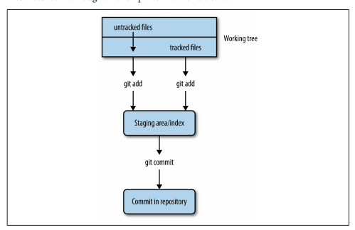
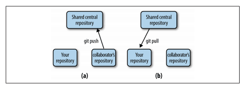

## 第五章、git科学家

&emsp;&emsp;在第2章中，我们讨论了如何组织生物信息学项目目录以及如何在开发过程中如何保持工作目录的整洁。好的项目组织结构也促进了任务的自动化，这也会使我们的工作变得更容易，并会让工作的可复现性更高。但是，随着时间的推移，我们的项目会发生变化，并且可能会加入许多合作者的工作，我们面临着另一个挑战：管理不同的文件版本。

&emsp;&emsp;很可能您已经在工作中使用了某种版本控制系统。例如，您可能有一些文件分别命名为thesis-vers1.docx, thesisvers3_CD_edits.docx,analysis-vers6.R, and thesis-vers8_CD+GM+SW_edits.docx。存储这些过去的版本，可以在我们需要时返回并还原整个或部分文件。文件版本还可以帮助我们区分我们的文件副本与协作者编辑的副本。然而，这种特殊的文件版本控制系统不能很好地适应复杂的生物信息学项目-我们原本整洁的项目目录会被不同版本的脚本、R分析、自述文件和论文搞得一团糟。

&emsp;&emsp;只有当我们协同工作时，项目组织才会变得更加复杂。我们可以通过Dropbox或Google Drive等服务与同事共享我们的整个目录，但这样做也会让我们的项目有被删除或损坏的风险。也不可能将整个生物信息学项目目录放到共享目录中，因为它可能包含千兆字节(或更多)的数据，这些数据可能太大而无法在网络上共享。这些工具对于共享小文件很有用，但不适用于管理涉及更改代码和数据的大型协作项目。

&emsp;&emsp;幸运的是，软件工程师在现代协同软件开发中遇到了同样的问题，并开发了版本控制系统(VCS)来管理协作编辑的代码的不同版本。我们将在本章中使用的VCS是由Linus Torvalds编写的，名为Git。Linus编写Git来管理Linux内核(他也是这样写的)，这是一个庞大的代码库，有数千个协作者同时更改和处理文件。正如您所想象的那样，Git非常适合于多人协同工作的项目版本控制管理。

&emsp;&emsp;诚然，Git一开始学习起来可能很棘手。我强烈建议您在本章中花时间学习Git，但请注意，理解Git(就像本书中的大多数主题，以及可以说是生活中的一切)需要时间进行练习。在本章中，我将指出某些特备重要的章节；您可以稍后重新访问这些章节，而不会出现与本书其余部分的连续性问题。此外，我建议您使用本书中的示例项目和代码来练习使用Git，以便在您的脑海中形成基本的使用习惯。在一开始与Git抗争之后，您很快就会发现它是最好的版本控制系统。

## 为什么Git在生物信息学项目中是必备的
       
&emsp;&emsp;作为Git的长期支持者，我已经向许多同事提出了这个建议，并提出要教他们一些基础知识。在大多数情况下，我发现最困难的部分实际上是说服科学家在他们的工作中应该采用版本控制。因为你可能想知道读完这一章是否值得，我想讨论一下为什么学习Git绝对值得付出努力。如果你已经100%相信了，你可以在下一节开始学习Git。
## Git允许您保留项目的快照
      
&emsp;&emsp;使用版本控制系统，您可以在开发过程中的特定时间点创建当前项目的快照。如果出现任何错误，您可以倒带到项目状态的过去快照(称为Commit)并恢复文件。在生物信息学工作的快节奏中，有这个保障是非常有用的。
      
&emsp;&emsp;Git还有助于修复一种令人沮丧的bug类型，即所谓的软件回归，即一段曾经正常工作的代码神秘地停止工作或给出不同的结果。例如，假设您正在对SNP数据进行分析。在你的分析中，你发现14%的SNP落在染色体的一条延伸中的编码区。这与你的项目相关，所以你在论文中引用这个百分比并做出承诺。
      
&emsp;&emsp;两个月后，你已经忘记了这个分析的细节，但是需要重新审视14%的统计数据。让您大吃一惊的是，当您重新运行分析代码时，这将更改为26%！如果您一直通过提交(例如，拍摄快照)来跟踪项目的开发，那么您将拥有项目所有更改的完整历史，并且可以准确地确定结果何时发生更改。
      
&emsp;&emsp;Git提交允许您轻松地复制和回滚到分析的过去版本。还可以轻松查看每个提交，何时提交，在提交之间发生了什么变化，甚至比较任何两个提交之间的差异。Git可以为您提供跨版本的逐行代码差异，而不是重做几个月的工作来查找bug。
      
&emsp;&emsp;除了简化bug查找之外，Git是正确文档的重要组成部分。当您的代码产生结果时，为了可重复性，此版本的代码必须有完整的文档记录。我的朋友兼同事迈克·科文顿(Mike Covington)打了一个很好的比喻：想象你用铅笔保存着一个实验室笔记本，每次你运行一次新的PCR，你都会抹去过去的结果，并记下最新的结果。这听起来可能很极端，但在功能上与更改代码和不记录过去的版本没有什么不同。

## Git帮助您跟踪对代码的重要更改
      
&emsp;&emsp;随着新功能的增加或bug的修复，大多数软件都会随着时间的推移而发生变化。在科学计算中，跟踪我们使用的软件的开发是很重要的，因为一个固定的bug可能意味着在我们自己的工作中正确和不正确的结果之间的区别。Git在帮助您跟踪代码更改方面非常有帮助-要了解这一点，让我们来看看我遇到的一个情况(我怀疑世界各地的实验室都会发生这种情况)。
      
&emsp;&emsp;假设一个实验室有一位聪明的生物信息学家，他写了一个脚本，从阅读中剔除质量不好的区域。这个生物信息学家然后把这个分发给他实验室的所有成员。他实验室的两名成员将其发送给其他实验室的朋友。大约一个月后，聪明的生物信息学家意识到在某些情况下存在导致错误结果的错误。生物信息学家迅速向实验室中的每个人发送新版本的电子邮件，并警告他们可能出现不正确的结果。不幸的是，其他实验室的成员可能没有收到消息，可能会继续使用较旧的存在Bug版本的脚本。
      
&emsp;&emsp;Git帮助解决了这个问题，因为它可以轻松地与软件开发保持同步。使用Git，可以轻松地跟踪软件更改和下载新的软件版本。此外，像GitHub和Bitbucket这样的服务在Web上托管Git存储库，这使得跨实验室的代码共享和协作变得很容易。

## Git有助项目在开发人员离开后保持软件的组织性和可用性
      
&emsp;&emsp;想象一下另一种情况：博士后开始自己的实验室，而她所有不同的软件工具和脚本都分散在不同的目录中，或者更糟，完全丢失了。无序的代码给其他实验室成员带来不便；丢失的代码导致无法复制的结果，并可能延误未来的研究。
      
&emsp;&emsp;Git有助于保持工作的连续性和项目历史的完整记录。将整个项目集中到存储库中可以使其保持组织。Git会存储每个提交的更改，因此即使主要开发人员离开，也不会出现问题，也可以获得项目的整个历史记录。由于能够回滚到以前的版本，修改项目的风险更小，从而更容易在现有工作的基础上进行构建。
## 安装git
        
&emsp;&emsp;如果您在OS X上，请通过Homebrew安装Git(例如，BREW install git)；在Linux上，使用apt-get(例如apt-get install git)。如果您的系统没有包管理器，则[Git网站](https://git-scm.com/)有Git的源代码和可执行版本可以下载。

## 基于Git：创建存储库、跟踪文件以及分段和提交更改
       
&emsp;&emsp;现在我们已经了解了一些Git概念以及Git如何适应您的生物信息学工作流程，让我们来探索最基本的Git概念，即创建存储库，告诉Git要跟踪哪些文件，以及暂存和提交更改。

## Git设置：告诉Git你是谁
       
&emsp;&emsp;因为Git是用来帮助协同编辑文件的，所以你需要告诉Git你是谁，你的电子邮件地址是什么。为此，请使用下面命令进行设置：
```shell
$ git config --global user.name "Sewall Wright"$ git config --global user.email "swright@adaptivelandscape.org"
```
       
&emsp;&emsp;确保使用自己的姓名和电子邮件，或课程。我们通过子命令与Git进行交互，子命令的格式为git<subcommand>。Git有很多子命令，但是你在日常工作中只需要几个。
       
&emsp;&emsp;现在启用的另一个有用的Git设置是终端颜色。Git的许多子命令使用终端颜色来直观地指示更改(例如，红色表示删除，绿色表示新的或修改的内容)。我们可以通过以下方式实现这一点：

```shell
$ git config --global color.ui true
```

## git init和git clone：创建存储库
       
&emsp;&emsp;要开始使用Git，我们首先需要将目录初始化为Git存储库。存储库是受版本控制的目录。它包含您当前的工作文件和项目在特定时间点的快照。在版本控制术语中，这些快照称为提交。使用Git从根本上讲就是创建和操作这些提交：创建提交，查看过去的提交，共享提交，以及比较不同的提交。
       
&emsp;&emsp;使用Git，有两种创建存储库的主要方法：从现有目录初始化一个存储库，或者克隆存在于其他地方的存储库。无论采用哪种方式，结果都是Git将其视为存储库的目录。Git只管理存储库目录内的文件和子目录-它不能管理存储库之外的文件。
       
&emsp;&emsp;让我们首先将我们在第2章中创建的zmays-snps/project目录初始化为Git存储库。切换到zmays-snps/目录并使用Git子命令git init：

```shell      
$ git initInitialized empty Git repository in  /Users/vinceb/Projects/zmays-snps/.git/
```
      
&emsp;&emsp;git init在zmays-snps/project目录中创建一个名为.git/的隐藏目录(可以使用ls-a查看它)。这个.git/目录是Git在后台管理存储库的方式。但是，不要修改或删除此目录中的任何内容-它只能由Git操作。相反，我们通过git init等Git子命令与存储库进行交互。
      
&emsp;&emsp;创建存储库的另一种方法是克隆现有存储库。您可以从任何地方克隆存储库：文件系统上的其他位置，从本地网络，或通过Internet。现在，有了像GitHub和Bitbucket这样的存储库托管服务，从Web上克隆Git存储库是最常见的。
      
&emsp;&emsp;让我们练习从GitHub克隆存储库。对于本例，我们将从Heng Li的GitHub页面克隆Seqtk代码。Seqtk是Sequence Toolkit的缩写，它包含一组编写良好且有用的工具，用于处理FASTQ和FASTA文件。首先，访问[GitHub存储库](https://github.com/lh3/seqtk)并查看一下。所有GitHub的存储库都有以下URL语法：user/repository。注意在这个存储库的页面上，右边的克隆URL-这是你可以复制链接来克隆这个存储库的地方。
      
&emsp;&emsp;现在，让我们切换到zmays-snps/之外的目录。无论您选择哪个目录都可以；我使用~/src/目录来克隆和编译其他开发人员的工具。从此目录运行：

```shell      
$ git clone git://github.com/lh3/seqtk.gitCloning into 'seqtk'...
remote: Counting objects: 92, done.
remote: Compressing objects: 100% (47/47), done.
remote: Total 92 (delta 56), reused 80 (delta 44)
Receiving objects: 100% (92/92), 32.58 KiB, done.
Resolving deltas: 100% (56/56), done.
```

&emsp;&emsp;git clone将seqtk克隆到您的本地目录，镜像GitHub上的原始存储库。请注意，您将无法直接修改 Heng Li的原始GitHub存储库-克隆此存储库仅允许您在发布新更新时从GitHub存储库中检索更新。
       
&emsp;&emsp;现在，如果您cd进入seqtk/并运行ls，您将看到seqtk的源代码：
```shell      
$ cd seqtk$ ls
Makefile README.md khash.h kseq.h seqtk.c
```       
&emsp;&emsp;尽管通过不同的方法发起，但是zmays-SNPs/和seqtk/都是Git存储库。

## Git中的文件跟踪：第一部分Git Add和Git状态
      
&emsp;&emsp;尽管您已经将zmays-snps/初始化为Git存储库，但Git不会自动开始跟踪此目录中的每个文件。相反，您需要使用子命令git add告诉Git要跟踪哪些文件。这实际上是Git的一个有用特性-生物信息学项目包含许多我们不想跟踪的文件，包括大型数据文件、中间结果或任何可以通过重新运行命令轻松重新生成的文件。
      
&emsp;&emsp;在跟踪文件之前，让我们使用git status命令检查存储库中文件的Git状态(如果您在其他位置，请切换到zmays-snps/目录)：

```shell
$ git status# On branch master (1)
# Initial commit
# Untracked files: (2)
# (use "git add &lt;file&gt;..." to include in what will be committed)
#
# README
# data/
nothing added to commit but untracked files present (use "git add" to track)
```

Git状态告诉我们：

(1)我们在master分支上，这是默认的Git分支。分支允许您同时处理项目的不同版本并在不同版本之间切换，Git简单而强大的分支是它成为如此流行的版本控制系统的主要原因。我们现在只使用Git的默认主分支，但是我们将在本章的后面学习更多关于分支的信息

(2)我们有一个“未跟踪的文件”列表，其中包括根项目目录中的所有内容。因为我们还没有告诉Git跟踪任何东西，所以如果我们尝试的话，Git没有任何东西需要提交。
      
&emsp;&emsp;git status是最常用的Git命令之一，所以 很容易手动获得Git状态。Git status描述了项目存储库的当前状态：哪些已更改，哪些已准备好包含在下一次提交中，以及哪些未被跟踪。我们将在本章的其余部分中广泛使用它。
      
&emsp;&emsp;让我们使用git add告诉Git跟踪zmays-snps/目录中的README和data/README文件：
```shell      
$ git add README data/README
```
        
&emsp;&emsp;现在，Git正在跟踪data/README和README文件。我们可以通过再次运行git status来验证这一点：
```shell
$ lsREADME analysis data scripts
$ git status
# On branch master
#
# Initial commit
#
# Changes to be committed:
# (use "git rm --cached &lt;file&gt;..." to unstage)
#
# new file: README  (1)
# new file: data/README
#
# Untracked files:
# (use "git add &lt;file&gt;..." to include in what will be committed)
#
# data/seqs/    (2)
```
(1)现在请注意Git在“要提交的更改”一节中,是如何将readme和data/readme作为新文件列出的。如果我们现在进行提交，我们的提交将拍摄这些文件的准确版本的快照，就像我们使用git add添加它们时一样。

(2)还有像data/seqs/这样的未跟踪目录，因为我们还没有告诉Git跟踪这些目录。但是，git status会提醒我们可以使用git add将这些添加到commit中。

&emsp;&emsp;scripts/ 和analysis/目录是空的，所以他们不包括在git状态中。因为data/seqs/目录中包含我们在第2章中使用touch创建的空序列文件，所以这个目录被列出在git状态中。

## Git中的暂存文件：第二部分git add和git status
       
&emsp;&emsp;使用Git，跟踪的文件和准备包含在下一次提交中的文件之间是不同的。这是一个微妙的差异，并且经常会给初学者带来很多困惑。被跟踪的文件意味着Git知道它。暂存的文件不仅会被跟踪，而且其最新的更改也会被暂存以包含在下一次提交中(参见图5-1)。
       
       ​​
图5-1、Git将工作树(存储库中的所有文件)、暂存区域(要包含在下一次提交中的文件)和提交的更改(某个时间点上项目版本的快照)分离；git add on a untracted file开始跟踪它并暂存它，而git add on a tracked file只为下一次提交暂存它

&emsp;&emsp;说明差异的一个好方法是考虑一下当我们更改一个我们开始使用git add跟踪的文件时会发生什么。对跟踪文件所做的更改不会自动包含在下一次提交中。要包含这些新的更改，我们需要显式地存放它们-再次使用git add。混淆的部分原因在于git add既可以跟踪新文件，也可以暂存对跟踪文件所做的更改。让我们通过一个例子来更清楚地说明这一点。
      
&emsp;&emsp;从上一节的git status输出中，我们看到data/readme和readme文件都准备好提交了。但是，看看当我们对这些跟踪文件之一进行更改，然后调用git status时会发生什么：
```shell
$ echo "Zea Mays SNP Calling Project" &gt;&gt; README # change file README$ git status
# On branch master
#
# Initial commit
#
# Changes to be committed:
# (use "git rm --cached &lt;file&gt;..." to unstage)
#
# new file: README
# new file: data/README
#
# Changes not staged for commit:
# (use "git add &lt;file&gt;..." to update what will be committed)
# (use "git checkout -- &lt;file&gt;..." to discard changes in working directory)
# modified: README
#
# Untracked files:
# (use "git add &lt;file&gt;..." to include in what will be committed)
#
# data/seqs/
```
       
&emsp;&emsp;修改README文件后，git状态会在“未暂存用于提交的更改”下列出README文件。这是因为自从最初使用git add跟踪和暂存README文件以来，我们对此文件进行了更改(第一次跟踪文件时，其当前版本也会被暂存)。如果我们现在进行提交，我们的提交将包括以前版本的README文件，而不是这个新修改的版本。
       
&emsp;&emsp;为了在下一次提交中将这些最近的修改添加到README中，我们使用git add进行暂存文件。在进行这步操作之后，看看git status返回了什么：
```shell
$ git add README$ git status
# On branch master
#
# Initial commit
#
# Changes to be committed:
# (use "git rm --cached &lt;file&gt;..." to unstage)
#
# new file: README
# new file: data/README
#
# Untracked files:
# (use "git add &lt;file&gt;..." to include in what will be committed)
#
# data/seqs/
# notebook.md
```
&emsp;&emsp;现在，README文件再次列在“要提交的更改”下，因为我们已经使用git add暂存了这些更改。我们的下一次提交将包括最新的版本。
      
&emsp;&emsp;再说一次，如果你觉得这令人困惑，请不要烦恼。差别是微妙的，我们使用git add进行这两个操作是没有帮助的。记住git add的两个角色：

1.	提醒Git开始跟踪未跟踪的文件(这也会将文件的当前版本包括在下一次提交中)
2.	暂存对已跟踪的文件所做的更改(已暂存的更改将包括在下一次提交中)

&emsp;&emsp;重要的是要知道，自上次登台以来对文件所做的任何修改都不会包含在下一次提交中，除非使用git add进行暂存。这个额外的步骤看起来可能会带来不便，但实际上有很多好处。假设您对项目中的许多文件进行了更改。其中两个文件的更改已经完成，但其他的一切都还没有完全准备好。使用Git的Staging，您可以仅暂存和提交这两个完整的文件，并将其他不完整的文件排除在提交之外。通过计划的暂存，您的提交可以反映开发中有意义的点，而不是整个项目目录的随机快照(这可能包括许多处于混乱状态的文件)。当我们在下一节学习提交时，我们将看到一个存放和提交所有修改的文件的快捷方式。

## Git Commit：创建项目快照
      
&emsp;&emsp;我们已经谈了很多关于提交的内容，但实际上还没有做过。当第一次学习Git时，进行提交的最棘手的部分是理解暂存。实际上，提交暂存的提交非常简单：
```shell
$ git commit -m "initial import" 2 files changed, 1 insertion(+)
 create mode 100644 README
 create mode 100644 data/README
 ```
       
&emsp;&emsp;此命令使用提交消息“初始导入”将暂存的更改提交到存储库。提交消息是对您的合作者(以及您将来的自己)关于特定提交包含的内容的注释。或者，您可以省略-m选项，Git将打开默认的文本编辑器。如果您更喜欢在文本编辑器中编写提交消息(如果它们是多行消息，则非常有用)，您可以使用以下命令更改Git使用的默认编辑器：

```shell       
$ git config --global core.editor emacs
```
          
&emsp;&emsp;其中emacs可以替换为vim(默认编辑器)或您选择的其他文本编辑器。
关于提交消息的一些建议
    
    提交消息看起来可能会带来不便，但对提交如何更改代码以及影响什么功能进行描述将会在对将来在查看代码带来便利。三个月后，当你需要弄清楚为什么你的SNP调用分析会返回意外的结果时，如果它们有像“修改SNP频率函数来修复单例bug，重构覆盖率计算”这样的消息而不是“cont”(这是我在公共项目中见过的实际提交)，那么找到相关的提交就会容易得多。有关这方面的有趣信息，请参阅[xkcd的“Git Commit”漫画](https://xkcd.com/1296/)。

&emsp;&emsp;早些时候，我们使用git add来暂存我们的更改。因为程序员喜欢快捷方式，所以有一种简单的方法可以存放所有跟踪文件的更改，并在一个命令中提交它们：git commit-a-m“your commit message”。选项-a告诉git commit在这个commit中自动存放所有修改过的跟踪文件。请注意，虽然这样可以节省时间，但它也会在此提交中抛出对跟踪文件的所有更改。理想情况下，提交应该反映项目开发的有用快照，因此包含每个稍有更改的文件可能会让您稍后查看存储库的历史记录时感到困惑。相反，应该频繁提交与项目的离散更改相对应的内容，如“添加了新的计数功能”或“修复了导致不正确翻译的bug”。
        
&emsp;&emsp;我们已经在提交中包含了所有更改，因此我们的工作目录现在是“干净的”：没有跟踪的文件与上次提交中的版本不同。在我们进行修改之前，git status表示没有需要提交的内容：
```shell
$ git status# On branch master
# Untracked files:
# (use "git add &lt;file&gt;..." to include in what will be committed)
#
# data/seqs/
```
       
&emsp;&emsp;未跟踪的文件和目录仍将保持未跟踪状态(例如，data/seqs/)，并且对跟踪文件的任何未暂存更改将不会包括在下一次提交中，除非添加。有时包含未暂存更改的工作目录称为“messy"，但这不是问题。

## 查看文件更改:git diff
        
&emsp;&emsp;到目前为止，我们已经看到了帮助您在存储库中暂存和提交更改所需的Git工具。我们已经使用git status子命令来查看哪些文件被跟踪，哪些文件有更改，哪些文件被暂存用于下一次提交。另一个子命令在这个过程中非常有用：git diff。
        
&emsp;&emsp;在没有任何参数的情况下，git diff向您显示工作目录中的文件与已暂存的文件之间的差异。如果您的更改都没有准备好，git diff会向我们显示您上次提交的文件和当前版本的文件之间的区别。例如，如果我向readme.md添加一行并运行git diff：
```shell        
$ echo "Project started 2013-01-03" &gt;&gt; README$ git diff
diff --git a/README b/README
index 5483cfd..ba8d7fc 100644
--- a/README  (1)
+++ b/README
@@ -1 +1,2 @@  (2)
 Zea Mays SNP Calling Project
+Project started 2013-01-03   (3)
```
       
&emsp;&emsp;这种格式(称为Unifed dif)一开始可能看起来有点神秘。当启用Git的终端颜色时，Git diff的输出更易于阅读，因为添加的行将为绿色，删除的行将为红色。
       
(1)这一行(以及后面的一行)表示我们正在比较的README文件有两个版本a和b。---表示在我们的例子中原始文件，是上次提交的文件。+++表示更改的版本。

(2)这表示改变的块的开始(块是diff对大的改变的块的术语)，并且指示改变从哪一行开始，以及它们有多长。不同尝试将您的更改分解为大块，以便您可以轻松地识别已更改的部分。如果你对细节感兴趣，请查看[维基百科关于diff实用程序的页面](https://en.wikipedia.org/wiki/Diff)。

(3)这是变化的实质。行之前的空格(例如，Zea Mays…开头的行。表示没有任何更改(只提供上下文)。加号表示行添加(例如，开始项目…的行)。负号表示行删除(此差异中未显示，因为我们只添加了一行)。对行的更改表示为删除原始行和添加新行。

&emsp;&emsp;在我们暂存文件之后，git diff不会显示任何更改，因为git diff会将工作目录中的文件版本与上次暂存的版本进行比较。例如：
```shell
$ git add README$ git diff # shows nothing
```
       
&emsp;&emsp;如果我们想要将已暂存的内容与上一次提交进行比较(这将显示下一次提交的确切内容)，我们可以使用git diff-stated(在Git的旧版本中，这不起作用，所以如果不起作用，则升级)。事实上，我们可以看到我们刚刚上演的变化：

```shell       
$ git diff --stageddiff --git a/README b/README
index 5483cfd..ba8d7fc 100644
--- a/README
+++ b/README
@@ -1 +1,2 @@
 Zea Mays SNP Calling Project
+Project started 2013-01-03
```

&emsp;&emsp;Git diff还可以用于比较Git提交历史中的任意对象，这个主题我们将在第100页的“More Git diff：Comparing Comments and Files”中看到。

## 查看历史提交记录:git log
        
&emsp;&emsp;提交类似于链(更严格地说，是有向无环图)，每个提交都指向其父对象(如图5-2所示)。
        ​​
图5-2、Git中的提交在某个时间点获取项目的离散快照，并且每个提交(第一个除外)都指向其父提交；这个提交链是您的一组连接的快照，这些快照显示了项目存储库是如何发展的。
    
&emsp;&emsp;我们可以使用git log来可视化我们的提交链：
```shell    
$ git logcommit 3d7ffa6f0276e607dcd94e18d26d21de2d96a460   (1)
Author: Vince Buffalo &lt;vsbuffaloAAAAAA@gmail.com&gt;
Date: Mon Sep 23 23:55:08 2013 -0700
initial import
```
(1)这个奇怪的数字和字符的组合是SHA-1校验和。每个提交都会有其中一个，它们将取决于存储库过去的提交历史记录和当前文件。sha-1散列充当存储库中每个提交的唯一ID。您总是可以通过SHA-1散列来引用COMMIT。

​​Git日志和终端界面

    git log在默认终端界面中打开存储库的历史记录(通常程序或多或少)。如果你不是很熟悉寻呼机，不要烦恼。要退出并返回到提示，请按字母q。按空格键可以向前移动，按b可以向后移动。我们将在第7章中更详细地介绍。

&emsp;&emsp;让我们提交上一节中所做的更改：
```shell
$ git commit -a -m "added information about project to README"[master 94e2365] added information about project to README
 1 file changed, 1 insertion(+)
 ```

&emsp;&emsp;现在，如果我们使用git log查看提交历史，我们可以看到：

```shell
$ git logcommit 94e2365dd66701a35629d29173d640fdae32fa5c
Author: Vince Buffalo <vsbuffaloAAAAAA@gmail.com&gt>
Date: Tue Sep 24 00:02:11 2013 -0700
 added information about project to README
commit 3d7ffa6f0276e607dcd94e18d26d21de2d96a460
Author: Vince Buffalo <vsbuffaloAAAAAA@gmail.com>
Date: Mon Sep 23 23:55:08 2013 -0700
 initial import
 ```
      
&emsp;&emsp;当我们继续对存储库进行更改并提交更改时，这个提交链将会增长。如果您想看到一个更长的Git历史的好例子，将目录更改到我们之前克隆的seqtk存储库，并调用git log。

## 移动和删除文件：git mv and git rm
      
&emsp;&emsp;当Git跟踪你的文件时，它想要负责。使用mv命令移动跟踪的文件会使Git混淆。使用rm删除文件时也是如此。要在Git中移动或删除跟踪文件，我们需要使用Git的mv和rm版本：git mv和git rm。
      
&emsp;&emsp;例如，我们的README文件没有扩展名。这不是一个很严重的问题，但是因为README文件稍后可能包含Markdown，所以最好将其扩展名更改为.md。您可以使用git mv执行此操作：
```shell
$ git mv README README.md$ git mv data/README data/README.md
```
       
&emsp;&emsp;与所有更改一样，只有在提交后才会将其存储在存储库中。如果您列出了您的文件，您可以看到您的工作副本已被重命名：
```shell
$ lsREADME.md analysis data notebook.md scripts
```
     
&emsp;&emsp;使用git status，我们看到此更改已暂存，可以提交：
```shell
$ git status# On branch master
# Changes to be committed:
# (use "git reset HEAD &lt;file&gt;..." to unstage)
#
# renamed: README -&gt; README.md
# renamed: data/README -&gt; data/README.md
#
# Untracked files:
# (use "git add &lt;file&gt;..." to include in what will be committed)
#
# data/seqs/
```
       
&emsp;&emsp;git mv已经为我们暂存了这些提交；git add只用于暂存对文件内容的修改，而不是移动或删除文件。让我们提交这些更改：
```shell
$ git commit -m "added markdown extensions to README files"[master e4feb22] added markdown extensions to README files
 2 files changed, 0 insertions(+), 0 deletions(-)
 rename README =&gt; README.md (100%)
 rename data/{README =&gt; README.md} (100%)
 ```
       
&emsp;&emsp;请注意，即使您更改或删除文件并提交，它仍然存在于过去的快照中。Git尽其所能使一切都可回收。我们将在本章后面的部分中了解如何恢复文件。

## 告诉git应该忽略什么：gitignore
      
&emsp;&emsp;您可能已经注意到，git status一直在列出哪些文件没有被跟踪。随着您的生物信息学项目中的文件数量开始增加(这种情况发生得很快！)。这份长长的清单将成为一种负担。
      
&emsp;&emsp;这个未跟踪列表中的许多项目可能是我们永远不想提交的文件。排序数据文件是一个很好的例子：它们通常太大而不能包含在存储库中。如果我们要提交这些大文件，克隆您的存储库的合作者将不得不下载这些巨大的数据文件。我们稍后会讨论其他管理这些的方法，但是现在，让我们忽略它们。
      
&emsp;&emsp;假设我们希望忽略data/seqs/目录中的所有FASTQ文件(扩展名为.fast)。为此，请在zmays-snps/repository目录中创建并编辑文件.gitignore，并添加：
```shell
data/seqs/*.fast
```
&emsp;&emsp;现在，git status列出:
```shell
$ git status# On branch master
# Untracked files:
# (use "git add &lt;file&gt;..." to include in what will be committed)
#
# .gitignore
```
      
&emsp;&emsp;似乎我们已经摆脱了一个烦恼(“untracked files”中的data/seqs/目录)，但是添加了另一个(新的.gitignore)文件。实际上，解决这个问题的最好方法是添加并提交.gitignore文件。将文件贡献给仅仅是为了告诉Git要忽略什么的项目，这似乎是违反直觉的。然而，这是一个很好的解决办法；它可以避免合作者看到Git应该忽略的未跟踪文件的列表。让我们继续并暂存.gitignore文件，并提交之前所做的文件名更改：
```shell
$ git add .gitignore$ git commit -m "added .gitignore"
[master c509f63] added .gitignore
 1 file changed, 1 insertion(+)
 create mode 100644 .gitignore
 ```

&emsp;&emsp;我们应该告诉.gitignore忽略什么？在生物信息学项目中，以下是一些指南：

*大型文件*
      
&emsp;&emsp;这些应该被忽略并通过其他方式进行管理，因为Git不是为管理真正大的文件而设计的。大型文件会减慢创建、推送和拉取提交的速度。这可能会在协作者克隆您的存储库时造成相当大的负担。

*中间文件*
      
&emsp;&emsp;生物信息学项目往往充满了中间文件。例如，如果将读数与基因组对齐，这将创建SAM或BAM文件。即使这些不是大文件，也应该忽略这些文件。如果通过重新运行命令(或者更好的是脚本)可以很容易地再现数据文件，那么通常更好的做法是只存储它是如何创建的。最终，记录和存储如何在Git中创建中间文件比实际文件更重要。这也确保了再现性。

*文本编辑器临时文件*

&emsp;&emsp;像Emacs和Vim这样的文本编辑器有时会在您的目录中创建临时文件。这些可能看起来像textfle.txt~或#textfle.txt#。将这些内容存储在Git中是没有意义的，在查看具有Git状态的进度时，它们可能会很烦人。应始终将这些文件添加到.gitignore中。幸运的是，.gitignore使用通配符，因此可以使用*~和\#*\#这样的条目忽略这些通配符。

*临时代码文件*

&emsp;&emsp;一些语言解释器(例如Python)生成临时文件(通常带有某种优化的代码)。使用Python，这些看起来像overlap.pyc。
       
&emsp;&emsp;我们可以使用全局.gitignore文件在所有项目中普遍忽略某个文件。要全局忽略的文件的优秀候选文件是我们的文本编辑器的临时文件或您的操作系统创建的文件(例如，OS X有时会在目录中创建名为.DS_Store的隐藏文件，以存储图标位置等详细信息)。GitHub维护着一个有用的[全球.gitignore建议存储库](https://github.com/github/gitignore/tree/master/Global)。
       
&emsp;&emsp;您可以在~/.gitignore_global中创建全局.gitignore文件，然后将Git配置为将其与以下内容一起使用：
```shell
git config --global core.excludesfile ~/.gitignore_global
```
    
&emsp;&emsp;存储库应存储复制项目所需的所有内容，但大型数据集和外部程序除外。这包括所有的脚本，文档，分析，甚至可能是最终的手稿。以这种方式组织存储库意味着项目的所有依赖项都在一个位置，并由Git管理。从长远来看，让Git跟踪您的项目文件要比尝试自己跟踪要容易得多。
   
## 撤消：git rreset
       
&emsp;&emsp;回想一下，Git的一个很好的特性是，您不必在提交中包含混乱的更改-只是不要暂存这些文件。如果您无意中使用git add暂存了一个混乱的文件进行提交，则可以使用git reset将其取消暂存。例如，假设您将更改添加到文件，将其暂存，但确定它尚未准备好提交：
```shell
$ echo "TODO: ask sequencing center about adapters" &gt;&gt; README.md$ git add README.md
$ git status
# On branch master
# Changes to be committed:
# (use "git reset HEAD &lt;file&gt;..." to unstage)
#
# new file: README.md
#
```
      
&emsp;&emsp;有了git status，我们可以看到对readme.md的更改将包含在下一次提交中。要取消此更改，请遵循Git Status提供的说明：
```shell      
$ git reset HEAD README.md$ git status
# On branch master
# Changes not staged for commit:
# (use "git add &lt;file&gt;..." to update what will be committed)
# (use "git checkout -- &lt;file&gt;..." to discard changes in working
directory)
#
# modified: README.md
#
```
       
&emsp;&emsp;语法看起来有点奇怪，但我们所做的只是将我们的暂存区域(Git称为索引)重置为Readme.md文件头部的版本。在Git的专业术语中，head是当前分支上最后一次提交的别名或指针(如前所述，这是默认的Git分支，称为master)。Git的reset命令是一个强大的工具，但它的默认操作是只重置您的索引。当我们学习如何使用提交历史记录时，我们将看到使用git reset的其他方法。

## git协作: git remotes, git push, and git pull
       
&emsp;&emsp;到目前为止，我们已经介绍了Git的基本知识：跟踪和处理文件，暂存更改，进行提交，以及查看提交历史记录。提交是Git的基础-它们是我们项目发展过程中的快照。提交允许您回到过去，查看、比较和恢复过去的版本，这些都是我们在本章后面讨论的主题。在本节中，我们将学习如何与Git协作，其核心就是在存储库和协作者的存储库之间共享提交。
       
&emsp;&emsp;在Git中共享提交的基础是远程存储库的概念，远程存储库只是托管在其他地方的存储库的一个版本。这可能是一个共享的部门服务器，你的同事版本的存储库，或者在一个存储库托管服务，如GitHub或Bitbucket。与Git协作首先需要我们配置本地存储库以与远程存储库协同工作。然后，我们可以从远程存储库检索提交(拉取)，并将提交发送到远程存储库(推送)。
       
&emsp;&emsp;请注意，Git作为一个分布式版本控制系统，允许您以任何您喜欢的方式使用远程存储库。这些工作台的选择取决于您和您的合作者。在本章中，我们将学习一种易于入门的常见工作流：通过共享的中央存储库进行协作。
       
&emsp;&emsp;让我们来看一个例子：假设您正在处理一个希望与同事共享的项目。您在本地存储库中启动项目。完成一些提交后，您希望通过与您的合作者共享这些提交来共享您的进度。在了解如何使用Git执行它之前，让我们逐步了解整个工作流程：
1.	您在您和您的合作者都有权访问的服务器上创建一个共享的中央存储库。
2.	您将项目的初始提交推送到这个存储库(见图5-3中的(a)。
3.	然后，您的合作者通过克隆这个中央存储库来检索您的初始工作(见图5-3中的(b)。
4.	然后，您的合作者对项目进行更改，将它们提交到她的本地存储库，然后将这些提交推送到中央存储库(如图5-4中的(a)所示)。
5.	然后拉取您的合作者推送到中央存储库的提交(如图5-4中的(b)所示)。您的项目的提交历史记录将是您和您的合作者提交的混合。

​​
图5-3、在创建新的共享中央存储库之后，您可以推送项目的提交(a)；您的合作者可以通过克隆这个中央存储库来检索您的项目及其提交(b)。
​​​​
图5-4。在做出并提交更改之后，您的协作者将它们推送到中央存储库(a)；要检索您的协作者的新提交，您需要从中央存储库中提取它们(b)。

        
&emsp;&emsp;然后重复这个过程：您和您的合作者在您自己的本地存储库中独立工作，并且当你们中的任何一个有提交要共享时，您将它们推送到中央存储库。在许多情况下，如果您和您的合作者处理不同的文件或同一文件的不同部分，Git可以自动确定如何最好地合并这些更改。这是与Git协作的一个令人惊叹的特性：您和您的合作者可以同时在同一个项目上工作。在我们深入研究如何做到这一点之前，有一个警告需要讨论。
        
&emsp;&emsp;需要注意的是，Git不会一直能自动合并代码和文档。如果您和您的合作者都在编辑同一文件的相同部分，并且都提交了这些更改，git会创建合并冲突。不幸的是，你们中的一个将不得不手动解决冲突的文件。当您(或您的协作者)从中央存储库中拉取提交，并且您的协作者(或您的)提交与本地存储库中的提交冲突时，就会发生合并冲突。在这些情况下，Git就是不够聪明，不知道如何协调你和你的合作者的版本冲突。
        
&emsp;&emsp;当我们在文字处理器中协作编辑手稿时，我们大多数人都遇到过这样一个过程。如果您编写了一份手稿并将其发送给所有合作者进行编辑时，您将需要手动解决编辑有冲突的部分。通常，我们通过计划和优先考虑哪些共同作者将首先编辑，并逐渐纳入更改来绕过这种混乱的情况。同样，与您的合作者进行良好的沟通和规划也可以防止出现Git合并时出现冲突。此外，经常向中央存储库推送和拉取提交是有帮助的；这可以使所有协作者保持同步，这样每个人都可以使用最新版本的文件。

## 使用gitHub创建共享存储库
        
&emsp;&emsp;我们工作流程的第一步是创建一个共享的中央存储库，这是您和您的合作者共享提交所通过的。在我们的示例中，我们将使用GitHub，这是一个基于Web的Git存储库托管服务。[Bitbucket](https://bitbucket.org/)是另一个您和您的合作者可以使用的Git存储库托管服务。两者都很棒；我们将使用GitHub，因为它已经是许多大型生物信息学项目的所在地，如Biopython和Samtools。
        
&emsp;&emsp;导航到[http://github.com](http://github.com)并注册帐户。帐户创建成功并登陆之后，您首先会进入GitHub的主页，这是一个用于跟踪项目开发动态的新闻源(此新闻源对于跟踪您使用的生物信息学软件如何随时间变化非常有用)。在主页上，有一个创建新存储库的链接。导航到创[建新存储库](https://github.com/new)的页面后，您将看到需要填写存储库名称，并且可以选择创建README.md文件(GitHub可以很好地使用Markdown)、.gitignore文件和许可证(以许可您的软件项目)进行初始化。现在，只需创建一个名为zmayssnps的存储库。单击“创建存储库”按钮后，GitHub会将您链接到一个空的存储库页面-项目的公共前端。

关于GitHub有几点需要注意：
1.	公共储存库是免费的，但私人储存库是需要付费的。幸运的是，GitHub为教育用户提供了一个[特殊的程序](https://education.github.com/)。如果您需要免费的私有存储库，Bitbucket有不同的定价方案，并免费提供一些。或者，如果您拥有共享的服务器空间，则可以在网络上设置自己的内部Git存储库。设置自己的Git服务器超出了本书的范围，但有关更多信息，请参阅Scott Chacon和Ben Straub的免费在线图书[Pro Git](https://git-scm.com/book/en/v2/Git-on-the-Server-Setting-Up-the-Server)中的“Git on the Server-Setting Up the Server”。如果您的存储库是公共的，任何人都可以看到源代码(甚至可以克隆和开发自己版本的存储库)。但是，除非您授予其他用户修改GitHub存储库的权限，否则他们无权修改。
2.	如果要使用GitHub进行协作，所有参与的协作者都需要GitHub帐户。
3.	默认情况下，您是唯一一个对您创建的存储库具有写入(推送)访问权限的人员。要将远程存储库用作共享的中央存储库，您必须在GitHub存储库的设置中添加协作者。协作者是GitHub用户，他们有权将他们的更改推送到GitHub上的存储库(这将对其进行修改)。
4.	还有其他常见的GitHub工作流。例如，如果您管理实验室或其他组，则可以设置组织帐户。您可以创建存储库，并以组织的名义与协作者共享它们。我们将在本章后面讨论其他GitHub工作流。

## 使用git进行远程身份验证

&emsp;&emsp;GitHub使用SSH密钥对您进行身份验证(与我们在第59页的“使用SSH密钥进行快速身份验证”中生成的类别相同)。SSH密钥使您不必在每次从远程存储库推送或拉取时输入密码。回想一下，在第59页的“使用SSH密钥进行快速身份验证”中，我们生成了两个SSH密钥：一个公钥和一个私钥。导航到GitHub上的帐户设置，并在“帐户设置”中找到“SSH密钥”选项卡。在这里，您可以输入您的公共SSH密钥(记住，不要共享您的私有密钥！)。通过使用cat~/.ssh/id_rsa.pub查看它，将其复制到剪贴板，并将其粘贴到GitHub的表单中。然后，您可以使用以下命令试用您的SSH公钥：
```shell
$ ssh -T git@github.comHi vsbuffalo! You've successfully authenticated, but
 GitHub does not provide shell access.
 ```
         
&emsp;&emsp;如果您对此有问题，请参阅GitHub的“[Generating SSH Keys](https://help.github.com/en/articles/connecting-to-github-with-ssh)”(生成SSH密钥)文章。
         
&emsp;&emsp;GitHub允许您使用to HTTP作为协议，但这通常仅在您的网络阻止SSH时使用。默认情况下，每次尝试拉动和推送时，HTTP都会要求输入密码(很快就会变得令人厌烦)，但是有一些方法可以解决这个问题-请参阅GitHub的“[Caching Your GitHub Password in Git](https://help.github.com/en/articles/set-up-git#password-caching)”一文。

## 连接远程git：git remote
        
&emsp;&emsp;现在，让我们将本地存储库配置为使用我们刚刚创建的作为远程存储库的GitHub存储库。我们可以用git remote add做到这一点：
```shell
$ git remote add origin git@github.com:username/zmays-snps.git
```
          
&emsp;&emsp;在这个命令中，我们不仅指定了Git存储库的地址(git@github.com：username/zmays-snps.git)，还指定了它的名称：Origin。按照惯例，Origin是主要远程存储库的名称。事实上，早些时候当我们从GitHub克隆Seqtk时，Git会自动添加我们克隆的URL作为远程命名源。
          
&emsp;&emsp;现在，如果输入git remote-v(-v使其更加详细)，您会看到我们的本地Git存储库知道远程存储库：
```shell          
$ git remote -vorigin git@github.com:username/zmays-snps.git (fetch)
origin git@github.com:username/zmays-snps.git (push)
```
       
&emsp;&emsp;实际上，Origin现在是一个我们可以推送提交和从中获取提交的存储库。我们将在接下来的两节中看到如何执行这两个操作。
       
&emsp;&emsp;同样值得注意的是，您可以拥有多个远程存储库。前面我们提到过，Git是一个分布式版本控制系统；因此，我们可以拥有许多远程存储库。稍后我们将回到这是如何有用的。现在，请注意，您可以添加其他具有不同名称的远程存储库。如果需要删除未使用的远程存储库，可以使用git remote rm<repository-name>。

## 使用git push将提交推送到远程仓库
         
&emsp;&emsp;随着我们的远程添加，我们准备通过将我们的提交推送到远程存储库来共享我们的工作。Git上的协作的特点是反复推送您的工作，以允许您的合作者查看和处理它，并将他们的更改拉入您自己的本地存储库。当您开始协作时，请记住，您只共享您所做的提交。
         
&emsp;&emsp;让我们将初始提交从zmays-SNP推送到GitHub上的远程存储库。我们在这里使用的子命令是git push<remote-name> <Branch>。稍后我们将更多地讨论使用分支，但是回想一下第72页上的“Tracking Files in Git：Git add and git status part I”，我们的默认分支名称是master。因此，为了推动zmays-SNPs存储库的提交，我们执行以下操作：
```shell
$ git push origin masterCounting objects: 14, done.
Delta compression using up to 2 threads.
Compressing objects: 100% (9/9), done.
Writing objects: 100% (14/14), 1.24 KiB | 0 bytes/s, done.
Total 14 (delta 0), reused 0 (delta 0)
To git@github.com:vsbuffalo/zmays-snps.git
 * [new branch] master -&gt; master
```
       
&emsp;&emsp;就是这样-您的合作者现在可以通过中央存储库访问您的主分支上的所有提交。您的协作者通过将这些提交从中央存储库拉入她自己的本地存储库来检索这些提交。

## 使用git pull从远程仓库拉取内容
       
&emsp;&emsp;当您将新的提交推送到中央存储库时，您的合作者的存储库将过期，因为在她自己的本地存储库中没有的共享存储库上有提交。在继续她的工作之前，她需要拉取这些提交。Git上的协作是一种来回交换，其中一个人将其最新提交推送到远程存储库，其他协作者将更改拉取到其本地存储库，进行自己的更改和提交，然后将这些提交推送到中央存储库，供其他人查看和使用。
       
&emsp;&emsp;为了完成这个交换的示例，我们将把我们自己的存储库克隆到不同的目录，模仿合作者的项目版本。让我们首先将远程存储库克隆到名为zMay-snps-barbara/的本地目录。这个目录名反映了这个本地存储库的意思是代表我们的同事Barbara的存储库。我们可以将zmays-SNP从GitHub克隆到名为zmayssnps-barbara/的本地目录，如下所示：
```shell       
$ git clone git@github.com:vsbuffalo/zmays-snps.git zmays-snps-barbaraCloning into 'zmays-snps-barbara'...
remote: Counting objects: 14, done.
remote: Compressing objects: 100% (9/9), done.
remote: Total 14 (delta 0), reused 14 (delta 0)
Receiving objects: 100% (14/14), done.
Checking connectivity... done
```
        
&emsp;&emsp;现在，两个存储库都有相同的提交。您可以通过使用git log并查看两者具有相同的提交来验证这一点。现在，在我们最初的zMay-SNPs/local存储库中，让我们修改一个文件，进行提交，然后推送到中央存储库：
```shell
$ echo "Samples expected from sequencing core 2013-01-10" &gt;&gt; README.md$ git commit -a -m "added information about samples"
[master 46f0781] added information about samples
 1 file changed, 1 insertion(+)
$ git push origin master
Counting objects: 5, done.
Delta compression using up to 2 threads.
Compressing objects: 100% (3/3), done.
Writing objects: 100% (3/3), 415 bytes | 0 bytes/s, done.
Total 3 (delta 0), reused 0 (delta 0)
To git@github.com:vsbuffalo/zmays-snps.git
 c509f63..46f0781 master -&gt; master
```
       
&emsp;&emsp;现在，Barbara的存储库(zmays-SNPs-barbara)是我们本地zmays-SNPs存储库和中央共享存储库背后的提交。Barbara可以按如下方式引入此更改：
```shell
$ # in zmays-snps-barbara/$ git pull origin master
remote: Counting objects: 5, done.
remote: Compressing objects: 100% (3/3), done.
remote: Total 3 (delta 0), reused 3 (delta 0)
Unpacking objects: 100% (3/3), done.
From github.com:vsbuffalo/zmays-snps
 * branch master -&gt; FETCH_HEAD
 c509f63..46f0781 master -&gt; origin/master
Updating c509f63..46f0781
Fast-forward
 README.md | 1 +
 1 file changed, 1 insertion(+)
```
        
&emsp;&emsp;我们可以使用git log验证Barbara的存储库是否包含最新的提交。因为我们只想要最近几次提交的快速图像，所以我将使用带有一些有用的格式化选项的git log：
```shell
$ # in zmays-snps-barbara/$ git log --pretty=oneline --abbrev-commit
46f0781 added information about samples
c509f63 added .gitignore
e4feb22 added markdown extensions to README files
94e2365 added information about project to README
3d7ffa6 initial import
```
        
&emsp;&emsp;现在，我们的提交都在中央存储库和Barbara的存储库中。

## 和你的同伴协同工作：pulling和 pushing 
        
&emsp;&emsp;一旦你对推拉提交有了更多的了解，它就会成为你的第二天性。我建议与实验室的同事或朋友一起使用假存储库来练习这一点，以便掌握它的诀窍。除了合并冲突(我们将在下一节讨论)之外，推拉没有什么棘手的事情。让我们再做几次推拉，这样就非常清楚了。
        
&emsp;&emsp;在最后一节中，Barbara将我们的新提交拉入她的存储库。但她也会创建自己的提交并将其推送到中央存储库。为了继续我们的示例，让我们从Barbara的本地存储库进行提交，并将其推送到中央存储库。因为没有Barbara(Git正在使用我们在本章开始时创建的帐户进行提交)，我将修改Git日志的输出以显示Barbara作为合作者。假设她将以下行添加到readme.md：
```shell
$ # in zmays-snps-barbara/ -- Barbara's version$ echo "\n\nMaize reference genome version: refgen3" &gt;&gt; README.md
$ git commit -a -m "added reference genome info"
[master 269aa09] added reference genome info
 1 file changed, 3 insertions(+)
$ git push origin master
Counting objects: 5, done.
Delta compression using up to 2 threads.
Compressing objects: 100% (3/3), done.
Writing objects: 100% (3/3), 390 bytes | 0 bytes/s, done.
Total 3 (delta 1), reused 0 (delta 0)
To git@github.com:vsbuffalo/zmays-snps.git
 46f0781..269aa09 master -&gt; master
```
        
&emsp;&emsp;现在，Barbara的本地存储库和中央存储库比我们的本地存储库提前两次提交。让我们切换到zmays-SNPs存储库，并拉入这些新的提交。我们可以看到Barbara使用cat修改了他的Readme.md文件：
```shell
$ # in zmays-snps/ -- our version$ git pull origin master
From github.com:vsbuffalo/zmays-snps
 * branch master -&gt; FETCH_HEAD
Updating 46f0781..269aa09
Fast-forward
 README.md | 3 +++
 1 file changed, 3 insertions(+)
$ cat README.md
Zea Mays SNP Calling Project
Project started 2013-01-03
Samples expected from sequencing core 2013-01-10
Maize reference genome version: refgen3
```
&emsp;&emsp;如果我们查看最后两个日志条目，它们将如下所示：
```shell
$ git log -n 2commit 269aa09418b0d47645c5d077369686ff04b16393
Author: Barbara &lt;barbara@barbarasmaize.com&gt;
Date: Sat Sep 28 22:58:55 2013 -0700
 added reference genome info
commit 46f0781e9e081c6c9ee08b2d83a8464e9a26ae1f
Author: Vince Buffalo &lt;vsbuffaloAAAAAA@gmail.com&gt;
Date: Tue Sep 24 00:31:31 2013 -0700
 added information about samples
```
        
&emsp;&emsp;这就是Git历史上协作的样子：由不同的人进行的一组连续提交。每个都是他们的存储库以及自上次提交以来所做的更改的快照。所有提交，无论它们来自您的合作者还是您的存储库，都是同一历史记录的一部分，并指向它们的父提交。
        
&emsp;&emsp;因为新的提交是在提交历史记录的基础上构建的，所以执行以下操作会很有帮助，以避免出现问题：
1.	在引入变更时，提交项目的变更是有帮助的。如果拉取会更改您尚未提交的更改的文件，Git将会出错，但在拉取之前提交重要的更改仍然是有帮助的。
2.	经常拉。这是对早先的建议的补充：计划和沟通你将与你的合作者一起工作的内容。通过经常拉入合作者的更改，您可以更好地在合作者更改的基础上构建。避免使用旧的、过期的提交。

## 合并冲突
         
&emsp;&emsp;偶尔，您会拉取提交，Git会警告您存在合并冲突。解决合并冲突可能有点棘手-如果你到目前为止还在这一章中挣扎，你可以为这一节添加书签，当你在自己的工作中遇到合并冲突时，可以返回到这一节。  
         
&emsp;&emsp;当Git无法自动将您的存储库与最新的Pull提交合并时，就会发生合并冲突-Git需要您输入如何最好地解决文件版本中的冲突。合并冲突看起来很可怕，但是解决它们的策略总是一样的：
1.	使用git status查找冲突文件。
2.	手动打开并编辑这些文件，使其成为修复冲突的版本。
3.	使用git add告诉Git您已经解决了特定文件中的冲突。
4.	解决所有冲突后，使用git status检查是否所有更改都已暂存。然后，提交冲突文件的已解决版本。立即推送这个合并提交也是明智的，这样您的合作者就可以看到您已经解决了一个冲突，并且可以相应地继续他们在这个新版本上的工作。

&emsp;&emsp;例如，让我们在zmays-SNPs存储库和Barbara的zmays-SNPs-Barbara存储库之间创建一个合并冲突。出现合并冲突的一种常见情况是拉入合作者的更改，这些更改会影响您所做并提交的更改的文件。例如，假设Barbara将readme.md更改为类似于以下内容(如果您遵循以下内容，则必须在文本编辑器中执行此操作)：
```shell
Zea Mays SNP Calling ProjectProject started 2013-01-03
Samples expected from sequencing core 2013-01-10
```
       
&emsp;&emsp;在对readme.md进行这些编辑之后，Barbara提交并推送这些更改。同时，在您的存储库中，您还更改了最后一行：
```shell
Zea Mays SNP Calling ProjectProject started 2013-01-03
Samples expected from sequencing core 2013-01-10

We downloaded refgen3 on 2013-01-04.
```          
&emsp;&emsp;您提交此更改，然后尝试推送到共享的中央存储库。令您惊讶的是，您会收到以下错误消息：
```shell
$ git push origin masterTo git@github.com:vsbuffalo/zmays-snps.git
 ! [rejected] master -&gt; master (fetch first)
error: failed to push some refs to 'git@github.com:vsbuffalo/zmays-snps.git'
hint: Updates were rejected because the remote contains work that you do
hint: not have locally. This is usually caused by another repository pushing
hint: to the same ref. You may want to first integrate the remote changes
hint: (e.g., 'git pull ...') before pushing again.
hint: See the 'Note about fast-forwards' in 'git push --help' for details.
```
       
&emsp;&emsp;Git拒绝您的推送尝试，因为Barbara已经更新了中央存储库的主分支。正如Git的消息所描述的，我们需要通过将Barbara推送的提交集成到我们自己的本地存储库来解决这个问题。让我们拉取Barbara的提交，然后按照消息的提示尝试推送(请注意，此错误不是合并冲突-而只是告诉我们，我们不能推送到比本地存储库提前一个或多个提交的远程位置)：
```shell
$ git pull origin masterremote: Counting objects: 5, done.
remote: Compressing objects: 100% (2/2), done.
remote: Total 3 (delta 1), reused 3 (delta 1)
Unpacking objects: 100% (3/3), done.
From github.com:vsbuffalo/zmays-snps
 * branch master -&gt; FETCH_HEAD
 269aa09..dafce75 master -&gt; origin/master
Auto-merging README.md
CONFLICT (content): Merge conflict in README.md
Automatic merge failed; fix conflicts and then commit the result.
```
        
&emsp;&emsp;这就是合并冲突。此消息帮助不大，因此我们按照合并策略的第一步检查所有具有git状态的内容：
```shell
$ git status# On branch master
# You have unmerged paths.
# (fix conflicts and run "git commit")
#
# Unmerged paths:
# (use "git add &lt;file&gt;..." to mark resolution)
#
# both modified: README.md
#
no changes added to commit (use "git add" and/or "git commit -a")
```
      
&emsp;&emsp;git status告诉我们只有一个文件存在合并冲突，readme.md(因为我们都编辑了它)。我们策略的第二步是在文本编辑器中查看冲突文件：
```shell
Zea Mays SNP Calling ProjectProject started 2013-01-03
Samples expected from sequencing core 2013-01-10


<<<<<<< HEAD (1)
We downloaded refgen3 on 2013-01-04.
======= (2)
Maize reference genome version: refgen3, downloaded 2013-01-04 from
http://maizegdb.org into `/share/data/refgen3/`.
>>>>>>> dafce75dc531d123922741613d8f29b894e605ac   (3)
```

&emsp;&emsp;请注意，Git已在指示冲突行中更改了此文件的内容。
(1)这是我们的版本的开始，在我们的存储库中的头部。Head是Git对最新提交的行话(从技术上讲，Head指的是当前分支上的最新提交)。

(2)表示我们的合作者变更的结束和开始。

(3)这个最后的分隔符表示我们的合作者版本的结束，以及不同的冲突块。Git尽其所能地隔离冲突的行，因此可能会有许多这样的块。

&emsp;&emsp;现在我们使用合并冲突策略的第二步：编辑冲突文件以解决所有冲突。记住，Git在不知道该做什么的时候会引发合并冲突，所以你必须手动解决这个问题。解决文件中的合并冲突需要一些实践。解决Readme.md中的冲突后，编辑后的文件将显示如下：
```shell
Zea Mays SNP Calling ProjectProject started 2013-01-03
Samples expected from sequencing core 2013-01-10


We downloaded refgen3 on 2013-01-04.
Maize reference genome version: refgen3, downloaded 2013-01-04 from
```

&emsp;&emsp;我已经编辑了这个文件，所以它是两个版本的组合。我们现在对我们的更改很满意，所以我们继续执行我们的策略的第三步-使用git add来声明这个冲突已经解决：
```shell
$ git add README.md
```
      
&emsp;&emsp;现在，我们战略的最后一步-检查git status以确保所有冲突都已解决并准备好合并，并提交它们：
```shell
$ git statusgit status
# On branch master
# All conflicts fixed but you are still merging.
# (use "git commit" to conclude merge)
#
# Changes to be committed:
#
# modified: README.md
#
$ git commit -a -m "resolved merge conflict in README.md"
[master 20041ab] resolved merge conflict in README.md
```
      
&emsp;&emsp;就是这样：我们的合并冲突解决了！有了最新的本地存储库，我们的最后一步是与我们的合作者共享我们的合并提交。这样，我们的合作者就可以知道合并，并且可以从文件的新合并版本继续他们的工作。
      
&emsp;&emsp;在使用git push将我们的合并提交推送到中央存储库之后，让我们切换到Barbara的本地存储库并引入合并提交：
```shell
$ git pull origin masterremote: Counting objects: 10, done.
remote: Compressing objects: 100% (4/4), done.
remote: Total 6 (delta 2), reused 5 (delta 2)
Unpacking objects: 100% (6/6), done.
From github.com:vsbuffalo/zmays-snps
 * branch master -&gt; FETCH_HEAD
 dafce75..20041ab master -&gt; origin/master
Updating dafce75..20041ab
Fast-forward
 README.md | 2 +-
 1 file changed, 1 insertion(+), 1 deletion(-)
```
&emsp;&emsp;使用git log，我们看到这是一个特殊的提交-合并提交：
```shell
commit cd72acf0a81cdd688cb713465cb774320caeb2fdMerge: f9114a1 d99121e
Author: Vince Buffalo &lt;vsbuffaloAAAAAA@gmail.com&gt;
Date: Sat Sep 28 20:38:01 2013 -0700
 resolved merge conflict in README.md
```
       
&emsp;&emsp;合并提交是特殊的，因为它们有两个父项。之所以会发生这种情况，是因为Barbara和我都使用相同的父提交了对同一文件的更改。从图形上看，这种情况如图5-5所示。
​​       
图5-5、合并提交有两个父项-在本例中是Barbara的版本和我们的版本；合并提交解决版本之间的冲突。
       
&emsp;&emsp;我们还可以使用git log的-graph选项查看类似的提交，它绘制了您的提交的纯文本图表：
```shell
* commit 20041abaab156c39152a632ea7e306540f89f706|\ Merge: 08ccd3b dafce75
| | Author: Vince Buffalo &lt;vsbuffaloAAAAAA@gmail.com&gt;
| | Date: Sat Sep 28 23:13:07 2013 -0700
| |
| | resolved merge conflict in README.md
| |
| * commit dafce75dc531d123922741613d8f29b894e605ac
| | Author: Vince Buffalo &lt;vsbuffaloAAAAAA@gmail.com&gt;
| | Date: Sat Sep 28 23:09:01 2013 -0700
| |
| | added ref genome download date and link
| |
* | commit 08ccd3b056785513442fc405f568e61306d62d4b
|/ Author: Vince Buffalo &lt;vsbuffaloAAAAAA@gmail.com&gt;
| Date: Sat Sep 28 23:10:39 2013 -0700
|
| added reference download date
```       
&emsp;&emsp;合并冲突一开始令人生畏，但遵循本节开头介绍的四步策略将帮助您渡过难关。记住反复检查git状态以查看需要解决的内容，并在解决文件中的冲突时使用git add暂存编辑的文件。在任何时候，如果您不知所措，您可以使用git merge中止合并-中止并重新开始(但请注意：您将丢失所做的任何更改)。
       
&emsp;&emsp;对于合并有一个重要的警告：如果您的项目代码分散在几个文件中，解决合并冲突并不能保证您的代码能够正常工作。即使Git可以在拉取之后快进您的本地存储库，但仍然有可能您的合作者的更改可能会破坏某些东西(这就是与合作者一起工作时的危险！)。在收回代码之后做一些健全的检查总是明智的。
       
&emsp;&emsp;对于复杂的合并冲突，您可能需要使用合并工具。合并工具通过并排放置两个版本并指出不同之处(而不是使用不等式和等号的Git内联表示法)来帮助可视化合并冲突。一些常用的合并工具包括MELD和Kdiff。

## 多个git工作流：分支和拉取请求
       
&emsp;&emsp;虽然共享中央存储库工作流是开始与Git协作的最简单方式，但GitHub建议使用基于分叉存储库的略微不同的工作流。当您访问GitHub上其他用户拥有的存储库时，您将看到一个“fork”链接。分叉完全是GitHub的概念-它不是Git本身的一部分。通过分叉他人的GitHub存储库，您将他们的存储库复制到您自己的GitHub帐户中。然后，您可以克隆您的分叉版本，并在您自己的存储库中继续开发。从本地版本推送到远程存储库的更改不会干扰主项目。如果您决定已经做出了想要与主存储库共享的更改，您可以使用Pull请求(GitHub的另一个特性)请求拉取您的提交。
       
&emsp;&emsp;这是围绕GitHub设计的工作流，它可以很好地与许多协作者合作的项目。开发主要发生在贡献者自己的存储库中。开发人员的贡献只有在被拉入时才被合并到主项目中。这与共享中央存储库工作流形成对比，在共享中央存储库工作流中，合作者可以随心所欲地将他们的提交推送到主项目。因此，领导开发人员可以仔细控制添加到项目中的提交内容，这可以防止新的更改破坏功能或产生bug的麻烦。
## 使用git使工作更轻松：使用过去的提交
       
&emsp;&emsp;到目前为止，在本章中，我们已经在本地存储库中创建了提交，并与我们的合作者共享了这些提交。但是我们的提交历史记录允许我们做的远不止协作-我们可以比较不同版本的文件，检索过去的版本，并用有用的消息标记某些提交。
       
&emsp;&emsp;在这一点之后，本章中的材料变得更加先进。读者可以跳到第6章，而不会失去连续性。如果您确实跳过了，请将此部分作为书签，因为它包含了许多用于摆脱麻烦的技巧(例如，恢复文件，隐藏您的工作更改，通过比较版本来查找bug，以及编辑和撤消提交)。在最后一节中，我们还将介绍分支，这是一种更高级的Git工作流-但它可以使您的工作更轻松。

## 获取之前的文件：git checkout
        
&emsp;&emsp;Git中任何已提交的内容都很容易恢复。假设您不小心使用>而不是>>覆盖了当前版本的readme.md。您可以看到git状态的变化：
```shell
$ echo "Added an accidental line" &gt; README.md$ cat README.md
Added an accidental line
$ git status
# On branch master
# Changes not staged for commit:
# (use "git add &lt;file&gt;..." to update what will be committed)
# (use "git checkout -- &lt;file&gt;..." to discard changes in working
directory)
#
# modified: README.md
#
no changes added to commit (use "git add" and/or "git commit -a")
```
        
&emsp;&emsp;这一不正确的操作意外地抹去了readme.md之前版本的内容！但是，我们可以通过使用git checkout-<file>命令查出上次提交中的版本(提交头指向)来恢复此文件。注意，您不需要记住这个命令，因为它包含在git状态消息中。让我们还原readme.md：
```shell
$ git checkout -- README.md$ cat README.md
Zea Mays SNP Calling Project
Project started 2013-01-03
Samples expected from sequencing core 2013-01-10
```
        
&emsp;&emsp;但是要注意：以这种方式恢复文件会擦除自上次提交以来对该文件所做的所有更改！如果您很好奇，神秘的-向Git表明您正在签出文件，而不是分支(git checkout也用于检出分支；在Git中具有多种用途的命令很常见)。
        
&emsp;&emsp;默认情况下，git checkout从head恢复文件版本。但是，git checkout可以从提交历史恢复任何任意版本。例如，假设我们想在HEAD之前还原README.md的版本一次提交。我们历史中过去的三次提交如下所示(使用一些选项使git log更简洁)：
```shell
$ git log --pretty=oneline --abbrev-commit -n 320041ab resolved merge conflict in README.md
08ccd3b added reference download date
dafce75 added ref genome download date and link
```
      
&emsp;&emsp;因此，我们希望将readme.md恢复到Commit 08ccd3b的版本。这些SHA-1 ID(甚至是此处显示的缩写ID)用作对提交的绝对引用(类似于Unix中的绝对路径，如/ome/dir/path/fle.txt)。我们始终可以通过SHA-1 ID引用特定的Commit。因此，要将Readme.md恢复到Commit 08ccd3b的版本，我们使用：
```shell
$ git checkout 08ccd3b -- README.md$ cat README.md
Zea Mays SNP Calling Project
Project started 2013-01-03
Samples expected from sequencing core 2013-01-10
We downloaded refgen3 on 2013-01-04.
```
&emsp;&emsp;如果我们恢复以获取最新提交的版本，则可以使用：
```shell
$ git checkout 20041ab -- README.md
$ git status
# On branch master
nothing to commit, working directory clean
```
       
&emsp;&emsp;请注意，在从Commit 20041ab签出最新版本的readme.md文件后，我们的工作目录中没有任何有效的更改；您可以使用git status来验证这一点。

## 隐藏提交:git stash
         
&emsp;&emsp;一个非常有用的Git子命令是git stash，它保存自上次提交以来所做的任何工作更改，并将存储库恢复到HEAD的版本。然后，您可以稍后重新应用这些保存的更改。当我们希望在使用干净的工作目录执行最好的操作之前保存凌乱的、部分的进度时，git stash非常方便-例如，git pull或分支(稍后会有更多关于分支的内容)。
         
&emsp;&emsp;让我们通过首先向readme.md添加一行来练习使用git stash：
```shell
$ echo "\\nAdapter file: adapters.fa" &gt;&gt; README.md$ git status
# On branch master
# Changes not staged for commit:
# (use "git add &lt;file&gt;..." to update what will be committed)
# (use "git checkout -- &lt;file&gt;..." to discard changes in working
directory)
#
# modified: README.md
#
no changes added to commit (use "git add" and/or "git commit -a")
```
&emsp;&emsp;然后，让我们使用git stash来存放这个更改：
```shell
$ git stashSaved working directory and index state WIP on master: 20041ab
resolved merge conflict in README.md
HEAD is now at 20041ab resolved merge conflict in README.md
```
        
&emsp;&emsp;隐藏我们的工作更改会将我们的目录设置为与上次提交时相同的状态；现在我们的项目目录是干净的。
        
&emsp;&emsp;要重新应用我们隐藏的更改，请使用git stash pop：
```shell       
$ git stash pop# On branch master
# Changes not staged for commit:
# (use "git add &lt;file&gt;..." to update what will be committed)
# (use "git checkout -- &lt;file&gt;..." to discard changes in working
# directory)
#
# modified: README.md
#
no changes added to commit (use "git add" and/or "git commit -a")
Dropped refs/stash@{0} (785dad46104116610d5840b317f05465a5f07c8b)
```
        
&emsp;&emsp;请注意，使用git stash存储的更改不会提交；git stash是一种在提交历史记录之外存储更改的单独方式。如果您开始在工作中大量使用git stash，请查看其他有用的stash子命令，如git stash apply和git stash list。

## 多个git dif：比较提交和文件差异
    
&emsp;&emsp;之前，我们使用git diff查看工作目录和暂存区域之间的差异。但是git diff还有很多其他用途和特性；在本节中，我们将研究如何使用git diff来将当前的工作树与其他提交进行比较。
     
&emsp;&emsp;git diff的一个用途是比较两个任意提交之间的差异。例如，如果我们想要比较我们现在(在头部)提交dafce75：
```shell
$ git diff dafce75diff --git a/README.md b/README.md
index 016ed0c..9491359 100644
--- a/README.md
+++ b/README.md
@@ -3,5 +3,7 @@ Project started 2013-01-03
 Samples expected from sequencing core 2013-01-10
```
​​
<hr>

&emsp;&emsp;&emsp;&emsp;&emsp;&emsp;**指定相对于标头的修订**
       
&emsp;&emsp;就像在Unix中写出绝对路径一样，通过完整的SHA-1 ID引用提交是乏味的。虽然我们可以通过使用缩写提交(完整SHA-1 ID的前七个字符)来减少键入，但有一种更简单的方法：相对父目录引用。与在Unix中使用./和../等相对路径类似，Git允许您指定相对于head的提交(或任何其他提交，具有SHA-1 ID)。

&emsp;&emsp;插入符号(^)表示提交的父提交。例如，要引用当前分支上最近提交的父项(Head)，我们将使用head^(在我们的示例中是commit 08ccd3b)。
       
&emsp;&emsp;同样，如果我们想要引用父代的父提交(在我们的示例中是dafce75)，我们使用head^。我们的示例存储库没有足够的提交来引用这个提交的父项，但是如果它引用了，我们可以使用Head^。在某一点上，使用这种表示法并不比复制和粘贴SHA-1更容易，因此存在一种简洁的替代语法：git head~<；n>；，其中<；n>；是HEAD祖先中返回的提交数(包括最后一个)。使用这种表示法，Head^与Head~2相同。
      
&emsp;&emsp;使用合并提交时，指定修订变得更加复杂，因为这些修订有两个父项。Git有一种精心设计的语言来指定这些提交。要获得完整的规范，请输入git rev-parse-help，并参见本手册页的“指定修订”部分。

<hr>    ​​

&emsp;&emsp;使用git diff，我们还可以查看在两次提交之间对文件所做的所有更改。为此，请将提交和文件路径指定为参数(例如，git diff<commit> <path>)。例如，要在提交269aa09和46f0781之间比较我们的readme.md版本，我们可以使用：
```shell  
$ git diff 46f0781 269aa09 README.md# or
$ git diff HEAD~3 HEAD~2 README.md
```
       
&emsp;&emsp;第二个命令利用在第101页的“指定相对于头的修订”中解释的相对祖先引用。
       
&emsp;&emsp;这有什么帮助？Git比较两次提交之间的更改的技能，可以帮您找到哪里有bug以及如何进入您的代码。例如，如果修改的脚本产生了与早期版本不同的结果，您可以使用git diff来确切地查看哪些行在不同版本之间有所不同。Git还有一个叫做git bisect的工具，可以帮助开发人员找到bug进入提交历史的确切位置。Git平分超出了本章的范围，但是在Git平分-help中有一些很好的例子。

## 撤消和编辑提交：git commit --amend
       
&emsp;&emsp;在某些情况下，您一定会意外地提交您无意中的更改，或者在提交消息中犯下令人尴尬的打字错误。例如，假设我们在提交消息中犯了一个错误：

```shell       
$ git commit -a -m "added adpters file to readme"[master f4993e3] added adpters file to readme
 1 file changed, 2 insertions(+)
```
&emsp;&emsp;我们可以很容易地修改我们的提交：
```shell
$ git commit --amend
```
         
&emsp;&emsp;git commit-amend在默认的文本编辑器中打开最后一条提交消息，允许您对其进行编辑。然而，修改提交并不仅限于更改提交消息。您可以对文件进行更改，进行暂存，然后使用git commit-amend修改这些暂存的更改。通常，除非您犯了错误，否则最好只使用单独的提交。
         
&emsp;&emsp;也可以使用git revert或更高级的git reset撤消提交(如果使用不当，可能会导致数据丢失)。这些是我们在本章中没有篇幅讨论的更高级的主题，但是我已经在GitHub上本章的自述文件中列出了一些关于这个问题的资源。

## 在工作中使用分支
        
&emsp;&emsp;我们的最后一个话题可能是Git最伟大的特性：分支。如果到目前为止你对Git感到不知所措(当我第一次学习它的时候我确实感到不知所措)，你可以前进到第6章，稍后再学习这一节。
        
&emsp;&emsp;与其他版本控制系统相比，使用Git进行分支要容易得多-事实上，在对另一个版本控制系统的分支模型越来越失望之后，我转而使用Git。Git的分支是虚拟的，这意味着分支不需要实际复制存储库中的文件。您可以使用Git毫不费力地创建、合并和共享分支。以下是一些使用分支如何帮助您开展生物信息学工作的例子。
1.	分支允许您在项目中进行试验，而不会对主分支产生不利影响。例如，如果在变体调用项目的中间要试验新的管道，您可以创建一个新的分支并在那里实现更改。如果新的变体调用者不工作，您可以很容易地切换回主分支-它不会受到您的实验的影响。
2.	如果您正在开发软件，分支允许您在不影响工作生产版本(主分支)的情况下开发新功能或错误修复。功能或bug修复完成后，您可以将其合并到主分支中，将更改合并到您的生产版本中。
3.	同样，分支机构简化了对存储库的协作工作。每个协作者都可以在自己单独的分支上工作，这可以防止其他协作者中断主分支。当协作者的更改准备好共享时，可以将它们合并到主分支中。

