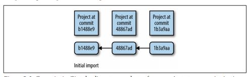

## 第五章、git科学家

&emsp;&emsp;在第2章中，我们讨论了如何组织生物信息学项目目录以及如何在开发过程中如何保持工作目录的整洁。好的项目组织结构也促进了任务的自动化，这也会使我们的工作变得更容易，并会让工作的可复现性更高。但是，随着时间的推移，我们的项目会发生变化，并且可能会加入许多合作者的工作，我们面临着另一个挑战：管理不同的文件版本。

&emsp;&emsp;很可能您已经在工作中使用了某种版本控制系统。例如，您可能有一些文件分别命名为thesis-vers1.docx, thesisvers3_CD_edits.docx,analysis-vers6.R, and thesis-vers8_CD+GM+SW_edits.docx。存储这些过去的版本，可以在我们需要时返回并还原整个或部分文件。文件版本还可以帮助我们区分我们的文件副本与协作者编辑的副本。然而，这种特殊的文件版本控制系统不能很好地适应复杂的生物信息学项目-我们原本整洁的项目目录会被不同版本的脚本、R分析、自述文件和论文搞得一团糟。

&emsp;&emsp;只有当我们协同工作时，项目组织才会变得更加复杂。我们可以通过Dropbox或Google Drive等服务与同事共享我们的整个目录，但这样做也会让我们的项目有被删除或损坏的风险。也不可能将整个生物信息学项目目录放到共享目录中，因为它可能包含千兆字节(或更多)的数据，这些数据可能太大而无法在网络上共享。这些工具对于共享小文件很有用，但不适用于管理涉及更改代码和数据的大型协作项目。

&emsp;&emsp;幸运的是，软件工程师在现代协同软件开发中遇到了同样的问题，并开发了版本控制系统(VCS)来管理协作编辑的代码的不同版本。我们将在本章中使用的VCS是由Linus Torvalds编写的，名为Git。Linus编写Git来管理Linux内核(他也是这样写的)，这是一个庞大的代码库，有数千个协作者同时更改和处理文件。正如您所想象的那样，Git非常适合于多人协同工作的项目版本控制管理。

&emsp;&emsp;诚然，Git一开始学习起来可能很棘手。我强烈建议您在本章中花时间学习Git，但请注意，理解Git(就像本书中的大多数主题，以及可以说是生活中的一切)需要时间进行练习。在本章中，我将指出某些特备重要的章节；您可以稍后重新访问这些章节，而不会出现与本书其余部分的连续性问题。此外，我建议您使用本书中的示例项目和代码来练习使用Git，以便在您的脑海中形成基本的使用习惯。在一开始与Git抗争之后，您很快就会发现它是最好的版本控制系统。

## 为什么Git在生物信息学项目中是必备的
       
&emsp;&emsp;作为Git的长期支持者，我已经向许多同事提出了这个建议，并提出要教他们一些基础知识。在大多数情况下，我发现最困难的部分实际上是说服科学家在他们的工作中应该采用版本控制。因为你可能想知道读完这一章是否值得，我想讨论一下为什么学习Git绝对值得付出努力。如果你已经100%相信了，你可以在下一节开始学习Git。
## Git允许您保留项目的快照
      
&emsp;&emsp;使用版本控制系统，您可以在开发过程中的特定时间点创建当前项目的快照。如果出现任何错误，您可以倒带到项目状态的过去快照(称为Commit)并恢复文件。在生物信息学工作的快节奏中，有这个保障是非常有用的。
      
&emsp;&emsp;Git还有助于修复一种令人沮丧的bug类型，即所谓的软件回归，即一段曾经正常工作的代码神秘地停止工作或给出不同的结果。例如，假设您正在对SNP数据进行分析。在你的分析中，你发现14%的SNP落在染色体的一条延伸中的编码区。这与你的项目相关，所以你在论文中引用这个百分比并做出承诺。
      
&emsp;&emsp;两个月后，你已经忘记了这个分析的细节，但是需要重新审视14%的统计数据。让您大吃一惊的是，当您重新运行分析代码时，这将更改为26%！如果您一直通过提交(例如，拍摄快照)来跟踪项目的开发，那么您将拥有项目所有更改的完整历史，并且可以准确地确定结果何时发生更改。
      
&emsp;&emsp;Git提交允许您轻松地复制和回滚到分析的过去版本。还可以轻松查看每个提交，何时提交，在提交之间发生了什么变化，甚至比较任何两个提交之间的差异。Git可以为您提供跨版本的逐行代码差异，而不是重做几个月的工作来查找bug。
      
&emsp;&emsp;除了简化bug查找之外，Git是正确文档的重要组成部分。当您的代码产生结果时，为了可重复性，此版本的代码必须有完整的文档记录。我的朋友兼同事迈克·科文顿(Mike Covington)打了一个很好的比喻：想象你用铅笔保存着一个实验室笔记本，每次你运行一次新的PCR，你都会抹去过去的结果，并记下最新的结果。这听起来可能很极端，但在功能上与更改代码和不记录过去的版本没有什么不同。

## Git帮助您跟踪对代码的重要更改
      
&emsp;&emsp;随着新功能的增加或bug的修复，大多数软件都会随着时间的推移而发生变化。在科学计算中，跟踪我们使用的软件的开发是很重要的，因为一个固定的bug可能意味着在我们自己的工作中正确和不正确的结果之间的区别。Git在帮助您跟踪代码更改方面非常有帮助-要了解这一点，让我们来看看我遇到的一个情况(我怀疑世界各地的实验室都会发生这种情况)。
      
&emsp;&emsp;假设一个实验室有一位聪明的生物信息学家，他写了一个脚本，从阅读中剔除质量不好的区域。这个生物信息学家然后把这个分发给他实验室的所有成员。他实验室的两名成员将其发送给其他实验室的朋友。大约一个月后，聪明的生物信息学家意识到在某些情况下存在导致错误结果的错误。生物信息学家迅速向实验室中的每个人发送新版本的电子邮件，并警告他们可能出现不正确的结果。不幸的是，其他实验室的成员可能没有收到消息，可能会继续使用较旧的存在Bug版本的脚本。
      
&emsp;&emsp;Git帮助解决了这个问题，因为它可以轻松地与软件开发保持同步。使用Git，可以轻松地跟踪软件更改和下载新的软件版本。此外，像GitHub和Bitbucket这样的服务在Web上托管Git存储库，这使得跨实验室的代码共享和协作变得很容易。

## Git有助项目在开发人员离开后保持软件的组织性和可用性
      
&emsp;&emsp;想象一下另一种情况：博士后开始自己的实验室，而她所有不同的软件工具和脚本都分散在不同的目录中，或者更糟，完全丢失了。无序的代码给其他实验室成员带来不便；丢失的代码导致无法复制的结果，并可能延误未来的研究。
      
&emsp;&emsp;Git有助于保持工作的连续性和项目历史的完整记录。将整个项目集中到存储库中可以使其保持组织。Git会存储每个提交的更改，因此即使主要开发人员离开，也不会出现问题，也可以获得项目的整个历史记录。由于能够回滚到以前的版本，修改项目的风险更小，从而更容易在现有工作的基础上进行构建。
## 安装git
        
&emsp;&emsp;如果您在OS X上，请通过Homebrew安装Git(例如，BREW install git)；在Linux上，使用apt-get(例如apt-get install git)。如果您的系统没有包管理器，则[Git网站](https://git-scm.com/)有Git的源代码和可执行版本可以下载。

## 基于Git：创建存储库、跟踪文件以及分段和提交更改
       
&emsp;&emsp;现在我们已经了解了一些Git概念以及Git如何适应您的生物信息学工作流程，让我们来探索最基本的Git概念，即创建存储库，告诉Git要跟踪哪些文件，以及暂存和提交更改。

## Git设置：告诉Git你是谁
       
&emsp;&emsp;因为Git是用来帮助协同编辑文件的，所以你需要告诉Git你是谁，你的电子邮件地址是什么。为此，请使用下面命令进行设置：
```shell
$ git config --global user.name "Sewall Wright"$ git config --global user.email "swright@adaptivelandscape.org"
```
       
&emsp;&emsp;确保使用自己的姓名和电子邮件，或课程。我们通过子命令与Git进行交互，子命令的格式为git<subcommand>。Git有很多子命令，但是你在日常工作中只需要几个。
       
&emsp;&emsp;现在启用的另一个有用的Git设置是终端颜色。Git的许多子命令使用终端颜色来直观地指示更改(例如，红色表示删除，绿色表示新的或修改的内容)。我们可以通过以下方式实现这一点：

```shell
$ git config --global color.ui true
```

## git init和git clone：创建存储库
       
&emsp;&emsp;要开始使用Git，我们首先需要将目录初始化为Git存储库。存储库是受版本控制的目录。它包含您当前的工作文件和项目在特定时间点的快照。在版本控制术语中，这些快照称为提交。使用Git从根本上讲就是创建和操作这些提交：创建提交，查看过去的提交，共享提交，以及比较不同的提交。
       
&emsp;&emsp;使用Git，有两种创建存储库的主要方法：从现有目录初始化一个存储库，或者克隆存在于其他地方的存储库。无论采用哪种方式，结果都是Git将其视为存储库的目录。Git只管理存储库目录内的文件和子目录-它不能管理存储库之外的文件。
       
&emsp;&emsp;让我们首先将我们在第2章中创建的zmays-snps/project目录初始化为Git存储库。切换到zmays-snps/目录并使用Git子命令git init：

```shell      
$ git initInitialized empty Git repository in  /Users/vinceb/Projects/zmays-snps/.git/
```
      
&emsp;&emsp;git init在zmays-snps/project目录中创建一个名为.git/的隐藏目录(可以使用ls-a查看它)。这个.git/目录是Git在后台管理存储库的方式。但是，不要修改或删除此目录中的任何内容-它只能由Git操作。相反，我们通过git init等Git子命令与存储库进行交互。
      
&emsp;&emsp;创建存储库的另一种方法是克隆现有存储库。您可以从任何地方克隆存储库：文件系统上的其他位置，从本地网络，或通过Internet。现在，有了像GitHub和Bitbucket这样的存储库托管服务，从Web上克隆Git存储库是最常见的。
      
&emsp;&emsp;让我们练习从GitHub克隆存储库。对于本例，我们将从Heng Li的GitHub页面克隆Seqtk代码。Seqtk是Sequence Toolkit的缩写，它包含一组编写良好且有用的工具，用于处理FASTQ和FASTA文件。首先，访问[GitHub存储库](https://github.com/lh3/seqtk)并查看一下。所有GitHub的存储库都有以下URL语法：user/repository。注意在这个存储库的页面上，右边的克隆URL-这是你可以复制链接来克隆这个存储库的地方。
      
&emsp;&emsp;现在，让我们切换到zmays-snps/之外的目录。无论您选择哪个目录都可以；我使用~/src/目录来克隆和编译其他开发人员的工具。从此目录运行：

```shell      
$ git clone git://github.com/lh3/seqtk.gitCloning into 'seqtk'...
remote: Counting objects: 92, done.
remote: Compressing objects: 100% (47/47), done.
remote: Total 92 (delta 56), reused 80 (delta 44)
Receiving objects: 100% (92/92), 32.58 KiB, done.
Resolving deltas: 100% (56/56), done.
```

&emsp;&emsp;git clone将seqtk克隆到您的本地目录，镜像GitHub上的原始存储库。请注意，您将无法直接修改 Heng Li的原始GitHub存储库-克隆此存储库仅允许您在发布新更新时从GitHub存储库中检索更新。
       
&emsp;&emsp;现在，如果您cd进入seqtk/并运行ls，您将看到seqtk的源代码：
```shell      
$ cd seqtk$ ls
Makefile README.md khash.h kseq.h seqtk.c
```       
&emsp;&emsp;尽管通过不同的方法发起，但是zmays-SNPs/和seqtk/都是Git存储库。

## Git中的文件跟踪：第一部分Git Add和Git状态
      
&emsp;&emsp;尽管您已经将zmays-snps/初始化为Git存储库，但Git不会自动开始跟踪此目录中的每个文件。相反，您需要使用子命令git add告诉Git要跟踪哪些文件。这实际上是Git的一个有用特性-生物信息学项目包含许多我们不想跟踪的文件，包括大型数据文件、中间结果或任何可以通过重新运行命令轻松重新生成的文件。
      
&emsp;&emsp;在跟踪文件之前，让我们使用git status命令检查存储库中文件的Git状态(如果您在其他位置，请切换到zmays-snps/目录)：

```shell
$ git status# On branch master (1)
# Initial commit
# Untracked files: (2)
# (use "git add &lt;file&gt;..." to include in what will be committed)
#
# README
# data/
nothing added to commit but untracked files present (use "git add" to track)
```

Git状态告诉我们：

(1)我们在master分支上，这是默认的Git分支。分支允许您同时处理项目的不同版本并在不同版本之间切换，Git简单而强大的分支是它成为如此流行的版本控制系统的主要原因。我们现在只使用Git的默认主分支，但是我们将在本章的后面学习更多关于分支的信息

(2)我们有一个“未跟踪的文件”列表，其中包括根项目目录中的所有内容。因为我们还没有告诉Git跟踪任何东西，所以如果我们尝试的话，Git没有任何东西需要提交。
      
&emsp;&emsp;git status是最常用的Git命令之一，所以 很容易手动获得Git状态。Git status描述了项目存储库的当前状态：哪些已更改，哪些已准备好包含在下一次提交中，以及哪些未被跟踪。我们将在本章的其余部分中广泛使用它。
      
&emsp;&emsp;让我们使用git add告诉Git跟踪zmays-snps/目录中的README和data/README文件：
```shell      
$ git add README data/README
```
        
&emsp;&emsp;现在，Git正在跟踪data/README和README文件。我们可以通过再次运行git status来验证这一点：
```shell
$ lsREADME analysis data scripts
$ git status
# On branch master
#
# Initial commit
#
# Changes to be committed:
# (use "git rm --cached &lt;file&gt;..." to unstage)
#
# new file: README  (1)
# new file: data/README
#
# Untracked files:
# (use "git add &lt;file&gt;..." to include in what will be committed)
#
# data/seqs/    (2)
```
(1)现在请注意Git在“要提交的更改”一节中,是如何将readme和data/readme作为新文件列出的。如果我们现在进行提交，我们的提交将拍摄这些文件的准确版本的快照，就像我们使用git add添加它们时一样。

(2)还有像data/seqs/这样的未跟踪目录，因为我们还没有告诉Git跟踪这些目录。但是，git status会提醒我们可以使用git add将这些添加到commit中。

&emsp;&emsp;scripts/ 和analysis/目录是空的，所以他们不包括在git状态中。因为data/seqs/目录中包含我们在第2章中使用touch创建的空序列文件，所以这个目录被列出在git状态中。

## Git中的暂存文件：第二部分git add和git status
       
&emsp;&emsp;使用Git，跟踪的文件和准备包含在下一次提交中的文件之间是不同的。这是一个微妙的差异，并且经常会给初学者带来很多困惑。被跟踪的文件意味着Git知道它。暂存的文件不仅会被跟踪，而且其最新的更改也会被暂存以包含在下一次提交中(参见图5-1)。
       
       ​​
图5-1、Git将工作树(存储库中的所有文件)、暂存区域(要包含在下一次提交中的文件)和提交的更改(某个时间点上项目版本的快照)分离；git add on a untracted file开始跟踪它并暂存它，而git add on a tracked file只为下一次提交暂存它

&emsp;&emsp;说明差异的一个好方法是考虑一下当我们更改一个我们开始使用git add跟踪的文件时会发生什么。对跟踪文件所做的更改不会自动包含在下一次提交中。要包含这些新的更改，我们需要显式地存放它们-再次使用git add。混淆的部分原因在于git add既可以跟踪新文件，也可以暂存对跟踪文件所做的更改。让我们通过一个例子来更清楚地说明这一点。
      
&emsp;&emsp;从上一节的git status输出中，我们看到data/readme和readme文件都准备好提交了。但是，看看当我们对这些跟踪文件之一进行更改，然后调用git status时会发生什么：
```shell
$ echo "Zea Mays SNP Calling Project" &gt;&gt; README # change file README$ git status
# On branch master
#
# Initial commit
#
# Changes to be committed:
# (use "git rm --cached &lt;file&gt;..." to unstage)
#
# new file: README
# new file: data/README
#
# Changes not staged for commit:
# (use "git add &lt;file&gt;..." to update what will be committed)
# (use "git checkout -- &lt;file&gt;..." to discard changes in working directory)
# modified: README
#
# Untracked files:
# (use "git add &lt;file&gt;..." to include in what will be committed)
#
# data/seqs/
```
       
&emsp;&emsp;修改README文件后，git状态会在“未暂存用于提交的更改”下列出README文件。这是因为自从最初使用git add跟踪和暂存README文件以来，我们对此文件进行了更改(第一次跟踪文件时，其当前版本也会被暂存)。如果我们现在进行提交，我们的提交将包括以前版本的README文件，而不是这个新修改的版本。
       
&emsp;&emsp;为了在下一次提交中将这些最近的修改添加到README中，我们使用git add进行暂存文件。在进行这步操作之后，看看git status返回了什么：
```shell
$ git add README$ git status
# On branch master
#
# Initial commit
#
# Changes to be committed:
# (use "git rm --cached &lt;file&gt;..." to unstage)
#
# new file: README
# new file: data/README
#
# Untracked files:
# (use "git add &lt;file&gt;..." to include in what will be committed)
#
# data/seqs/
# notebook.md
```
&emsp;&emsp;现在，README文件再次列在“要提交的更改”下，因为我们已经使用git add暂存了这些更改。我们的下一次提交将包括最新的版本。
      
&emsp;&emsp;再说一次，如果你觉得这令人困惑，请不要烦恼。差别是微妙的，我们使用git add进行这两个操作是没有帮助的。记住git add的两个角色：

1.	提醒Git开始跟踪未跟踪的文件(这也会将文件的当前版本包括在下一次提交中)
2.	暂存对已跟踪的文件所做的更改(已暂存的更改将包括在下一次提交中)

&emsp;&emsp;重要的是要知道，自上次登台以来对文件所做的任何修改都不会包含在下一次提交中，除非使用git add进行暂存。这个额外的步骤看起来可能会带来不便，但实际上有很多好处。假设您对项目中的许多文件进行了更改。其中两个文件的更改已经完成，但其他的一切都还没有完全准备好。使用Git的Staging，您可以仅暂存和提交这两个完整的文件，并将其他不完整的文件排除在提交之外。通过计划的暂存，您的提交可以反映开发中有意义的点，而不是整个项目目录的随机快照(这可能包括许多处于混乱状态的文件)。当我们在下一节学习提交时，我们将看到一个存放和提交所有修改的文件的快捷方式。

## Git Commit：创建项目快照
      
&emsp;&emsp;我们已经谈了很多关于提交的内容，但实际上还没有做过。当第一次学习Git时，进行提交的最棘手的部分是理解暂存。实际上，提交暂存的提交非常简单：
```shell
$ git commit -m "initial import" 2 files changed, 1 insertion(+)
 create mode 100644 README
 create mode 100644 data/README
 ```
       
&emsp;&emsp;此命令使用提交消息“初始导入”将暂存的更改提交到存储库。提交消息是对您的合作者(以及您将来的自己)关于特定提交包含的内容的注释。或者，您可以省略-m选项，Git将打开默认的文本编辑器。如果您更喜欢在文本编辑器中编写提交消息(如果它们是多行消息，则非常有用)，您可以使用以下命令更改Git使用的默认编辑器：

```shell       
$ git config --global core.editor emacs
```
          
&emsp;&emsp;其中emacs可以替换为vim(默认编辑器)或您选择的其他文本编辑器。
关于提交消息的一些建议
    
    提交消息看起来可能会带来不便，但对提交如何更改代码以及影响什么功能进行描述将会在对将来在查看代码带来便利。三个月后，当你需要弄清楚为什么你的SNP调用分析会返回意外的结果时，如果它们有像“修改SNP频率函数来修复单例bug，重构覆盖率计算”这样的消息而不是“cont”(这是我在公共项目中见过的实际提交)，那么找到相关的提交就会容易得多。有关这方面的有趣信息，请参阅[xkcd的“Git Commit”漫画](https://xkcd.com/1296/)。

&emsp;&emsp;早些时候，我们使用git add来暂存我们的更改。因为程序员喜欢快捷方式，所以有一种简单的方法可以存放所有跟踪文件的更改，并在一个命令中提交它们：git commit-a-m“your commit message”。选项-a告诉git commit在这个commit中自动存放所有修改过的跟踪文件。请注意，虽然这样可以节省时间，但它也会在此提交中抛出对跟踪文件的所有更改。理想情况下，提交应该反映项目开发的有用快照，因此包含每个稍有更改的文件可能会让您稍后查看存储库的历史记录时感到困惑。相反，应该频繁提交与项目的离散更改相对应的内容，如“添加了新的计数功能”或“修复了导致不正确翻译的bug”。
        
&emsp;&emsp;我们已经在提交中包含了所有更改，因此我们的工作目录现在是“干净的”：没有跟踪的文件与上次提交中的版本不同。在我们进行修改之前，git status表示没有需要提交的内容：
```shell
$ git status# On branch master
# Untracked files:
# (use "git add &lt;file&gt;..." to include in what will be committed)
#
# data/seqs/
```
       
&emsp;&emsp;未跟踪的文件和目录仍将保持未跟踪状态(例如，data/seqs/)，并且对跟踪文件的任何未暂存更改将不会包括在下一次提交中，除非添加。有时包含未暂存更改的工作目录称为“messy"，但这不是问题。

## 查看文件更改:git diff
        
&emsp;&emsp;到目前为止，我们已经看到了帮助您在存储库中暂存和提交更改所需的Git工具。我们已经使用git status子命令来查看哪些文件被跟踪，哪些文件有更改，哪些文件被暂存用于下一次提交。另一个子命令在这个过程中非常有用：git diff。
        
&emsp;&emsp;在没有任何参数的情况下，git diff向您显示工作目录中的文件与已暂存的文件之间的差异。如果您的更改都没有准备好，git diff会向我们显示您上次提交的文件和当前版本的文件之间的区别。例如，如果我向readme.md添加一行并运行git diff：
```shell        
$ echo "Project started 2013-01-03" &gt;&gt; README$ git diff
diff --git a/README b/README
index 5483cfd..ba8d7fc 100644
--- a/README  (1)
+++ b/README
@@ -1 +1,2 @@  (2)
 Zea Mays SNP Calling Project
+Project started 2013-01-03   (3)
```
       
&emsp;&emsp;这种格式(称为Unifed dif)一开始可能看起来有点神秘。当启用Git的终端颜色时，Git diff的输出更易于阅读，因为添加的行将为绿色，删除的行将为红色。
       
(1)这一行(以及后面的一行)表示我们正在比较的README文件有两个版本a和b。---表示在我们的例子中原始文件，是上次提交的文件。+++表示更改的版本。

(2)这表示改变的块的开始(块是diff对大的改变的块的术语)，并且指示改变从哪一行开始，以及它们有多长。不同尝试将您的更改分解为大块，以便您可以轻松地识别已更改的部分。如果你对细节感兴趣，请查看[维基百科关于diff实用程序的页面](https://en.wikipedia.org/wiki/Diff)。

(3)这是变化的实质。行之前的空格(例如，Zea Mays…开头的行。表示没有任何更改(只提供上下文)。加号表示行添加(例如，开始项目…的行)。负号表示行删除(此差异中未显示，因为我们只添加了一行)。对行的更改表示为删除原始行和添加新行。

&emsp;&emsp;在我们暂存文件之后，git diff不会显示任何更改，因为git diff会将工作目录中的文件版本与上次暂存的版本进行比较。例如：
```shell
$ git add README$ git diff # shows nothing
```
       
&emsp;&emsp;如果我们想要将已暂存的内容与上一次提交进行比较(这将显示下一次提交的确切内容)，我们可以使用git diff-stated(在Git的旧版本中，这不起作用，所以如果不起作用，则升级)。事实上，我们可以看到我们刚刚上演的变化：

```shell       
$ git diff --stageddiff --git a/README b/README
index 5483cfd..ba8d7fc 100644
--- a/README
+++ b/README
@@ -1 +1,2 @@
 Zea Mays SNP Calling Project
+Project started 2013-01-03
```

&emsp;&emsp;Git diff还可以用于比较Git提交历史中的任意对象，这个主题我们将在第100页的“More Git diff：Comparing Comments and Files”中看到。

## 查看历史提交记录:git log
        
&emsp;&emsp;提交类似于链(更严格地说，是有向无环图)，每个提交都指向其父对象(如图5-2所示)。
        ​​
图5-2、Git中的提交在某个时间点获取项目的离散快照，并且每个提交(第一个除外)都指向其父提交；这个提交链是您的一组连接的快照，这些快照显示了项目存储库是如何发展的。
    
&emsp;&emsp;我们可以使用git log来可视化我们的提交链：
```shell    
$ git logcommit 3d7ffa6f0276e607dcd94e18d26d21de2d96a460   (1)
Author: Vince Buffalo &lt;vsbuffaloAAAAAA@gmail.com&gt;
Date: Mon Sep 23 23:55:08 2013 -0700
initial import
```
(1)这个奇怪的数字和字符的组合是SHA-1校验和。每个提交都会有其中一个，它们将取决于存储库过去的提交历史记录和当前文件。sha-1散列充当存储库中每个提交的唯一ID。您总是可以通过SHA-1散列来引用COMMIT。

​​Git日志和终端界面

    git log在默认终端界面中打开存储库的历史记录(通常程序或多或少)。如果你不是很熟悉寻呼机，不要烦恼。要退出并返回到提示，请按字母q。按空格键可以向前移动，按b可以向后移动。我们将在第7章中更详细地介绍。

&emsp;&emsp;让我们提交上一节中所做的更改：
```shell
$ git commit -a -m "added information about project to README"[master 94e2365] added information about project to README
 1 file changed, 1 insertion(+)
 ```

&emsp;&emsp;现在，如果我们使用git log查看提交历史，我们可以看到：

```shell
$ git logcommit 94e2365dd66701a35629d29173d640fdae32fa5c
Author: Vince Buffalo <vsbuffaloAAAAAA@gmail.com&gt>
Date: Tue Sep 24 00:02:11 2013 -0700
 added information about project to README
commit 3d7ffa6f0276e607dcd94e18d26d21de2d96a460
Author: Vince Buffalo <vsbuffaloAAAAAA@gmail.com>
Date: Mon Sep 23 23:55:08 2013 -0700
 initial import
 ```
      
&emsp;&emsp;当我们继续对存储库进行更改并提交更改时，这个提交链将会增长。如果您想看到一个更长的Git历史的好例子，将目录更改到我们之前克隆的seqtk存储库，并调用git log。

## 移动和删除文件：git mv and git rm
      
&emsp;&emsp;当Git跟踪你的文件时，它想要负责。使用mv命令移动跟踪的文件会使Git混淆。使用rm删除文件时也是如此。要在Git中移动或删除跟踪文件，我们需要使用Git的mv和rm版本：git mv和git rm。
      
&emsp;&emsp;例如，我们的README文件没有扩展名。这不是一个很严重的问题，但是因为README文件稍后可能包含Markdown，所以最好将其扩展名更改为.md。您可以使用git mv执行此操作：
```shell
$ git mv README README.md$ git mv data/README data/README.md
```
       
&emsp;&emsp;与所有更改一样，只有在提交后才会将其存储在存储库中。如果您列出了您的文件，您可以看到您的工作副本已被重命名：
```shell
$ lsREADME.md analysis data notebook.md scripts
```
     
&emsp;&emsp;使用git status，我们看到此更改已暂存，可以提交：
```shell
$ git status# On branch master
# Changes to be committed:
# (use "git reset HEAD &lt;file&gt;..." to unstage)
#
# renamed: README -&gt; README.md
# renamed: data/README -&gt; data/README.md
#
# Untracked files:
# (use "git add &lt;file&gt;..." to include in what will be committed)
#
# data/seqs/
```
       
&emsp;&emsp;git mv已经为我们暂存了这些提交；git add只用于暂存对文件内容的修改，而不是移动或删除文件。让我们提交这些更改：
```shell
$ git commit -m "added markdown extensions to README files"[master e4feb22] added markdown extensions to README files
 2 files changed, 0 insertions(+), 0 deletions(-)
 rename README =&gt; README.md (100%)
 rename data/{README =&gt; README.md} (100%)
 ```
       
&emsp;&emsp;请注意，即使您更改或删除文件并提交，它仍然存在于过去的快照中。Git尽其所能使一切都可回收。我们将在本章后面的部分中了解如何恢复文件。

## 告诉git应该忽略什么：gitignore
      
&emsp;&emsp;您可能已经注意到，git status一直在列出哪些文件没有被跟踪。随着您的生物信息学项目中的文件数量开始增加(这种情况发生得很快！)。这份长长的清单将成为一种负担。
      
&emsp;&emsp;这个未跟踪列表中的许多项目可能是我们永远不想提交的文件。排序数据文件是一个很好的例子：它们通常太大而不能包含在存储库中。如果我们要提交这些大文件，克隆您的存储库的合作者将不得不下载这些巨大的数据文件。我们稍后会讨论其他管理这些的方法，但是现在，让我们忽略它们。
      
&emsp;&emsp;假设我们希望忽略data/seqs/目录中的所有FASTQ文件(扩展名为.fast)。为此，请在zmays-snps/repository目录中创建并编辑文件.gitignore，并添加：
```shell
data/seqs/*.fast
```
&emsp;&emsp;现在，git status列出:
```shell
$ git status# On branch master
# Untracked files:
# (use "git add &lt;file&gt;..." to include in what will be committed)
#
# .gitignore
```
      
&emsp;&emsp;似乎我们已经摆脱了一个烦恼(“untracked files”中的data/seqs/目录)，但是添加了另一个(新的.gitignore)文件。实际上，解决这个问题的最好方法是添加并提交.gitignore文件。将文件贡献给仅仅是为了告诉Git要忽略什么的项目，这似乎是违反直觉的。然而，这是一个很好的解决办法；它可以避免合作者看到Git应该忽略的未跟踪文件的列表。让我们继续并暂存.gitignore文件，并提交之前所做的文件名更改：
```shell
$ git add .gitignore$ git commit -m "added .gitignore"
[master c509f63] added .gitignore
 1 file changed, 1 insertion(+)
 create mode 100644 .gitignore
 ```

&emsp;&emsp;我们应该告诉.gitignore忽略什么？在生物信息学项目中，以下是一些指南：

*大型文件*
      
&emsp;&emsp;这些应该被忽略并通过其他方式进行管理，因为Git不是为管理真正大的文件而设计的。大型文件会减慢创建、推送和拉取提交的速度。这可能会在协作者克隆您的存储库时造成相当大的负担。

*中间文件*
      
&emsp;&emsp;生物信息学项目往往充满了中间文件。例如，如果将读数与基因组对齐，这将创建SAM或BAM文件。即使这些不是大文件，也应该忽略这些文件。如果通过重新运行命令(或者更好的是脚本)可以很容易地再现数据文件，那么通常更好的做法是只存储它是如何创建的。最终，记录和存储如何在Git中创建中间文件比实际文件更重要。这也确保了再现性。

*文本编辑器临时文件*

&emsp;&emsp;像Emacs和Vim这样的文本编辑器有时会在您的目录中创建临时文件。这些可能看起来像textfle.txt~或#textfle.txt#。将这些内容存储在Git中是没有意义的，在查看具有Git状态的进度时，它们可能会很烦人。应始终将这些文件添加到.gitignore中。幸运的是，.gitignore使用通配符，因此可以使用*~和\#*\#这样的条目忽略这些通配符。

*临时代码文件*

&emsp;&emsp;一些语言解释器(例如Python)生成临时文件(通常带有某种优化的代码)。使用Python，这些看起来像overlap.pyc。
       
&emsp;&emsp;我们可以使用全局.gitignore文件在所有项目中普遍忽略某个文件。要全局忽略的文件的优秀候选文件是我们的文本编辑器的临时文件或您的操作系统创建的文件(例如，OS X有时会在目录中创建名为.DS_Store的隐藏文件，以存储图标位置等详细信息)。GitHub维护着一个有用的[全球.gitignore建议存储库](https://github.com/github/gitignore/tree/master/Global)。
       
&emsp;&emsp;您可以在~/.gitignore_global中创建全局.gitignore文件，然后将Git配置为将其与以下内容一起使用：
```shell
git config --global core.excludesfile ~/.gitignore_global
```
    
&emsp;&emsp;存储库应存储复制项目所需的所有内容，但大型数据集和外部程序除外。这包括所有的脚本，文档，分析，甚至可能是最终的手稿。以这种方式组织存储库意味着项目的所有依赖项都在一个位置，并由Git管理。从长远来看，让Git跟踪您的项目文件要比尝试自己跟踪要容易得多。
