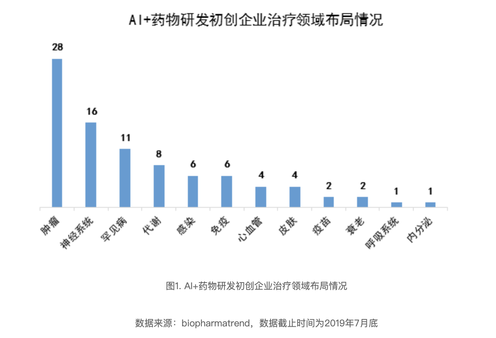
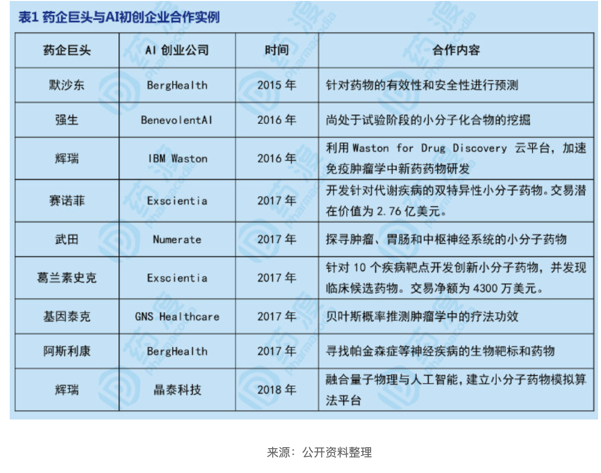
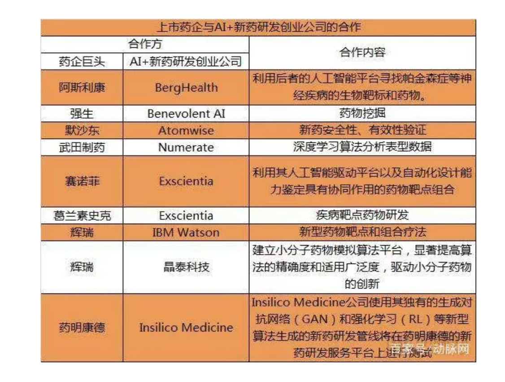
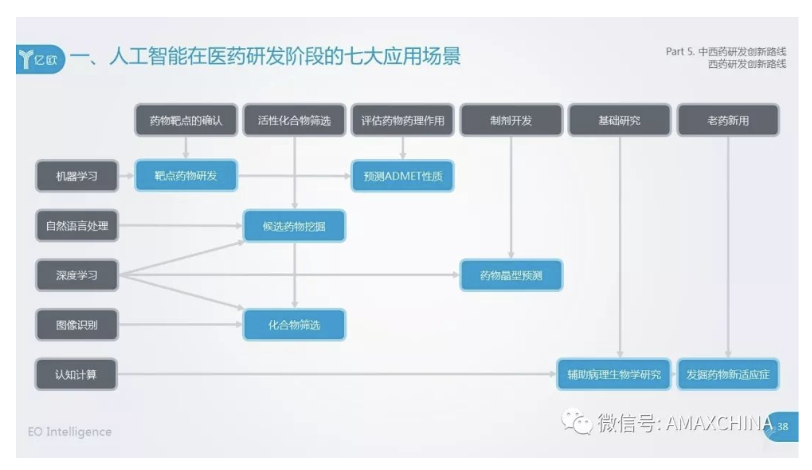

# ai + 药物研发

## ai + 药物研发的机遇与挑战

新药研发具有成本高、研发周期长、成功率低三大高风险性质。据《Natrue》报道，新药研发成本约为26亿美元，耗时约10年，成功率不到1/10。如何加速新药研发进程，降低研发费用已经成为各大制药公司迫切需要解决的问题。

### ai + 药物研发应用场景与技术

从1956年的达特茂斯会议开始，AI在药物研发中的应用已经有将近70年的历史，现在已经渗入医药研发各个阶段，但还主要集中在新药发现和验证阶段。不过应用的技术已有很大进步，已从以前定量关系的（QSAR）和定量结构-性质关系（QSPR）的研究中的标记训练数据集和模型进步到机器学习、认知计算和图像识别等。
现在，AI与药物研发相结合应用的主要场景包括：发掘药物靶点、挖掘候选药物、高通量筛选、药物设计、药物合成、预测药物ADMET性质、病理生理学研究及新适应症的开发——老药新用。其中靶点筛选是近期AI+药物研发最热门的领域，而两者相结合的应用也将让老药新用达到新高度，但小分子药物筛选和设计仍然占主要地位。但按照应用场景的发展速度来看，药物合成未来或将成自动化程度最高的方向。这些应用场景常用的AI技术主要是机器学习、认知计算和图像识别。

### AI+药物研发代表企业和布局领域

目前，AI+药物研发代表性的初创企业有Exscientia、BenevolentAI、Atomwise、Relay Therapeutics、晶泰科技、Numerate和IBM Waston和Lam Therapeutics等。按照现有初创企业在治疗领域的布局情况来看，肿瘤占比最多，而神经领域次之，而罕见病相关的企业也较多。因此，肿瘤和神经系统不仅是目前AI+药物研发的布局重点领域，也是未来发展的潜力领域，而AI也将助力破解罕见病诊断难和药物研发难的“两难”境地。

### 合作

## 主要企业:

### 药渡

 药渡经纬信息科技（北京）有限公司，成立于2013年，一直深耕于海量药物研发数据和信息的手机整理，精炼整合和挖掘分析。现阶段，已收录>8000个全球上市和临床、II、III期在研的小分子药和生物药，整合了药物相关的专利、化学、药效学、药代学、毒理学等十几个学科的研发数据，并通过旗下网站“药渡网”和移动应用程序“药渡头条”给药物研发专业人员提供全方位的药物数据和便捷的信息获取渠道。

### 医药魔方

### 米内数据

### BenevolentAI，伦敦，英国

### Numerate， 圣布鲁诺 (San Bruno)，加利福尼亚州

### Recursion Pharmaceuticals， 盐湖城 (Salt Lake City)，犹他州

这家公司的核心技术在于运用计算机视觉技术来处理细胞图像，并且通过分析1000多种细胞特征来评估疾病细胞在给药后的效果。使用先进的成像技术和人工智能技术，这一平台可以进行高通量的细胞模型实验，在上百种疾病的细胞模型中进行上千种候选药物的检测。Recursion公司已经发现了15种治疗罕见病的候选药物，其中治疗脑海绵状血管畸形 (cerebral cavernous malformation) 的候选药物即将进入临床试验。

### Insilico Medicine， 巴尔的摩 (Baltimore)， 马里兰州

### Atomwise，旧金山 (San Francisco)，加利福尼亚州

### NuMedii， 门洛帕克 (Menlo Park)， 加利福尼亚州

### Verge Genomics， 旧金山，加利福尼亚州

## AI药物研发工具

 2019年4月，IBM公司因为财务业绩低迷，决定停止开发和销售药物开发工具——Watson人工智能套件。
 付费使用Exscientia的人工智能（artificial-intelligence, AI）平台来寻找代谢疾病的治疗药物

## 信息

 新浪医药公众号
 机器之心
 动脉网编译了FICCI发布的《人工智能和高级分析在制药业的应用》报告

## 重要事件

 「2007 年 6 月 12 日，是 AI 历史上值得铭记的一天。」
这一天，一个名叫 Adam（亚当）的机器人发现了一种酵母基因的功能。

人工智能和高级分析成医药数字化新风口

而在印度，制药公司最近（2019年3月）才开始将人工智能应用于药物研发和产品供应链。药物发现仍然是医药行业数字化转型的重点领域，因为人工智能可以通过扫描数据库，寻找到药物的特定分子。

达沃斯世界经济论坛（World Economic Forum）发布了2018十大新兴技术报告：增强现实、个性化医疗、人工智能分子设计、数字助手、可植入细胞药物、实验室培育肉、电子疗法、基因驱动、等离子体材料和量子计算机算法。

动脉网翻译了相关报告，对于一系列医疗相关问题——比如机器学习算法如何帮助研发新药、可植入细胞药物如何改变长期病症的治疗方法、电子疗法如何减少药物依赖、光控纳米颗粒如何用于治疗癌症。

## 该行业发展趋势：

药物研发：大型制药公司选择发展自己的AI技术，或者与AI初创企业合作，来加快药物研发过程，实现个体化用药；

药物剂量和用药安全：人工智能可以根据患者的病情和特点，为每位患者定制相应的药物剂量。人工智能被应用于安全价值链的各个阶段，以提高整体质量和药物依从性；

药物生产和供应链：人工智能正被用于优化整个生产过程中的药物验证以及假药识别；

商业化：人工智能越来越多地被用于患者分类，提高药物疗效，减少不良反应；

监管机构的审批：简化临床药品的审批流程，使之更加快速、透明。

## AI+用药安全

药物剂量：新加坡国立大学创建了一个名为“CURATE.AI”的人工智能平台。它可以利用患者的临床数据，比如历史记录，来快速识别药物剂量，并在此基础上对肿瘤大小或肿瘤生物标志物水平进行修正。这些数据还可用于根据患者的需要定制不同疗程。 

临床安全：Agios Pharmaceuticals利用自然语言处理(NLP)，帮助其系统做出快速全面的决策。该技术还可以通过探索性研究，识别安全信号，用于临床前的药物研发。此外，自然语言处理还可用于研究患者的症状模式，以帮助识别患者是否处于高危情况。 

非临床安全：Merck公司利用NLP技术来自动化工作流程，将非结构化数据和结构化数据结合，进行分析，为安全评估团队创建可视化的商业智能仪表盘。这一过程使公司能够识别只有在长期测试中才能识别的异常情况。 

药物警戒：GSK的临床安全团队通过研究医学文献，不断确定相关的安全信号。GSK拥有近200种产品组合，它可以利用NLP来提高研究效率和语言处理速度，使搜索过程更加规范，并更快确定药物和不良事件之间的关系。

## AI+药物研发的七大应用

### 1.AI+候选药物挖掘

研究者尝试使用人工智能技术，从科技论文、专利、临床试验信息，以及大量结构化数据集中的非结构化信息中，自动生成有用的知识。例如通过深度学习优化的自然语言处理算法来分析和理解语境来理解信息，然后理解、学习、探索、创造和翻译它所学到的东西来产生独特的假设。该技术通过找到本来可能会漏掉的连接，使以前不可能的科学发现成为可能。通过系统能够自动提取生物学知识，找出关联并提出相应的候选药物，进一步筛选具有对某些特定疾病有效的分子结构，从而使科学家能够更有效地开发新药。

典型案例是英国的新药研发公司BenevolentAI，其开发的JACS（Judgment Augmented Cognition System）人工智能系统，能够集中处理大量高度碎片化信息。其与强生达成战略合作，利用JACS系统来指导临床试验的进行和数据的收集。

### 2.AI+化合物筛选

硅谷的AI公司Atomwise，开发AIMS（Artificial Intelligence Molecular Screen）项目，计划通过分析每一种疾病的数百万种化合物，以加快对救命药物的研发速度。同时，该公司开发了基于卷积神经网络的AtomNet系统，该系统大量学习了化学知识及研究资料，而后测试其是否能预测过去物理实验中发生的事情。研究者发现，AtomNet已经学会识别重要的化学基团，如氢键、芳香度和单键碳。**该系统可以分析化合物的构效关系，识别医药化学中的基础模块，用于新药发现和评估新药风险。**

### 3.AI+靶点药物研发

靶点药物是指药物在体内的作用结合位点，包括基因位点、受体、酶、离子通道、核酸等生物大分子。选择确定新颖的有效药靶是新药开发的首要任务。

**利用机器学习算法，能够复合设计、评估编码深层次的知识，从而可以全面应用于传统的单目标药物发现项目。**为了确定那些最易于化学处理的靶点，研究者首先研究靶点选择性地结合平衡良好的小分子的可能性。针对双特异性小分子，设计过程与单目标药物类似，关键的区别是，效力必须同时满足两个不同的目标。

### 4.海量文献信息的整合

英国生物科技公司Benevolent Bio（隶属于 Benevolent AI），利用技术平台JACS（Judgment Augmented Cognition System），从全球范围内海量的学术论文、专利、临床试验结果、患者记录等数据中，提取出有用的信息，发现新药研发的蛛丝马迹。

### 5.化合物高通量筛选

化合物筛选，是指通过规范化的实验手段，从大量化合物或者新化合物中选择对某一特定作用靶点具有较高活性的化合物的过程。

AI 技术可以通过对现有化合物数据库信息的整合和数据提取、机器学习，提取大量化合物与毒性、有效性的关键信息，既避免了盲人摸象般的试错路径，还可以大幅提高筛选的成功率。

典型代表是硅谷公司Atomwise。Atomwise公司成立于2012年，其核心产品为AtomNet是一种基于深度学习神经网络的虚拟药物发现平台。AtomNet就像一位人类化学家，使用强大的深度学习算法和计算能力，来分析数以百万计的潜在新药数据。目前，AtomNet已经学会识别重要的化学基团，如氢键、芳香度和单键碳，同时该系统可以分析化合物的构效关系，识别医药化学中的基础模块，用于新药发现和评估新药风险。

### 6. 发掘药物靶点

现代新药研究与开发的关键是寻找、确定和制备药物靶点。靶点是指药物在体内的作用结合位点，包括基因位点、受体、酶、离子通道和核酸等生物大分子。

典型代表是Exscientia公司，Exscientia与葛兰素史克（GSK）在药物研发达成战略合作。

### 7.预测药物分子动力学指标（ADMET）

ADMET包括药物的吸收、分配、代谢、排泄和毒性。预测ADMET是当代药物设计和药物筛选中十分重要的方法。过去药物ADMET性质研究以体外研究技术与计算机模拟等方法相结合，研究药物在生物体内的动力学表现。目前市场中有数十种计算机模拟软件，包括ADMET Predicator、MOE、Discovery Studio和Shrodinger等。该类软件现已在国内外的药品监管部门、制药企业和研究院所得到了广泛应用。

典型的代表包括晶泰科技（XtalPi）、Numerate等。为了进一步提升ADMET性质预测的准确度，已有生物科技企业探索通过深度神经网络算法有效提取结构特征，加速药物的早期发现和筛选过程。其中晶泰科技通过应用人工智能高效地动态配置药物晶型，能完整预测一个小分子药物的所有可能的晶型，大大缩短晶型开发周期，更有效地挑选出合适的药物晶型，减少成本。

### 7.病理生物学研究

### 8.发掘药物新适应症
